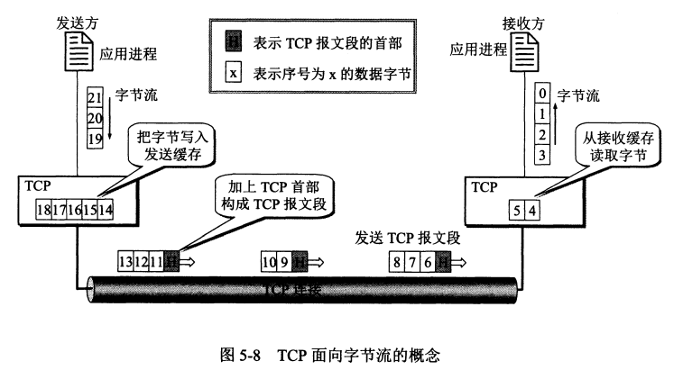
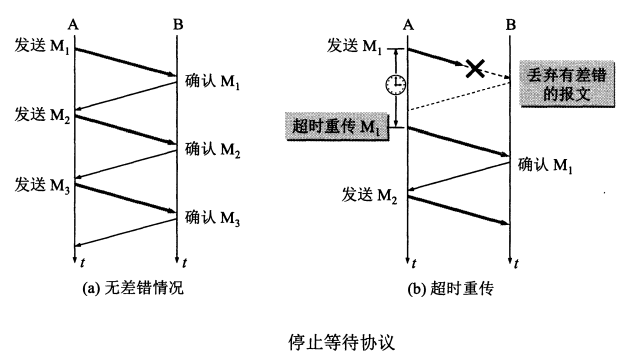
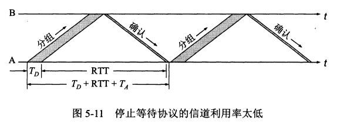
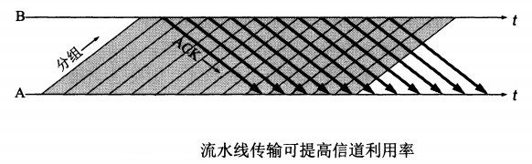
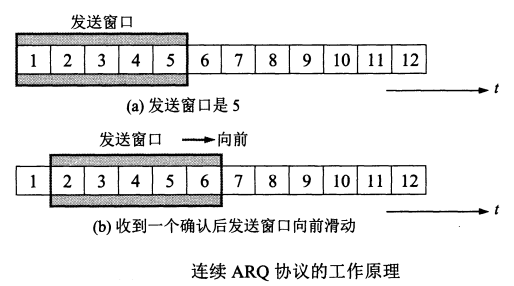
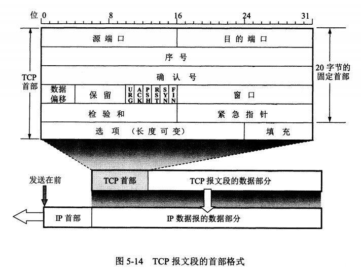
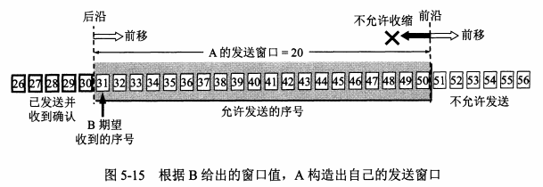
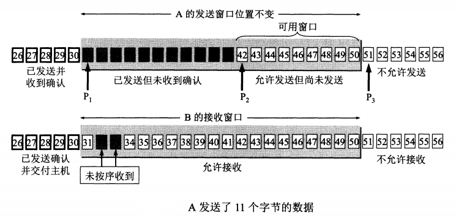
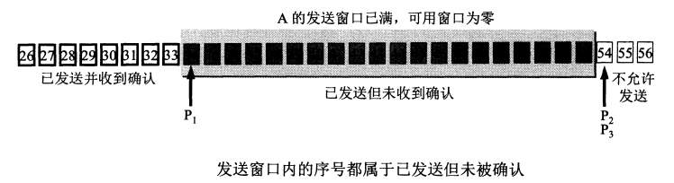
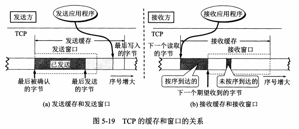

# 传输控制协议 TCP

## 传输控制协议 TCP 概述

### TCP 最主要的特点

- TCP 是`面向连接的运输层协议`。应用程序在使用 TCP 协议之前，必须先建立 TCP 连接。在传送数据完毕后，必须释放已经建立的 TCP 连接
- 每一条 TCP 连接只能有两个`端点`，每一条 TCP 连接只能是`点对点`的(一对一)
- TCP 提供`可靠交付`的服务。通过 TCP 连接传送的数据，无差错、不丢失、不重复，并且按序到达
- TCP 提供`全双工通信`。TCP 允许通信双方的应用进程在任何时候都能发送数据。TCP 连接的两端都设有发送缓存和接受缓存，用来临时存放双向通信的数据
- `面向字节流`。TCP 中的“流”指的是`流入到进程或从进程流出的字节序列`

### 面向字节流

“面向字节流”的含义是：虽然应用程序和 TCP 的交互式一次一个数据块(大小不等)，但 TCP 把应用程序交下来的数据仅仅看成是一连串的`无结构的字节流`。TCP 并不知道所传送的字节流的含义

TCP 不保证接收方应用程序所收到的数据块和发送方应用程序所发出的数据块具有对应大小的关系

> 例如，发送方应用程序交给发送方的 TCP 共10个数据块，但接收方的 TCP 可能只用了4个数据块就把收到的字节流交付上层的应用程序

接收方应用程序收到的字节流必须和发送方应用程序发出的字节流完全一样。接收方的应用程序必须有能力识别收到的字节流，把它还原成有意义的应用层数据

TCP 和 UDP 在发送报文时采用的方式完全不同。TCP 并不关心应用进程一次把多长的报文发送到 TCP 的缓存中，而是根据对方给出的窗口值和当前网络拥塞的程度来决定一个报文段应包含多少个字节(UDP 发送的报文长度是应用进程给出的)。如果应用进程传送到 TCP 缓存的数据块太长，TCP 就可以把它划分短一些再传送。如果应用进程一次只发来一个字节，TCP 也可以等待积累有足够多的字节后再构成报文段发送出去

### TCP 的连接

TCP 把`连接`作为`最基本的抽象`。TCP 的许多特性都与 TCP 是面向连接的这个基本特性有关

TCP 连接的端点叫做`套接字(socket)或插口`，根据 RFC 793 的定义：端口号拼接到(concatenated with) IP 地址即构成了套接字

> 套接字 socket = (IP 地址：端口号)

`每一条 TCP 连接唯一地被通信两端的两个端点(即两个套接字)所确定`

> TCP 连接 ::= {socket1, socket2} = {(IP1: port1), (IP2: port2)}

TCP 连接就是由协议软件所提供的一种抽象。`TCP 连接的端口是个很抽象的套接字`，即( `IP地址`: `端口号`)。同一个 IP 地址可以有多个不同的 TCP 连接，而同一个端口号也可以出现在多个不同的 TCP 连接中

### 易混淆的 socket

同一个名词 socket 却可表示多种不同的意思，以下 socket 的意思跟本文中所引用的 RFC 793 定义的 socket(指端口号拼接到 IP 地址)不同

- 允许应用程序访问连网协议的`应用编程接口 API(Application Programming Interface)`，即运输层和应用层之间的接口，称为 socket API，并简称为 socket
- 在 socket API 中使用的一个`函数名`也叫做 socket
- 调用 socket 函数的`端点`称为 socket，如“创建一个数据报 socket”
- 调用 socket 函数时，其`返回值`称为 socket 描述符，可简称为 socket
- 在操作系统内核中连网协议的 Berkeley 实现，称为 socket `实现`

## 可靠传输的工作原理

### 理想的传输条件

理想的传输条件有以下两个特点

- 传输信道不产生差错
- 不管发送方以多块的速度发送数据，接收方总是来得及处理收到的数据

实际的网络不具备以上两个理想条件。需要使用一些可靠的传输协议，当出现差错时让发送方重传出现差错的数据，同时在接收方来不及处理收到的数据时，及时告诉发送方适当减低发送数据的速度。这样，不可靠的传输信道就能够实现可靠传输了

### 停止等待协议

全双工通信的双方既是发送方也是接收方。把传送的数据单元都称为分组。“停止等待”就是每发完一个分组就停止发送，等待对方的确认。在收到确认后再发送下一个分组

#### 无差错情况

#### 出现差错

只要超过一段时间没有收到确认，就认为刚才发送的分组丢失了，因而重传前面发送过的分组。这就叫做`超时重传`。要实现超时重传，就要在每发送完一个分组时设置一个`超时计时器`

- 发送完一个分组后，`必须暂时保留已发送的分组的副本`(在发生超时重传时使用)。只有在收到相应的确认后才能清除暂时保留的分组副本
- 分组和确认分组都必须进行`编号`。这样才能明确是哪一个发送出去的分组收到了确认，而哪一个分组还没有收到确认
- 超时计时器的重传时间`应当比数据在分组传输的平均往返时间更长一些`

####  确认丢失和确认迟到

使用上述的确认和重传机制，我们就可以`在不可靠的传输网络上实现可靠的通信`

像上述的这种可靠传输协议常称为`自动重传请求 ARQ(Automatic Repeat reQuest)`。重传的请求是自动进行的。接收方不需要请求发送方重传某个出错的分组

#### 信道利用率

停止等待协议的优点是简单，但缺点是信道利用率太低

为了提高传输效率，发送方可以不使用低效率的停止等待协议，而是采用`流水线传输`。流水线传输就是发送方可连续发送多个分组，不必每发完一个分组就停顿下来等待对方的确认。这样可使信道上一直有数据不间断地在传送。这种传输方式可以获得很高的信道利用率

### 连续 ARQ 协议

位于发送窗口内的5个分组都可以连续发送出去，而不需要等待对方的确认。可以提高信道利用率

接收方一般都是采用`累积确认`的方式。接收方不需要对收到的分组逐个发送确认，而是在收到几个分组后，`对按序到达的最后一个分组发送确认`

积累确认有优点也有缺点。优点是：容易实现，即使确认丢失也不必重传。缺点是不能向发送方反映出接收方已经正确收到的所有分组的信息

## TCP 报文段的首部格式

TCP 虽然是面向字节流的，但 TCP 传送的数据单元却是报文段。一个 TCP 报文段分为首部和数据两部分。TCP 报文段首部的前20个字节是固定的，后面有4n字节是根据需要而增加的选项(n是整数)。因此 TCP 首部的最小长度是20字节

### 首部字段

- `源端口`和`目的端口` 各占2个字节，分别写入源端口号和目的端口号
- `序号` 占4字节。序号范围是[0, 232-1]，共232(即4 294 967 296)个序号。序号增加到232-1后，下一个序号就又回到0。在一个 TCP 连接中传送的字节流中的`每一个字节都按顺序编号`
- `确认号` 占4字节，是`期望收到对方下一个报文段的第一个数据字节的序号`
- `数据偏移` 占4字节，它指出 TCP 报文段的数据起始处距离 TCP 报文段的起始处有多远。这个字段实际上是指出 TCP 报文段的首部长度
- `保留` 占6位，保留为今后使用，但目前应置为0

下面有6个`控制位`，用来说明本报文段的性质

- `紧急 URG(URGent)` 当 URG=1 时，表明紧急指针字段有效。它告诉系统此报文段中有紧急数据，应尽快传送(相当于高优先级的数据)，而不是按原先的排队顺序来传送
- `确认 ACK(ACKnowledgment)` 仅当 ACK=1 时确认号字段才有效。当 ACK=0 时，确认号无效。TCP 规定，在连接建立后所有传送的报文段都必须把 ACK 置1
- `推送 PSH(Push)` 当两个应用进程进行交互式的通信时，有时在一端的应用进程希望在键入一个命令后立即就能够收到对方的响应
- `复位 RST(ReSeT)` 当 RST=1 时，表明 TCP 连接中出现严重差错(如由于主机崩溃或其他原因)，必须释放连接，然后再重新建立运输连接
- `同步 SYN(SYNnchronization)` 在连接建立时用来同步序号。当 SYN=1 而 ACK=0 时，表明这是一个连接请求报文段。对方若同意建立连接，则应在响应的报文段中使 SYN=1 和 ACK=1
- `终止 FIN(FINis)` 用来释放一个连接。当 FIN=1 时，表明此报文段的发送发的数据已发送完毕，并要求释放运输连接

- `窗口` 占2字节。窗口值是[0, 216-1]之间的整数。窗口值作为接收方让发送方设置其发送窗口的依旧
- `检验和` 占2字节。检验和字段检验的范围包括首部和数据这两部分
- `紧急指针` 占2字节。紧急指针仅在 URG=1 时才有意义，它指出本报文段中的紧急数据的字节数
- `选项` 长度可变，最长可达40字节

## TCP 可靠传输的实现

### 以字节为单位的滑动窗口

#### 发送窗口构造

TCP 的滑动窗口是以字节为单位的。假定 A 收到了 B `发来`的确认报文段，其中窗口是20字节，而确认号是31(这表明 B 期望收到的下一个序号是31，而序号30为止的数据已经收到了)。根据这两个数据，A 就构造出自己的发送窗口

发送窗口标识：在没有收到 B 的确认的情况下，A 可以连续把窗口内的数据都发送出去。凡是已经发送出去的数据，在未收到确认之前都必须暂时保留，以便在超时重传时使用

#### 发送窗口变化

发送窗口的位置由窗口前沿和后沿的位置共同确定。发送窗口后沿的变化情况有两种，即不动(没有收到新的确认)和前移(收到了新的确认)。发送窗口后沿不可能向后移动，因为不能撤销已收到的确认

发送窗口前沿通常是不断向前移动，但也有可能不动。这对应于两种情况：

- 一是没有收到信的确认，对应通知的窗口大小也不变
- 二是收到了新的窗口单对方通知的窗口缩小了，使得发送窗口前沿正好不动

发送窗口前沿也有可能`向后收缩`。这发生在对方通知的窗口缩小了。但 TCP 的标准`强烈不赞成这样做`。因为很可能发送方在收到这个通知以前已经发生了窗口中的许多数据，现在又要收缩窗口，不让发送这些数据，这样就会产生一些错误

要描述一个发送窗口的状态需要三个指针：P1，P2，P3。指针都指向字节的序号。这三个指针指向的几个部分的意义如下：

- 小于 P1 的是已发送并已收到确认的部分，而大于 P3 的是不允许发送的部分
- P3 - P1 = A 的发送窗口
- P2 - P1 已发送但尚未收到确认的字节数
- P3 - P2 允许发送但当前尚未发送的字节数(又称为`可用窗口`或`有效窗口`)

B 的接收窗口大小是20。在接收窗口外面，到30号为止的数据是已经发送过确认，并且已经交付主机了。因此在 B 可以不再保留这些数据。接收窗口内的序号(31\~50)是允许接收的。在上图中，B 收到了序号为32和33的数据。这些数据没有按序到达，因为序号为31的数据没有收到(也许丢失了，也许滞留在网络中的某处)。请注意，B 只能对按序收到的数据中的最高序号给出确认，因此 B 发送的确认报文段中的确认号仍然是31(即期望收到的序号)，而不是32或33

现在假定 B 收到了序号为31的数据，并把序号为31\~33的数据交付主机，然后 B 删除这些数据。接着把接收窗口向前移动3个序号，同时给 A 发送确认，其中窗口值仍为20，但确认号是34.这表明 B 已经收到了到序号33为止的数据。B 还收到了序号为37，38和40的数据，但这些都没有按序到达，只能先暂存在接收窗口中。A 收到 B 的确认后，就可以把发送窗口向前滑动3个序号，但指针 P2 不动。现在 A 的可用窗口增大了，可发送的序号范围是42\~53

A 在继续发送完序号42\~53的数据后，指针 P2 向前移动和 P3 重合。发送窗口内的序号都已用完，但还没有再收到确认。由于 A 的发送窗口已满，可用窗口已减小到零，因此必须停止发送。发送窗口内所有的数据都已正确到达 B，B 也早已发出了确认。但所有这些确认都滞留在网络中。在没有收到 B 的确认时，A 不能猜测：“或许 B 收到了吧!”为了保证可靠传输，A 只能认为 B 还没有收到这些数据。于是，A 在经过一段时间后(由超时计时器控制)就重传这部分数据，重新设置超时计时器，知道收到 B 的确认为止。如果 A 收到确认号落在发送窗口内，那么 A 就可以发送窗口继续向前滑动，并发送新的数据

#### 缓存和窗口

发送方维持的发送缓存和发送窗口，以及接收方维持的接收缓存和接收窗口

发送缓存用来暂时存放：

- 发送应用程序传送给对方 TCP 准备发送的数据
- TCP 已发送出但尚未收到确认的数据

已被确认的数据应当从发送缓存中删除，因此发送缓存和发送窗口的后沿是重合的。发送应用程序必须控制写入缓存的速率，不能太快，否则发送缓存就会没有存放数据的空间

接收缓存用来暂时存放：

- 按序到达的、但尚未被接收应用程序读取的数据
- 未按序到达的数据

收到的分组被检测出有差错，则丢弃。接收应用程序来不及读取收到的数据，接收缓存最终就会被填满，使接收窗口减小到零。接收应用程序能够及时从接收缓存中读取收到的数据，接收窗口就可以增大，最大亦不能超过接收缓存的大小

要点小结：

- 虽然 A 的发送窗口是根据 B 的接收窗口设置的，但在同一时刻，A 的发送窗口并不总是和 B 的接收窗口一样大。通过网络传送窗口值需要经历一定的时间滞后，该时间并不确定的
- 对于不按序到达的数据，TCP 通常是先临时存放在接收窗口，等字节流中所缺少的字节收到后，在`按序交付上层的应用进程`
- TCP 要求接收方必须有累积确认的功能，这样可以减少传输开销

### 超时重传时间的选择

### 选择确认 SACK

## TCP 流量控制

## TCP 的拥塞控制

## TCP 的运输连接管理