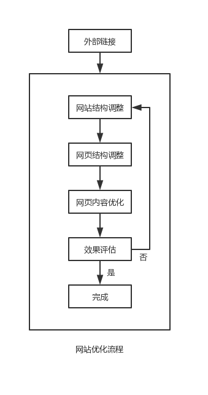
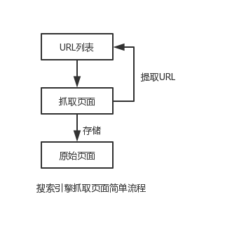
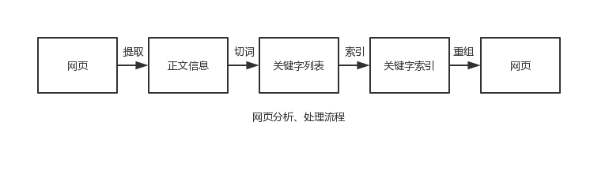

# 初探 SEO

## 初探 SEO

### SEO 的基本概念

> 搜索引擎优化（英语：search engine optimization，缩写为SEO），是一种透过了解搜索引擎的运作规则来调整网站，以及提高目的网站在有关搜索引擎内排名的方式

> 一般的可以理解为，通过了解谷歌/百度搜索引擎规则，从而提高网站在某些关键字下的排名，提高网站访问量

### SEO 优缺点

> 成本较低。从某个角度上看，SEO 是一种"免费"的搜索引擎营销方式。对个人网站来说，只要站长掌握一定的搜索引擎优化技术即可。而对于企业来说，成本主要来自于从引擎优化员工的薪酬或雇用专业搜索引擎优化公司所花的费用

> 持久性。一般情况下，采用正规方法优化的网站，排名效果会比较稳定。除非搜索算法发生重大的改变或强大的竞争对手后来居上，否则不会有太大的变化

### SEO 应用领域

- 企业网站

> 企业网站通过优化后，大大增加了向目标客户展示产品或者服务的机会，从而增强企业的影响力，提升品牌知名度

- 电子商务型网站

> 电子商务类网站经过优化后可以通过搜索引擎向更多的潜在消费者推销自身的产品，从而节省巨额的广告费用，提高产品销量

- 内容型网站

> 资讯内容类网站经过优化后，可以大大提高网站的流量，从而进一步蚕食强大的竞争对手的市场，最终后来居上，成为行业领先者

### SEO 主要工作

- SEO 的主要工作可以分为内部优化与外部优化

> 内部优化：从网站内部出发，对网站的基本要素（如网站结构、页面结构、关键字分布等）进行适当的调整，如果经过调整后，网站在搜索引擎中的表现达到了我们预期的效果，则内部优化工作就基本完成；否则，需要反复地对网站进行调整，直至达到预期效果为止

> 外部优化：主要围绕增强外部链接关系而展开的，此项工作必须贯彻优化的全过程。常用于增加外部链接的方法包括交换友情链接、登录分类目录、发布链接诱饵等

### SEO 宗旨

> SEO 工作应该以用户为中心，围绕提高用户体验、完善网站功能而进行，不能为了优化而优化

## 搜索引擎工作原理

> 搜索引擎优化的主要任务之一就是提高网站的搜索引擎友好性，因此，搜索引擎优化的每个环节都与搜索引擎存在必然的联系，研究搜索引擎优化实际上是对搜索引擎工作过程的逆向推理。因此，学习搜索引擎优化应该从了解搜索引擎的工作原理开始

> 搜索引擎的主要工作包括：页面收录、页面分析、页面排序及关键字查询

### 页面收录

> 页面收录指搜索引擎通过蜘蛛程序在互联网上抓取页面并进行存储的过程，它为搜索引擎开展各项工作提供了数据支持

- 页面收录流程

> 在互联网中，URL 是每个页面的入口地址，搜索引擎蜘蛛程序就是通过 URL 抓取到页面的。搜索引擎蜘蛛程序从 URL 列表出发，通过 URL 抓取并存储原始页面；同时，提取原始页面中的 URL 资源并加入到 URL 列表中。如此不断地循环，就可以从互联网获取足够多的页面

> 利用搜索引擎提供的网站登录入口，想搜索引擎提交网站域名

> 通过与外部网站建立链接关系，使搜索引擎可以通过外部网站发现我们的网站，从而实现对网站的收录

- 页面收录原理

> 如果把网站页面组成的集合看作是一个有向图，从指定的页面出发，沿着页面中的链接，按照某种特定的策略对网站中的页面进行遍历。不停地从 URL 列表中移出已经访问过的 URL，并存储原始页面，同时提取原始页面中的 URL 信息；再将 URL 分为域名及内部 URL 两大类，同时判断 URL 是否被访问过，将未访问的 URL 加入 URL 列表中。递归地扫描 URL 列表，直至耗尽所有 URL 资源为止。经过这些工作，搜索引擎就可以建立庞大的域名列表、页面 URL 列表并存储足够多的原始页面

- 页面收录方式

> 在互联网数以亿计的页面中，搜索引擎怎样才能从中抓取到相对重要的页面呢？这就涉及搜索引擎的页面收录方式

> 页面收录方式是指搜索引擎抓取页面时所使用的策略，目的是为了能在互联网中筛选出相对重要的信息

> 搜索引擎收录页面的方式主要有广度优先、深度优先及用户提交三种

> 广度优先：如果把整个网站看作是一棵树，首页就是根，每个页面就是叶子。广度优先是一种横向的页面抓取方式，先从树的较浅层开始抓取页面，直至抓取完同层次的所有页面后才进入下一层

> 深度优先：与广度优先抓取方式相反，深度优先首先跟踪浅层页面中的某一链接逐步抓取深层页面，直至抓取完最深的页面后才返回浅层页面再跟踪其另一链接，继续向深层页面抓取，这是一种纵向的页面抓取方式

> 用户提交：为了抓取更多的网页，搜索引擎还允许网站管理员主动提交页面。网站管理员只需要把网站中页面 URL 按照指定的格式制作成文件，提交给搜索引擎，搜索引擎即可通过该文件对网站中的页面进行抓取及更新

- 如何避免重复性收录

> 在互联网中，信息的重复是在所难免的。搜索引擎怎样识别重复信息呢？怎样判断哪些网页的信息是原创的，哪些是“复制”的？又会认为哪些重复的信息是有价值的，哪些又是可以舍弃的？

> 在网站中，重复信息主要包括转载内容及镜像内容两大类

> 转载页面：通过将网页正文内容划分，进行比对，判断相识度，确定互为转载关系后，再结合搜索引擎的抓取存储时间、页面权重等因素判断页面是否是原创页面还是转载页面

> 镜像页面：与转载页面判别类似

> 镜像网站：指两个内容完全相同的网站，形成镜像网站主要有两种情况，第一种是多个域名或 IP 指向同一服务器的同一个物理目录；另一个整个网站内容被复制到使用不同域名或者IP服务器上

> 转载页面、镜像页面、镜像网站，综合多项因素（网站权重值、建立时间）等因素，可能只收录极少页面，甚至不收录页面

### 页面分析

> 页面分析首先是对原始页面建立索引，实现对页面的快速定位；然后，提取页面的正文信息，并对正文信息进行切词以及为这些词（即关键字）建立索引，从而得到页面与关键字的对应关系；最后，对关键字进行重组，并建立关键字与网页相对于的反向索引列表，从而能够根据关键字快速定位至相应网页

### 页面排序

> 搜索引擎结合页面的内外部因素计算出页面与某个关键字的相关程度，从而得到与该关键字相关的页面排序列表

### 关键字查询

> 搜索引擎接收来自用户的查询请求，并对查询信息进行切词及匹配后，再向用户返回相应的页面排序列表

## 关键字

### 关键字介绍

### 关键字词频

### 关键字密度

### 关键字分布及表现形式

### 关键字策略

## URL 优化

## 代码优化

## 网页结构

## 网站结构

## 搜索引擎优化工具