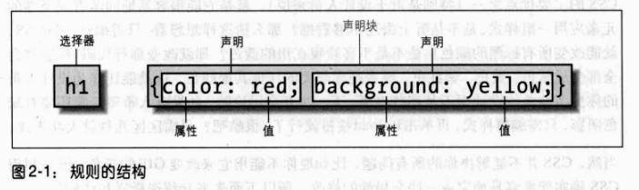

# CSS 选择器

## 基本规则

> 通过 CSS 可以向文档中的一组元素类型应用某些规则

> 利用 CSS，可以创建易于修改和编辑的规则，且能很容易地将其应用到定义的所有文本元素

### 规则结构

> 每个规则都有两个基本部分：选择器和声明块；声明块由一个或多个声明组成；每个声明则是一个属性-值对

> 每个样式表由一系列规则组成



> 如规则左边所示，选择器

## 选择器

## 通配选择器

```css
* {color: red;}
```

## 类选择器

```css
*.warning {font-weight: bold;}
p.warning {font-weight: bold;}
.warning {font-weight: bold;}
```

> 多类选择器

```css
.warning {font-weight: bold;}
.urgent {font-style: italic;}
.warning.urgent {background: silver;}
```

## ID 选择器

```css
*#first-para {font-weight: bold;}
#first-para {font-weight: bold;}
```

## 属性选择器

> 简单属性选择

```html
<h1 class="hoopla">Hello</h1>
<h1 class="severe">Serenity</h1>
<h1 class="fancy">Fooling</h1>
```

```css
h1[class] {color: silver;}
```

```css
img[alt] {border: 3px solid red;} /*对所有带有 alt 属性的图像应用样式*/
*[title] {font-weight: bold;} /*包含标题(title)信息的所有元素变为粗体显示*/
```

> 根据具体属性值选择

```css
/*将指向 Web 服务器上某个特定超链接变成粗体*/
a[href="https://blog.maplemark.cn"] {font-weight: bold;}
```

```html
<planet>Venus</planet>
<planet moons="1">Earth</planet>
<planet moons="2">Mars</planet>
```
```css
/*将第二个元素文本变成粗体*/
planet[moons="1"] {
    font-weight: bold;
}
```

> 根据部分属性值选择

```css
img[title~="Figure"] {border: 1px solid gray;}
```

子串匹配属性选择器

|类型|描述|
|-|-|
|[foo^="bar"]|选择 foo 属性值以"bar"开头的所有元素|
|[foo$="bar"]|选择 foo 属性值以"bar"结尾的所有元素|
|[foo*="bar"]|选择 foo 属性值中包含子串"bar"的所有元素|

> 特定属性选择类型

```html
<h1 lang="en">Hello!</h1>
<p lang="en-us">Greetings!</p>
<div lang="en-au">G'day!</div>
<p lang="fr">Bonjour!</p>
<h4 lang="cy-en">Jrooana!</h4>
```

```css
*[lang|="en"] {color: white;}
```