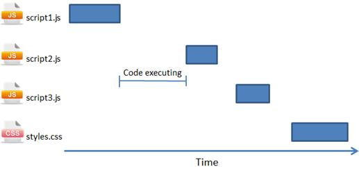

# JavaScript 的性能优化：加载和执行

## 概述

无论当前 JavaScript 代码是内嵌还是在外链文件中，页面的下载和渲染都必须停下来等待脚本执行完成。JavaScript 执行过程耗时越久，浏览器等待响应用户输入的时间就越长。浏览器在下载和执行脚本时出现阻塞的原因在于，脚本可能会改变页面或 JavaScript 的命名空间，它们对后面页面内容造成影响。一个典型的例子就是在页面中使用document.write()。例如清单 1

清单 1 JavaScript 代码内嵌示例
```html
<html>
<head>
    <title>Source Example</title>
</head>
<body>
    <p>
    <script type="text/javascript">
        document.write("Today is " + (new Date()).toDateString());
    </script>
    </p>
</body>
</html>
```

当浏览器遇到`<script>`标签时，当前 HTML 页面无从获知 JavaScript 是否会向`<p>`标签添加内容，或引入其他元素，或甚至移除该标签。因此，这时浏览器会停止处理页面，先执行 JavaScript代码，然后再继续解析和渲染页面。同样的情况也发生在使用 src 属性加载 JavaScript的过程中，浏览器必须先花时间下载外链文件中的代码，然后解析并执行它。在这个过程中，页面渲染和用户交互完全被阻塞了。

## 脚本位置

HTML 4 规范指出`<script>`标签可以放在 HTML 文档的`<head>`或`<body>`中，并允许出现多次。Web 开发人员一般习惯在`<head>`中加载外链的 JavaScript，接着用`<link>`标签用来加载外链的 CSS 文件或者其他页面信息。例如清单 2

清单 2 低效率脚本位置示例
```html
<html>
<head>
    <title>Source Example</title>
    <script type="text/javascript" src="script1.js"></script>
    <script type="text/javascript" src="script2.js"></script>
    <script type="text/javascript" src="script3.js"></script>
    <link rel="stylesheet" type="text/css" href="styles.css">
</head>
<body>
    <p>Hello world!</p>
</body>
</html>
```

然而这种常规的做法却隐藏着严重的性能问题。在清单 2 的示例中，当浏览器解析到 `<script>` 标签（第 4 行）时，浏览器会停止解析其后的内容，而优先下载脚本文件，并执行其中的代码，这意味着，其后的 styles.css 样式文件和`<body>`标签都无法被加载，由于`<body>`标签无法被加载，那么页面自然就无法渲染了。因此在该 JavaScript 代码完全执行完之前，页面都是一片空白。图 1 描述了页面加载过程中脚本和样式文件的下载过程。

图1 JavaScript 文件的加载和执行阻塞其他文件的下载


我们可以发现一个有趣的现象：第一个 JavaScript 文件开始下载，与此同时阻塞了页面其他文件的下载。此外，从 script1.js 下载完成到 script2.js 开始下载前存在一个延时，这段时间正好是 script1.js 文件的执行过程。每个文件必须等到前一个文件下载并执行完成才会开始下载。在这些文件逐个下载过程中，用户看到的是一片空白的页面。

从 IE 8、Firefox 3.5、Safari 4 和 Chrome 2 开始都允许并行下载 JavaScript 文件。这是个好消息，因为`<script>`标签在下载外部资源时不会阻塞其他`<script>`标签。遗憾的是，JavaScript 下载过程仍然会阻塞其他资源的下载，比如样式文件和图片。尽管脚本的下载过程不会互相影响，但页面仍然必须等待所有 JavaScript 代码下载并执行完成才能继续。因此，尽管最新的浏览器通过允许并行下载提高了性能，但问题尚未完全解决，脚本阻塞仍然是一个问题。

由于脚本会阻塞页面其他资源的下载，因此推荐将所有`<script>`标签尽可能放到`<body>`标签的底部，以尽量减少对整个页面下载的影响。例如清单 3

清单 3 推荐的代码放置位置示例
```html
<html>
<head>
    <title>Source Example</title>
    <link rel="stylesheet" type="text/css" href="styles.css">
</head>
<body>
    <p>Hello world!</p>
 
    <!-- Example of efficient script positioning -->
    <script type="text/javascript" src="script1.js"></script>
    <script type="text/javascript" src="script2.js"></script>
    <script type="text/javascript" src="script3.js"></script>
</body>
</html>
```

这段代码展示了在 HTML 文档中放置`<script>`标签的推荐位置。尽管脚本下载会阻塞另一个脚本，但是页面的大部分内容都已经下载完成并显示给了用户，因此页面下载不会显得太慢。这是优化 JavaScript 的首要规则：将脚本放在底部。

## 组织脚本

由于每个`<script>`标签初始下载时都会阻塞页面渲染，所以减少页面包含的`<script>`标签数量有助于改善这一情况。这不仅针对外链脚本，内嵌脚本的数量同样也要限制。浏览器在解析 HTML 页面的过程中每遇到一个`<script>`标签，都会因执行脚本而导致一定的延时，因此最小化延迟时间将会明显改善页面的总体性能。

这个问题在处理外链 JavaScript 文件时略有不同。考虑到 HTTP 请求会带来额外的性能开销，因此下载单个 100Kb 的文件将比下载 5 个 20Kb 的文件更快。也就是说，减少页面中外链脚本的数量将会改善性能。

通常一个大型网站或应用需要依赖数个 JavaScript 文件。您可以把多个文件合并成一个，这样只需要引用一个`<script>`标签，就可以减少性能消耗。文件合并的工作可通过离线的打包工具或者一些实时的在线服务来实现。

需要特别提醒的是，把一段内嵌脚本放在引用外链样式表的`<link>`之后会导致页面阻塞去等待样式表的下载。这样做是为了确保内嵌脚本在执行时能获得最精确的样式信息。因此，建议不要把内嵌脚本紧跟在`<link>`标签后面。

## 无阻塞的脚本

减少 JavaScript 文件大小并限制 HTTP 请求数在功能丰富的 Web 应用或大型网站上并不总是可行。Web 应用的功能越丰富，所需要的 JavaScript 代码就越多，尽管下载单个较大的 JavaScript 文件只产生一次 HTTP 请求，却会锁死浏览器的一大段时间。为避免这种情况，需要通过一些特定的技术向页面中逐步加载 JavaScript 文件，这样做在某种程度上来说不会阻塞浏览器。

无阻塞脚本的秘诀在于，在页面加载完成后才加载 JavaScript 代码。这就意味着在 window 对象的 onload事件触发后再下载脚本。有多种方式可以实现这一效果。

### 延迟加载脚本

HTML 4 为`<script>`标签定义了一个扩展属性：defer。Defer 属性指明本元素所含的脚本不会修改 DOM，因此代码能安全地延迟执行。defer 属性只被 IE 4 和 Firefox 3.5 更高版本的浏览器所支持，所以它不是一个理想的跨浏览器解决方案。在其他浏览器中，defer 属性会被直接忽略，因此`<script>`标签会以默认的方式处理，也就是说会造成阻塞。然而，如果您的目标浏览器支持的话，这仍然是个有用的解决方案。清单 4 是一个例子

清单 4 defer 属性使用方法示例
```html
<script type="text/javascript" src="script1.js" defer></script>
```

带有 defer 属性的`<script>`标签可以放置在文档的任何位置。对应的 JavaScript 文件将在页面解析到`<script>`标签时开始下载，但不会执行，直到 DOM 加载完成，即onload事件触发前才会被执行。当一个带有 defer 属性的 JavaScript 文件下载时，它不会阻塞浏览器的其他进程，因此这类文件可以与其他资源文件一起并行下载。

任何带有 defer 属性的`<script>`元素在 DOM 完成加载之前都不会被执行，无论内嵌或者是外链脚本都是如此。清单 5 的例子展示了defer属性如何影响脚本行为：

清单 5 defer 属性对脚本行为的影响
```html
<html>
<head>
    <title>Script Defer Example</title>
</head>
<body>
    <script type="text/javascript" defer>
        alert("defer");
    </script>
    <script type="text/javascript">
        alert("script");
    </script>
    <script type="text/javascript">
        window.onload = function(){
            alert("load");
        };
    </script>
</body>
</html>
```

这段代码在页面处理过程中弹出三次对话框。不支持 defer 属性的浏览器的弹出顺序是：“defer”、“script”、“load”。而在支持 defer 属性的浏览器上，弹出的顺序则是：“script”、“defer”、“load”。请注意，带有 defer 属性的`<script>`元素不是跟在第二个后面执行，而是在 onload 事件被触发前被调用。

如果您的目标浏览器只包括 Internet Explorer 和 Firefox 3.5，那么 defer 脚本确实有用。如果您需要支持跨领域的多种浏览器，那么还有更一致的实现方式。

HTML 5 为`<script>`标签定义了一个新的扩展属性：async。它的作用和 defer 一样，能够异步地加载和执行脚本，不因为加载脚本而阻塞页面的加载。但是有一点需要注意，在有 async 的情况下，JavaScript 脚本一旦下载好了就会执行，所以很有可能不是按照原本的顺序来执行的。如果 JavaScript 脚本前后有依赖性，使用 async 就很有可能出现错误。

### 动态脚本元素

文档对象模型（DOM）允许您使用 JavaScript 动态创建 HTML 的几乎全部文档内容。`<script>`元素与页面其他元素一样，可以非常容易地通过标准 DOM 函数创建：

清单 6 通过标准 DOM 函数创建`<script>`元素

```javascript
var script = document.createElement ("script");
   script.type = "text/javascript";
   script.src = "script1.js";
   document.getElementsByTagName("head")[0].appendChild(script);
```

新的`<script>`元素加载 script1.js 源文件。此文件当元素添加到页面之后立刻开始下载。此技术的重点在于：无论在何处启动下载，文件的下载和运行都不会阻塞其他页面处理过程。您甚至可以将这些代码放在`<head>`部分而不会对其余部分的页面代码造成影响（除了用于下载文件的 HTTP 连接）。

当文件使用动态脚本节点下载时，返回的代码通常立即执行（除了 Firefox 和 Opera，他们将等待此前的所有动态脚本节点执行完毕）。当脚本是“自运行”类型时，这一机制运行正常，但是如果脚本只包含供页面其他脚本调用调用的接口，则会带来问题。这种情况下，您需要跟踪脚本下载完成并是否准备妥善。可以使用动态 `<script>` 节点发出事件得到相关信息。

Firefox、Opera, Chorme 和 Safari 3+会在`<script>`节点接收完成之后发出一个 onload 事件。您可以监听这一事件，以得到脚本准备好的通知：

清单 7 通过监听 onload 事件加载 JavaScript 脚本

```javascript
var script = document.createElement ("script")
script.type = "text/javascript";
 
//Firefox, Opera, Chrome, Safari 3+
script.onload = function(){
    alert("Script loaded!");
};
 
script.src = "script1.js";
document.getElementsByTagName("head")[0].appendChild(script);
```

Internet Explorer 支持另一种实现方式，它发出一个 readystatechange 事件。`<script>`元素有一个 readyState 属性，它的值随着下载外部文件的过程而改变。readyState 有五种取值：

- “uninitialized”：默认状态
- “loading”：下载开始
- “loaded”：下载完成
- “interactive”：下载完成但尚不可用
- “complete”：所有数据已经准备好

微软文档上说，在`<script>`元素的生命周期中，readyState 的这些取值不一定全部出现，但并没有指出哪些取值总会被用到。实践中，我们最感兴趣的是“loaded”和“complete”状态。Internet Explorer 对这两个 readyState 值所表示的最终状态并不一致，有时`<script>`元素会得到“loader”却从不出现“complete”，但另外一些情况下出现“complete”而用不到“loaded”。最安全的办法就是在 readystatechange 事件中检查这两种状态，并且当其中一种状态出现时，删除 readystatechange 事件句柄（保证事件不会被处理两次）：

清单 8 通过检查 readyState 状态加载 JavaScript 脚本

```javascript
var script = document.createElement("script")
script.type = "text/javascript";
 
//Internet Explorer
script.onreadystatechange = function(){
     if (script.readyState == "loaded" || script.readyState == "complete"){
           script.onreadystatechange = null;
           alert("Script loaded.");
     }
};
 
script.src = "script1.js";
document.getElementsByTagName("head")[0].appendChild(script);
```

大多数情况下，您希望调用一个函数就可以实现 JavaScript 文件的动态加载。下面的函数封装了标准实现和 IE 实现所需的功能：

清单 9 通过函数进行封装
```javascript
function loadScript(url, callback){
    var script = document.createElement ("script")
    script.type = "text/javascript";
    if (script.readyState){ //IE
        script.onreadystatechange = function(){
            if (script.readyState == "loaded" || script.readyState == "complete"){
                script.onreadystatechange = null;
                callback();
            }
        };
    } else { //Others
        script.onload = function(){
            callback();
        };
    }
    script.src = url;
    document.getElementsByTagName("head")[0].appendChild(script);
}
```

此函数接收两个参数：JavaScript 文件的 URL，和一个当 JavaScript 接收完成时触发的回调函数。属性检查用于决定监视哪种事件。最后一步，设置 src 属性，并将`<script>`元素添加至页面。此 loadScript() 函数使用方法如下：

清单 10 loadScript()函数使用方法
```javascript
loadScript("script1.js", function(){
    alert("File is loaded!");
});
```

您可以在页面中动态加载很多 JavaScript 文件，但要注意，浏览器不保证文件加载的顺序。所有主流浏览器之中，只有 Firefox 和 Opera 保证脚本按照您指定的顺序执行。其他浏览器将按照服务器返回它们的次序下载并运行不同的代码文件。您可以将下载操作串联在一起以保证他们的次序，如下：

清单 11 通过 loadScript()函数加载多个 JavaScript 脚本
```javascript
loadScript("script1.js", function(){
    loadScript("script2.js", function(){
        loadScript("script3.js", function(){
            alert("All files are loaded!");
        });
    });
});
```

此代码等待 script1.js 可用之后才开始加载 script2.js，等 script2.js 可用之后才开始加载 script3.js。虽然此方法可行，但如果要下载和执行的文件很多，还是有些麻烦。如果多个文件的次序十分重要，更好的办法是将这些文件按照正确的次序连接成一个文件。独立文件可以一次性下载所有代码（由于这是异步进行的，使用一个大文件并没有什么损失）。

动态脚本加载是非阻塞 JavaScript 下载中最常用的模式，因为它可以跨浏览器，而且简单易用。

### 使用 XMLHttpRequest(XHR)对象

此技术首先创建一个 XHR 对象，然后下载 JavaScript 文件，接着用一个动态 `<script>` 元素将 JavaScript 代码注入页面。清单 12 是一个简单的例子：

清单 12 通过 XHR 对象加载 JavaScript 脚本

```javascript
var xhr = new XMLHttpRequest();
xhr.open("get", "script1.js", true);
xhr.onreadystatechange = function(){
    if (xhr.readyState == 4){
        if (xhr.status >= 200 && xhr.status < 300 || xhr.status == 304){
            var script = document.createElement ("script");
            script.type = "text/javascript";
            script.text = xhr.responseText;
            document.body.appendChild(script);
        }
    }
};
xhr.send(null);
```

此代码向服务器发送一个获取 script1.js 文件的 GET 请求。onreadystatechange 事件处理函数检查 readyState 是不是 4，然后检查 HTTP 状态码是不是有效（2XX 表示有效的回应，304 表示一个缓存响应）。如果收到了一个有效的响应，那么就创建一个新的`<script>`元素，将它的文本属性设置为从服务器接收到的 responseText 字符串。这样做实际上会创建一个带有内联代码的`<script>`元素。一旦新`<script>`元素被添加到文档，代码将被执行，并准备使用。

这种方法的主要优点是，您可以下载不立即执行的 JavaScript 代码。由于代码返回在`<script>`标签之外（换句话说不受`<script>`标签约束），它下载后不会自动执行，这使得您可以推迟执行，直到一切都准备好了。另一个优点是，同样的代码在所有现代浏览器中都不会引发异常。

此方法最主要的限制是：JavaScript 文件必须与页面放置在同一个域内，不能从 CDN 下载（CDN 指"内容投递网络（Content Delivery Network）"，所以大型网页通常不采用 XHR 脚本注入技术。

## 总结

减少 JavaScript 对性能的影响有以下几种方法：

将所有的`<script>`标签放到页面底部，也就是`</body>`闭合标签之前，这能确保在脚本执行前页面已经完成了渲染。
尽可能地合并脚本。页面中的`<script>`标签越少，加载也就越快，响应也越迅速。无论是外链脚本还是内嵌脚本都是如此。

采用无阻塞下载 JavaScript 脚本的方法：

- 使用`<script>`标签的 defer 属性（仅适用于 IE 和 Firefox 3.5 以上版本）；
- 使用动态创建的`<script>`元素来下载并执行代码；
- 使用 XHR 对象下载 JavaScript 代码并注入页面中。

通过以上策略，可以在很大程度上提高那些需要使用大量 JavaScript 的 Web 网站和应用的实际性能。

> 本文转载自 IBM Developer，[《JavaScript 的性能优化：加载和执行》](https://www.ibm.com/developerworks/cn/web/1308_caiys_jsload/)