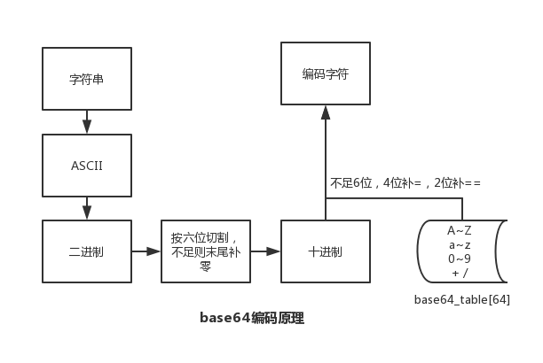
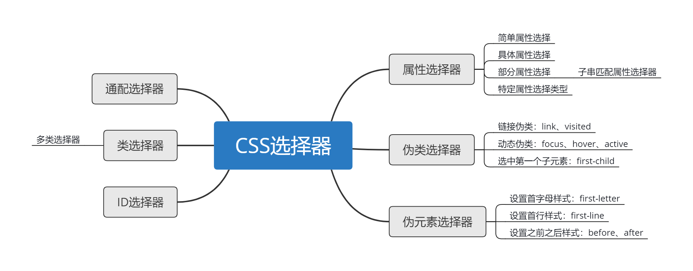

# 问题与简答

## 网络协议

### 计算机网络体系结构


- 五层协议各层作用

> 应用层: 应用进程间通信和交互的规则

> 运输层: 两台主机中进程之间的通信提供通用的数据传输服务

> 网络层：报文段或用户数据报封装成分组或包进行传送

> 数据链路层：将 IP 数据报组装成帧，并在相邻节点间的链路上传送

> 物理层：传送比特数据

### UDP 的主要特点

> UDP 是无连接的

> UDP 最大努力交付，不保证可靠交付，主机不需要维持复杂的链接状态

> UDP 是面向报文的

> UDP 没有拥塞控制，网络出现拥塞不会使源主机的发送速率降低（对实时应用很有用，如 直播，实时视频会议等）

> UDP 支持一对一、一对多、多对一和多对多的交互通信

> UDP 的首部开销小，只有8个字节，比 TCP 的20个字节的首部要短

### TCP 的主要特点

> TCP 是面向连接的。（就好像打电话一样，通话前需要先拨号建立连接，通话结束后要挂机释放连接）

> 每一条 TCP 连接只能有两个端点，每一条 TCP 连接只能是点对点的（一对一）

> TCP 提供可靠交付的服务。通过 TCP 连接传送的数据，无差错、不丢失、不重复、并且按序到达

> TCP 提供全双工通信。TCP 允许通信双方的应用进程在任何时候都能发送数据。TCP 连接的两端都设有发送缓存和接收缓存，用来临时存放双方通信的数据

> 面向字节流。TCP 中的“流”（Stream）指的是流入进程或从进程流出的字节序列。“面向字节流”的含义是：虽然应用程序和 TCP 的交互是一次一个数据块（大小不等），但 TCP 把应用程序交下来的数据仅仅看成是一连串的无结构的字节流

### 如何让不可靠的 UDP 可靠(了解)

> [拓展阅读](./01.网络协议/01.怎么让不可靠的UDP可靠.md)

### TCP 握手三次，断开四次，TIME-WAIT

- 为什么要三次握手

> 三次握手的目的是建立可靠的通信信道，说到通讯，简单来说就是数据的发送与接收，而三次握手最主要的目的就是双方确认自己与对方的发送与接收是正常的


- 为什么要传回 SYN

> 接收端传回发送端所发送的 SYN 是为了告诉发送端，我接收到的信息确实就是你所发送的信号了

- 传了 SYN,为啥还要传 ACK

> 双方通信无误必须是两者互相发送信息都无误。传了 SYN，证明发送方到接收方的通道没有问题，但是接收方到发送方的通道还需要 ACK 信号来进行验证

- 为什么要四次挥手

> 任何一方都可以在数据传送结束后发出连接释放的通知，待对方确认后进入半关闭状态。当另一方也没有数据再发送的时候，则发出连接释放通知，对方确认后就完全关闭了TCP连接


- 为什么客户端最后还要等待2MSL

> 保证客户端发送的最后一个ACK报文能够到达服务器，因为这个ACK报文可能丢失

> 防止类似与“三次握手”中提到了的“已经失效的连接请求报文段”出现在本连接中

### TCP 粘包如何解决

- 粘包的原因

> 发送方引起粘包是由 TCP 协议本身造成的，TCP 为提高传输效率，发送方往往要收集到足够多的数据后才发送一包数据。若连续几次发送的数据都很少，通常 TCP 会根据优化算法把这些数据合成一包后一次发送出去，这样接收方就收到了粘包数据

> 接收方引起的粘包是由于接收方用户进程不及时接收数据，从而导致粘包现象。这是因为接收方先把收到的数据放在系统接收缓冲区，用户进程从该缓冲区取数据，若下一包数据到达时前一包数据尚未被用户进程取走，则下一包数据放到系统接收缓冲区时就接到前一包数据之后，而用户进程根据预先设定的缓冲区大小从系统接收缓冲区取数据，这样就一次取到了多包数据

- 粘包解决 — 封包

> 封包就是给一段数据加上包头,这样一来数据包就分为包头和包体两部分内容了。包头其实上是个大小固定的结构体，其中有个结构体成员变量表示包体的长度，这是个很重要的变量，其他的结构体成员可根据需要自己定义。根据包头长度固定以及包头中含有包体长度的变量就能正确的拆分出一个完整的数据包

### UDP、TCP 区别，适用场景

|对比项|UDP|TCP|
|-|-|-|
|连接性|无连接|面向连接|
|可靠性|不可靠|可靠|
|效率|传输效率高|传输效率低|
|报文|面向报文-数据报模式|面向字节流-流模式|
|双工性|一对一、一对多、多对一、多对多|全双工|
|流量控制|无|有(滑动窗口)|
|拥塞控制|无|有(慢开始、拥塞避免、快重传、快恢复)|
|传输速度|快|慢|
|资源要求|较少|较多|
|首部开销|8字节|20字节|
|数据顺序|不保证|保证|

- UDP 适用场景

> 面向数据报方式

> 网络数据大多为短消息

> 拥有大量 Client

> 对数据安全性无特殊要求

> 网络负担非常重，但对响应速度要求高

- TCP 适用场景

> 文件传输(FTP HTTP 对数据准确性要求较高，速度可以相对慢)

> 发送或接收邮件(POP IMAP SMTP 对数据准确性要求高，非紧急应用)

> 远程登录(telnet SSH 对数据准确性有要求，有连接的概念)

### 建立 socket 需要哪些步骤

### TCP socket 和 UNIX socket 区别

### 本地 socket 与 网络 socket

### socket 如何实现多进程之间通信的

### HTTP 状态码

- 状态码类别

|状态码|响应类别|原因短语|
|-|-|-|
|1XX|信息性状态码(Informational)|服务器正在处理请求|
|2XX|成功状态码(Success)|请求已正常处理完毕|
|3XX|重定向状态码(Redirection)|需要进行额外操作以完成请求|
|4XX|客户端错误状态码(Client Error)|客户端原因导致服务器无法处理请求|
|5XX|服务器错误状态码(Server Error)|服务器原因导致处理请求出错|

- 常见状态码

|状态码|Message|备注|
|-|-|-|
|200|OK|
|204|Not Content|不包含实体部分|
|206|Partial Content|范围请求|
|301|Moved Permanently|永久重定向|
|302|Found|临时重定向|
|303|See Other|
|304|Not Modified|
|307|Temporary Redirect|临时重定向|
|400|Bad Request|请求报文存在语法错误|
|401|Unauthorized|
|403|Forbidden|访问被服务器拒绝|
|404|Not Found|
|500|Internal Server Error|
|502|Bad Gateway|
|503|Server Unavailable|
|504|Gateway Timeout|

- 错误原因

### HTTP 请求报文构成

> 方法、URI、协议版本、请求首部字段、内容实体

### HTTP 响应报文构成

> 协议版本、状态码、状态码的原因短语、响应首部字段

### GET 与 POST 请求方式区别

|GET|POST|
|-|-|
|后退按钮/刷新无害|数据会被重新提交|
|数据长度限制/URL长度2048字符|长度无限制|
|数据可见/安全性差|不可见/更安全|
|可以被缓存|不可以被缓存|
|书签可收藏|书签不可收藏|

### HTTP 优缺点

> 基于应用级的接口，使用方便

> 传输速度慢，数据包大；如实现实时交互，服务器性能压力大；数据传输安全性差

### HTTPS 通信原理


### HTTP 2.0

> 多路复用、客户端拉拽/服务器推送、流量控制、WebSocket

### DNS 主要作用是什么

> 将主机名称转换为 IP 地址

### IPv6 与 IPv4 有什么变化

> 更大的地址空间、扩展的地址层次结构、灵活的首部格式、改进的选项、允许协议继续扩充、支持资源的预分配

### 为什么是心跳机制

> 心跳机制是定时发送一个自定义的结构体(心跳包)，让对方知道自己还活着，以确保连接的有效性的机制

### 什么是长连接

> 长连接，指在一个连接上可以连续发送多个数据包，在连接保持期间，如果没有数据包发送，需要双方发链路检测包

### epoll

> epoll 是 Linux 内核为处理大批量文件描述符而作了改进的 poll，是 Linux 下多路复用 IO 接口 select/poll 的增强版本，它能显著提高程序在大量并发连接中只有少量活跃的情况下的系统 CPU 利用率

### 拓展资料

> [TCP的三次握手与四次挥手](./01.网络协议/02.TCP的三次握手与四次挥手.md)

## 数据结构与算法

### 衡量、比较算法优劣的指标

> 空间复杂度S(n)、时间复杂度T(n)

### 链表有哪些

> 单向链表、双向链表、循环链表

### 线性结构

- 线性表

> 线性表是由同一类型的数据元素构成的有序序列的线性结构

> 实现方式: 线性存储、链式存储

- 堆栈

> 堆栈可以认为是具有一定约束的线性表，插入和删除操作都作用在一个称为栈顶的端点位置

- 队列

> 队列是一个有序线性表，但队列的插入和删除是分别在线性表的两个不同端点进行的

### 树

- 查找

> 顺序查找、二分查找

- 二叉树

- 二叉搜索树

- 平衡二叉树

### 散列查找

- 散列表

- 散列函数的构造方法

> 数字型关键字、字符串关键字

- 处理冲突的方法

> 开放地址法、链地址法

### 排序

- 选择排序

> 简单选择排序、堆排序

- 插入排序

> 简单插入排序、希尔排序

- 交换排序

> 冒泡排序、快速排序

- 归并排序

- 基数排序

> 桶排序、基数排序

### 其他

- KPM

- 布隆过滤器

- 贪心算法

- 回溯算法

- 动态规划

- 最小生成树

- 最短路径

- 推荐算法

- 深度优先、广度优先

## PHP

### echo、print、print_r、var_dump 的区别

> echo：输出一个或多个字符串

> print：输出字符串

> print_r：打印关于变量的易于理解的信息

> var_dump：打印关于变量的易于理解的信息(带类型)

### 单引号和双引号的区别

> 双引号可以被分析器解析，单引号则不行

### isset 和 empty 的区别

> isset：检测变量是否已设置并且非 NULL

> empty：判断变量是否为空，变量为 0/false 也会被认为是空；变量不存在，不会产生警告

### static、self、$this 的区别

> static：static 可以用于静态或非静态方法中，也可以访问类的静态属性、静态方法、常量和非静态方法，但不能访问非静态属性

> self：可以用于访问类的静态属性、静态方法和常量，但 self 指向的是当前定义所在的类，这是 self 的限制

> $this：指向的是实际调用时的对象，也就是说，实际运行过程中，谁调用了类的属性或方法，$this 指向的就是哪个对象。但 $this 不能访问类的静态属性和常量，且 $this 不能存在于静态方法中

### include、require、include_once、require_once 的区别

> require 和 include 几乎完全一样，除了处理失败的方式不同之外。require 在出错时产生 E_COMPILE_ERROR 级别的错误。换句话说将导致脚本中止而 include 只产生警告（E_WARNING），脚本会继续运行

> include_once 语句在脚本执行期间包含并运行指定文件。此行为和 include 语句类似，唯一区别是如果该文件中已经被包含过，则不会再次包含。如同此语句名字暗示的那样，只会包含一次

### 数组处理函数

### Cookie 和 Session

> Cookie：PHP 透明的支持 HTTP cookie 。cookie 是一种远程浏览器端存储数据并以此来跟踪和识别用户的机制

> Session：会话机制(Session)在 PHP 中用于保持用户连续访问Web应用时的相关数据

### 预定义变量

> 对于全部脚本而言，PHP 提供了大量的预定义变量

```text
超全局变量 — 超全局变量是在全部作用域中始终可用的内置变量
$GLOBALS — 引用全局作用域中可用的全部变量
$_SERVER — 服务器和执行环境信息
$_GET — HTTP GET 变量
$_POST — HTTP POST 变量
$_FILES — HTTP 文件上传变量
$_REQUEST — HTTP Request 变量
$_SESSION — Session 变量
$_ENV — 环境变量
$_COOKIE — HTTP Cookies
$php_errormsg — 前一个错误信息
$HTTP_RAW_POST_DATA — 原生POST数据
$http_response_header — HTTP 响应头
$argc — 传递给脚本的参数数目
$argv — 传递给脚本的参数数组
```

- 超全局变量

> PHP 中的许多预定义变量都是“超全局的”，这意味着它们在一个脚本的全部作用域中都可用。在函数或方法中无需执行 global $variable; 就可以访问它们

> 超全局变量：$GLOBALS、$\_SERVER、$\_GET、$\_POST、$\_FILES、$\_COOKIE、$\_SESSION、$\_REQUEST、$\_ENV

### 传值和传引用的区别

> 传值导致对象生成了一个拷贝，传引用则可以用两个变量指向同一个内容

### 构造函数和析构函数

> 构造函数：PHP 5 允行开发者在一个类中定义一个方法作为构造函数。具有构造函数的类会在每次创建新对象时先调用此方法，所以非常适合在使用对象之前做一些初始化工作

> 析构函数：PHP 5 引入了析构函数的概念，这类似于其它面向对象的语言，如 C++。析构函数会在到某个对象的所有引用都被删除或者当对象被显式销毁时执行

### 魔术方法

> \_\_construct()， \_\_destruct()， \_\_call()， \_\_callStatic()， \_\_get()， \_\_set()， \_\_isset()， \_\_unset()， \_\_sleep()， \_\_wakeup()， \_\_toString()， \_\_invoke() 等方法在 PHP 中被称为"魔术方法"（Magic methods）

### public、protected、private、final 区别

> 对属性或方法的访问控制，是通过在前面添加关键字 public（公有），protected（受保护）或 private（私有）来实现的。被定义为公有的类成员可以在任何地方被访问

> PHP 5 新增了一个 final 关键字。如果父类中的方法被声明为 final，则子类无法覆盖该方法。如果一个类被声明为 final，则不能被继承

### 客户端/服务端 IP 获取，了解代理透传 实际IP 的概念

> 客户端IP: $\_SERVER['REMOTE_ADDR']

> 服务端IP: $\_SERVER['SERVER_ADDR']

> 客户端IP(代理透传): $\_SERVER['HTTP_X_FORWARDED_FOR']

### 类的静态调用和实例化调用

### PHP 不实例化调用方法

> 使用 PHP 反射方式

### php.ini 配置选项，ini_set 动态设置

- 配置选项列表

|名字|默认|备注|
|-|-|-|
|error_log|NULL|设置脚本错误将被记录到的文件|
|max_execution_time|30|最大执行时间|

- 动态设置

```php
ini_set(string $varname , string $newvalue);
```

### 如何返回一个301重定向

```php
header('HTTP/1.1 301 Moved Permanently');
header('Location: https://blog.maplemark.cn');
```

### PHP 与 MySQL 连接方式

- MySQL
```php
$conn = mysql_connect('127.0.0.1:3306', 'root', '123456');
if (!$conn) die(mysql_error() . "\n");
mysql_query("SET NAMES 'utf8'");
$select_db = mysql_select_db('app');
if (!$select_db) die(mysql_error() . "\n");
$sql = "SELECT * FROM `user` LIMIT 1";
$res = mysql_query($sql);
if (!$res) die(mysql_error() . "\n");
while ($row = mysql_fetch_assoc($res)) {
    var_dump($row);
}
mysql_close($conn);
```

- MySQLi
```php
$conn = @new mysqli('127.0.0.1:3306', 'root', '123456');
if ($conn->connect_errno) die($conn->connect_error . "\n");
$conn->query("set names 'utf8';");
$select_db = $conn->select_db('user');
if (!$select_db) die($conn->error . "\n");
$sql = "SELECT * FROM `user` LIMIT 1";
$res = $conn->query($sql);
if (!$res) die($conn->error . "\n");
while ($row = $res->fetch_assoc()) {
    var_dump($row);
}
$res->free();
$conn->close();
```

- PDO
```php
$pdo = new PDO('mysql:host=127.0.0.1:3306;dbname=user', 'root', '123456');
$pdo->exec("set names 'utf8'");
$sql = "SELECT * FROM `user` LIMIT 1";
$stmt = $pdo->prepare($sql);
$stmt->bindValue(1, 1, PDO::PARAM_STR);
$rs = $stmt->execute();
if ($rs) {
    while ($row = $stmt->fetch(PDO::FETCH_ASSOC)) {
        var_dump($row);
    }
}
$pdo = null;
```

### MySQL、MySQLi、PDO 区别

> MySQL：最常用，是过程式风格的一组应用

> MySQLi：是 MySQL 函数的增强改进版，提供过程化和面向对象两种风格的 API，增加了预编译和参数绑定等新的特性

> PDO：从语法上讲，PDO 更接近 MySQLi

### MySQL 连接池

### 代码执行过程

> PHP 代码 => 启动 php 及 zend 引擎，加载注册拓展模块 => 对代码进行词法/语法分析 => 编译成opcode(opcache) => 执行 opcode

> 当前作用域分配内存，充当运行栈，局部变量分配在当前栈，函数调用时压栈，返回时出栈

### base64 编码原理



### ip2long 实现


### MVC 的理解

> MVC 架构中 M 是指数据模型，V 是指用户界面，C 则是控制器；MVC 的思想是模块化分离，为了代码的重用和增强代码的维护性和扩展性出发的，其中 MVC 的实现有一定的思想和原则

### 主流 PHP 框架特点

- Laravel

> Simple, fast routing engine

> Powerful dependency injection container.

> Multiple back-ends for session and cache storage.

> Expressive, intuitive database ORM.

> Database agnostic schema migrations.

> Robust background job processing.

> Real-time event broadcasting.

- Symfony

> Database engine-independent

> Simple to use, in most cases, but still flexible enough to adapt to complex cases

> Based on the premise of convention over configuration--the developer needs to configure only the unconventional

> Compliant with most web best practices and design patterns

> Enterprise-ready--adaptable to existing information technology (IT) policies and architectures, and stable enough for long-term projects

> Very readable code, with phpDocumentor comments, for easy maintenance

> Easy to extend, allowing for integration with other vendor libraries

- CodeIgniter

> https://www.codeigniter.com/userguide3/overview/features.html

- ThinkPHP

> MVC支持-基于多层模型（M）、视图（V）、控制器（C）的设计模式

> ORM支持-提供了全功能和高性能的ORM支持，支持大部分数据库

> 模板引擎支持-内置了高性能的基于标签库和XML标签的编译型模板引擎

> RESTFul支持-通过REST控制器扩展提供了RESTFul支持，为你打造全新的URL设计和访问体验

> 云平台支持-提供了对新浪SAE平台和百度BAE平台的强力支持，具备“横跨性”和“平滑性”，支持本地化开发和调试以及部署切换，让你轻松过渡，打造全新的开发体验

> CLI支持-支持基于命令行的应用开发

> RPC支持-提供包括PHPRpc、HProse、jsonRPC和Yar在内远程调用解决方案

> MongoDb支持-提供NoSQL的支持

> 缓存支持-提供了包括文件、数据库、Memcache、Xcache、Redis等多种类型的缓存支持

### 对象关系映射/ORM

- 优点

> 缩短编码时间、减少甚至免除对 model 的编码，降低数据库学习成本

> 动态的数据表映射，在表结构发生改变时，减少代码修改

> 可以很方便的引入附加功能(cache 层)

- 缺点

> 映射消耗性能、ORM 对象消耗内存

> SQL 语句较为复杂时，ORM 语法可读性不高(使用原生 SQL)

### 链式调用实现

> 类定义一个内置变量，让类中其他定义方法可访问到

### 异常处理

> set_exception_handler — 设置用户自定义的异常处理函数

> 使用 try / catch 捕获

### 如何实现异步调用

```php
$fp = fsockopen("blog.maplemark.cn", 80, $errno, $errstr, 30);
if (!$fp) {
    echo "$errstr ($errno)<br />\n";
} else {
    $out = "GET /backend.php  / HTTP/1.1\r\n";
    $out .= "Host: blog.maplemark.cn\r\n";
    $out .= "Connection: Close\r\n\r\n";
    fwrite($fp, $out);
    /*忽略执行结果
    while (!feof($fp)) {
        echo fgets($fp, 128);
    }*/
    fclose($fp);
}
```

### 多进程同时写一个文件

> 加锁、队列

### PHP 进程模型，进程通讯方式，进程线程区别

> 消息队列、socket、信号量、共享内存、信号、管道

### PHP 支持回调的函数，实现一个

> array_map、array_filter、array_walk、usort

> is_callable + callbacks + 匿名函数实现

### 发起 HTTP 请求有哪几种方式，它们有何区别

> cURL、file_get_contents、fopen、fsockopen

### php for while foreach 迭代数组时候，哪个效率最高

### 弱类型变量如何实现

> PHP 中声明的变量，在 zend 引擎中都是用结构体 zval 来保存，通过共同体实现弱类型变量声明

### PHP 拓展初始化

- 初始化拓展

```shell
$ php /php-src/ext/ext_skel.php --ext
```

- 定义拓展函数

> zend_module_entry 定义 Extension name 编写 PHP_FUNCTION 函数

- 编译安装

```shell
$ phpize $ ./configure $ make && make install
```

### 如何获取扩展安装路径

### 垃圾回收机制

> 引用计数器

### Trait

> 自 PHP 5.4.0 起，PHP 实现了一种代码复用的方法，称为 trait

### yield 是什么，说个使用场景 yield、yield 核心原理是什么

> 一个生成器函数看起来像一个普通的函数，不同的是普通函数返回一个值，而一个生成器可以yield生成许多它所需要的值

### traits 与 interfaces 区别 及 traits 解决了什么痛点

### 如何 foreach 迭代对象、如何数组化操作对象 $obj[key]、如何函数化对象 $obj(123);

### Swoole 适用场景，协程实现方式

那你知道swoole的进程模型

### PHP 数组底层实现 （HashTable + Linked list）

### Copy on write 原理，何时 GC

### 如何解决 PHP 内存溢出问题

### ZVAL
> https://github.com/xianyunyh/PHP-Interview/blob/master/PHP/PHP-Zval%E7%BB%93%E6%9E%84.md

### HashTable
> https://github.com/xianyunyh/PHP-Interview/blob/master/PHP/PHP7-HashTable.md

### PHP7 新特性

> 标量类型声明、返回值类型声明、通过 define() 定义常量数组、匿名类、相同命名空间类一次性导入

### PHP7 底层优化

> ZVAL 结构体优化，占用由24字节降低为16字节

> 内部类型 zend_string，结构体成员变量采用 char 数组，不是用 char*

> PHP 数组实现由 hashtable 变为 zend array

> 函数调用机制，改进函数调用机制，通过优化参数传递环节，减少了一些指令

> https://github.com/xianyunyh/PHP-Interview/blob/master/PHP/php7.md

### PSR 介绍，PSR-1, 2, 4, 7

### Xhprof 、Xdebug 性能调试工具使用

### 字符串、数字比较大小的原理，注意 0 开头的8进制、0x 开头16进制

### BOM 头是什么，怎么除去

### 模板引擎是什么，解决什么问题、实现原理（Smarty、Twig、Blade）

## Web

### SEO 有哪些需要注意的

> 合理的 title、description、keywords

> 语义化的 HTML 代码，符合 W3C 规范：语义化代码让搜索引擎容易理解网页

> 重要内容 HTML 代码放在最前：搜索引擎抓取 HTML 顺序是从上到下，有的搜索引擎对抓取长度有限制，保证重要内容一定会被抓取

> 重要内容不要用 js 输出：爬虫不会执行 js 获取内容

> 少用 iframe：搜索引擎不会抓取 iframe 中的内容

> 非装饰性图片必须加 alt

> 提高网站速度：网站速度是搜索引擎排序的一个重要指标

拓展阅读[《初探 SEO》](./04.Web/01.初探SEO.md)

### img 标签的 title 和 alt 有什么区别

> title 属性规定关于元素的额外信息，这些信息通常会在鼠标移到元素上时显示一段提示文本

> alt 是标签的特有属性，是图片内容的等价描述。图片无法加载时显示。搜索引擎会重点分析

### CSS 选择器，优先级



拓展阅读[《CSS选择器》](./04.Web/02.CSS选择器.md)

### CSS sprite 是什么，有什么优缺点

> 概念：将多个小图片拼接到一个图片中。通过background-position和元素尺寸调节需要显示的背景图案。

- 优点：

> 减少HTTP请求数，极大地提高页面加载速度

> 增加图片信息重复度，提高压缩比，减少图片大小

> 更换风格方便，只需在一张或几张图片上修改颜色或样式即可实现

- 缺点：

> 图片合并麻烦

> 维护麻烦，修改一个图片可能需要从新布局整个图片，样式

### display: none;与visibility: hidden;的区别

> 联系：它们都能让元素不可见

- 区别：

> display:none;会让元素完全从渲染树中消失，渲染的时候不占据任何空间；visibility: hidden;不会让元素从渲染树消失，渲染师元素继续占据空间，只是内容不可见

> display: none;是非继承属性，子孙节点消失由于元素从渲染树消失造成，通过修改子孙节点属性无法显示；visibility: hidden;是继承属性，子孙节点消失由于继承了hidden，通过设置visibility: visible;可以让子孙节点显式

> 修改常规流中元素的display通常会造成文档重排。修改visibility属性只会造成本元素的重绘

> 读屏器不会读取display: none;元素内容；会读取visibility: hidden;元素内容

### display: block; 和 display: inline; 的区别

- block元素特点：

> 1.处于常规流中时，如果 width 没有设置，会自动填充满父容器

> 2.可以应用margin/padding

> 3.在没有设置高度的情况下会扩展高度以包含常规流中的子元素 

> 4.处于常规流中时布局时在前后元素位置之间（独占一个水平空间）

> 5.忽略vertical-align

- inline元素特点

> 1.水平方向上根据direction依次布局

> 2.不会在元素前后进行换行

> 3.受white-space控制

> 4.margin/padding在竖直方向上无效，水平方向上有效

> 5.width/height属性对非替换行内元素无效，宽度由元素内容决定

> 6.非替换行内元素的行框高由line-height确定，替换行内元素的行框高由height,margin,padding,border决定

> 7.浮动或绝对定位时会转换为block

> 8.vertical-align属性生效

### CSS 文件、style 标签、行内 style 属性优先级

### link 与 @import 的区别

> link是HTML方式， @import是CSS方式

> link最大限度支持并行下载，@import过多嵌套导致串行下载，出现FOUC

> link可以通过rel="alternate stylesheet"指定候选样式

> 浏览器对link支持早于@import，可以使用@import对老浏览器隐藏样式

> @import必须在样式规则之前，可以在css文件中引用其他文件

> 总体来说：link优于@import

### 盒子模型

### 容器包含若干浮动元素时如何清理（包含）浮动

> 容器元素闭合标签前添加额外元素并设置clear: both

> 父元素触发块级格式化上下文(见块级可视化上下文部分)

> 设置容器元素伪元素进行清理推荐的清理浮动方法

```html
/**
* 在标准浏览器下使用
* 1 content内容为空格用于修复opera下文档中出现
*   contenteditable属性时在清理浮动元素上下的空白
* 2 使用display使用table而不是block：可以防止容器和
*   子元素top-margin折叠,这样能使清理效果与BFC，IE6/7
*   zoom: 1;一致
**/
.clearfix:before,
.clearfix:after {
    content: " "; /* 1 */
    display: table; /* 2 */
}
.clearfix:after {
    clear: both;
}
```

### 如何水平居中一个元素

### 如何竖直居中一个元素

### 介绍下 CSS 盒子模型，与 flex 有什么区别

### 相对定位、浮动定位、绝对定位区别

### PNG,GIF,JPG 的区别及如何选

- GIF

> 8位像素，256色；无损压缩；支持简单动画；支持boolean透明；适合简单动画

- JPEG

> 颜色限于256；有损压缩；可控制压缩质量；不支持透明；适合照片

- PNG

> 有PNG8和truecolor PNG；PNG8类似GIF颜色上限为256，文件小，支持alpha透明度，无动画；适合图标、背景、按钮

### 为什么把 JavaScript 文件放在 Html 底部

### JavaScript 数据类型

### Javascript 有哪几种方法定义函数

### JavaScript 事件的三个阶段

### 原生获取 DOM 节点，属性

### 闭包原理及应用

### 如何解决跨域问题

### JSONP 原理

### Cookie 读写

### 客户端存储 localStorage 和 sessionStorage

### 渐进增强

> 渐进增强(英语：Progressive enhancement)是网页设计的一种策略，强调可访问性，语义 HTML 标记，外部样式表和脚本技术。渐进增强使用 Web 技术以分层的方式，允许所有人访问网页的基本内容和功能，使用任何浏览器或互联网连接，同时还给更先进的浏览器软件或更大的带宽提供了这些页面的一个增强版本

- 核心原则

> 基本内容应该是被所有网络浏览器访问

> 基本功能应该是被所有网络浏览器访问

> 稀疏的，语义化的标记包含的所有内容

> 增强的布局是由外部链接的 CSS 提供

> 增强的行为是由外部链接的非侵入式 JavaScript 提供

> 最终用户的网络浏览器偏好被受到尊重

### 从浏览器地址栏输入 url 到显示页面的步骤

### Vue.js 双向绑定原理

### 如何进行网站性能优化

### 优化
浏览器单域名并发数限制
静态资源缓存 304 （If-Modified-Since 以及 Etag 原理）
多个小图标合并使用 position 定位技术 减少请求
静态资源合为单次请求 并压缩
CDN
静态资源延迟加载技术、预加载技术
keep-alive
CSS 在头部，JS 在尾部的优化（原理）
### 新技术（了解）
ES6
模块化
打包
构建工具
vue、react、webpack、
前端 MVVM


## MySQL

### CRUD 基础

### char 和 varchar 数据类型区别

### JOIN、LEFT JOIN 、RIGHT JOIN、INNER JOIN

### UNION

### GROUP BY + COUNT + WHERE 组合案例

### 常用 MySQL 函数，如：now()、md5()、concat()、uuid()等

### 了解触发器是什么，说个使用场景

### 常见存储引擎，有什么区别

### 常见索引？有什么特点

### 聚族索引与非聚族索引的区别

### 事务机制

### BTree 与 BTree-/BTree+ 索引原理

### 分表数量级

### 数据库优化手段
索引、联合索引(命中条件)
分库分表(水平分表、垂直分表)
分区
会使用 explain 分析 SQL 性能问题，了解各参数含义(type、rows、key)
Slow log(有什么用，什么时候需要)
### 三范式、反三范式
### 锁，共享锁、排它锁、乐观锁、悲观锁、死锁
### 画下innodb主键索引的数据结构

## Redis

### Redis 特点

### Redis 有哪些数据类型

### 有序集合底层实现？跳跃表和平衡二叉树效率对比

### 一致性哈希

### 如何实现分布式锁

### Redis 如何实现持久化

### 可利用 CPU 多核心

### 内存淘汰机制

### 集群 cluster

### 事务支持

### 你之前为了解决什么问题使用的什么，为什么选它

### Redis 与 Memcache 区别

### redis 为啥单线程

### 给我说一下 redis 的 set 是怎么实现的

### 画画 redis 的 zset 是怎么实现的

## Linux

### 查看 CPU、内存、时间、系统版本等信息

### find 、grep 查找文件

### 批量删除文件

### sed、awk使用

### crontab

### vim快捷键

### 负载查看

### 如何查看 PHP 进程的内存、CPU 占用

### Linux进程

### 进程、线程、协程区别

### 502 大概什么什么原因？ 如何排查 504呢

### 进程间通信几种方式，最快的是哪种？

## 安全

### CSRF 攻击？请描述一个实例

### XSS 攻击

### SQL 注入

### IP 地址能被伪造吗

### include 请求参数

### md5 逆向原理

### DOS 攻击

### 数据库存储用户密码时，应该是怎么做才安全

### 目录权限安全

### disable_functions 关闭高危函数

### 文件上传 PHP 脚本

### eval 函数执行脚本

### 了解 Hash 与 Encrypt 区别

## 设计模式

### Autoload、Composer 原理

### OOP 思想

### 抽象类、接口 分别使用场景

### 依赖注入实现原理

### 单例模式

### 工厂模式

### 观察者模式

### 适配器模式

### 依赖注入模式

### 门面模式

## 架构

### 负载均衡有哪几种，挑一种你熟悉的说明其原理

### 介绍下 nginx

### 反向代理

### nginx 中 fastcgi_pass 监听，unix socket 和 tcp socket 的区别

### 消息队列？RabbitMQ、ActiveMq、Nsq、kafka

### 穿透、雪崩

### DB 主从、读写分离

### 如何保障数据的可用性，即使被删库了也能恢复到分钟级别。你会怎么做

### 数据库连接过多，超过最大值，如何优化架构。从哪些方便处理

### 数据冗余、备份（MySQL增量、全量 原理）

### 画出常见 PHP 应用架构图

### 介绍下 RESTful API

### API 请求如何保证数据不被篡改

### API 版本兼容怎么处理

### 限流（木桶、令牌桶）

### OAuth 2 主要用在哪些场景下

### JWT

### 了解常用语言特性，及不同场景适用性。

PHP VS Golang
PHP VS Python
PHP VS JAVA

## 业务相关

> 做了很多活动，经验总结？
> 重点介绍一个项目，分工，职责？

> https://img.qq52o.me/wp-content/uploads/2017/10/2017102909352282.png

## 其他

### Git 与 SVN 区别
### Git 基本使用
### SVN 基本使用

## 面试

### 个人简历
### 自我介绍
### 离职原因
### 职业规划
### 准备问题

> https://github.com/xianyunyh/PHP-Interview/blob/master/%E9%9D%A2%E8%AF%95/README.md


- 整体知识结构

- 关键问题列表

- 深入剖析原理

- 初级、中级、高级