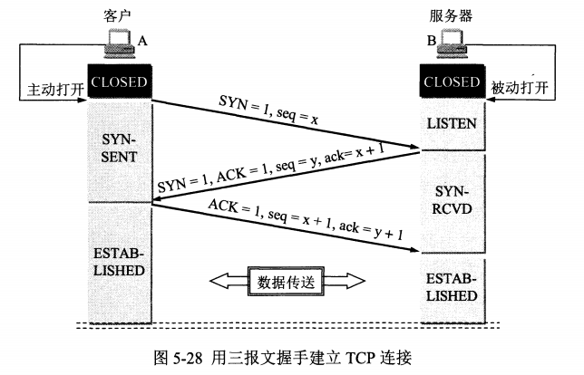
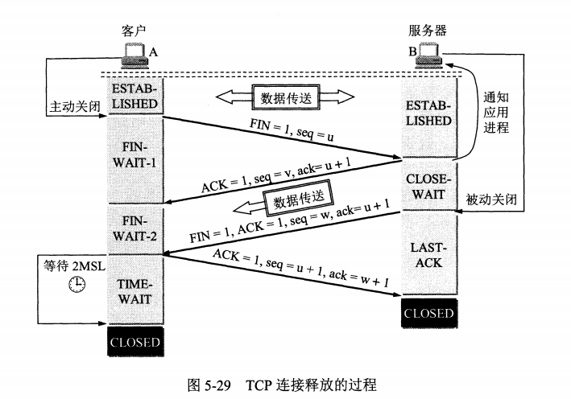

# 问题与简答

## 网络协议

### 计算机网络体系结构

- 五层协议各层作用

> 应用层: 应用进程间通信和交互的规则

> 运输层: 两台主机中进程之间的通信提供通用的数据传输服务

> 网络层：报文段或用户数据报封装成分组或包进行传送

> 数据链路层：将 IP 数据报组装成帧，并在相邻节点间的链路上传送

> 物理层：传送比特数据

### UDP 的主要特点

> UDP 是无连接的

> UDP 最大努力交付，不保证可靠交付，主机不需要维持复杂的链接状态

> UDP 是面向报文的

> UDP 没有拥塞控制，网络出现拥塞不会使源主机的发送速率降低（对实时应用很有用，如 直播，实时视频会议等）

> UDP 支持一对一、一对多、多对一和多对多的交互通信

> UDP 的首部开销小，只有8个字节，比 TCP 的20个字节的首部要短

### TCP 的主要特点

> TCP 是面向连接的。（就好像打电话一样，通话前需要先拨号建立连接，通话结束后要挂机释放连接）

> 每一条 TCP 连接只能有两个端点，每一条 TCP 连接只能是点对点的（一对一）

> TCP 提供可靠交付的服务。通过 TCP 连接传送的数据，无差错、不丢失、不重复、并且按序到达

> TCP 提供全双工通信。TCP 允许通信双方的应用进程在任何时候都能发送数据。TCP 连接的两端都设有发送缓存和接收缓存，用来临时存放双方通信的数据

> 面向字节流。TCP 中的“流”（Stream）指的是流入进程或从进程流出的字节序列。“面向字节流”的含义是：虽然应用程序和 TCP 的交互是一次一个数据块（大小不等），但 TCP 把应用程序交下来的数据仅仅看成是一连串的无结构的字节流

### 如何让不可靠的 UDP 可靠(了解)

> [拓展阅读](./01.网络协议/01.怎么让不可靠的UDP可靠.md)

### TCP 握手三次，断开四次，TIME-WAIT

- 为什么要三次握手

> 三次握手的目的是建立可靠的通信信道，说到通讯，简单来说就是数据的发送与接收，而三次握手最主要的目的就是双方确认自己与对方的发送与接收是正常的

- 为什么要传回 SYN

> 接收端传回发送端所发送的 SYN 是为了告诉发送端，我接收到的信息确实就是你所发送的信号了

- 传了 SYN,为啥还要传 ACK

> 双方通信无误必须是两者互相发送信息都无误。传了 SYN，证明发送方到接收方的通道没有问题，但是接收方到发送方的通道还需要 ACK 信号来进行验证

- 为什么要四次挥手

> 任何一方都可以在数据传送结束后发出连接释放的通知，待对方确认后进入半关闭状态。当另一方也没有数据再发送的时候，则发出连接释放通知，对方确认后就完全关闭了TCP连接

- 为什么客户端最后还要等待2MSL

> 保证客户端发送的最后一个ACK报文能够到达服务器，因为这个ACK报文可能丢失

> 防止类似与“三次握手”中提到了的“已经失效的连接请求报文段”出现在本连接中

### TCP 粘包如何解决

- 粘包的原因

> 发送方引起粘包是由 TCP 协议本身造成的，TCP 为提高传输效率，发送方往往要收集到足够多的数据后才发送一包数据。若连续几次发送的数据都很少，通常 TCP 会根据优化算法把这些数据合成一包后一次发送出去，这样接收方就收到了粘包数据

> 接收方引起的粘包是由于接收方用户进程不及时接收数据，从而导致粘包现象。这是因为接收方先把收到的数据放在系统接收缓冲区，用户进程从该缓冲区取数据，若下一包数据到达时前一包数据尚未被用户进程取走，则下一包数据放到系统接收缓冲区时就接到前一包数据之后，而用户进程根据预先设定的缓冲区大小从系统接收缓冲区取数据，这样就一次取到了多包数据

- 粘包解决 — 封包

> 封包就是给一段数据加上包头,这样一来数据包就分为包头和包体两部分内容了。包头其实上是个大小固定的结构体，其中有个结构体成员变量表示包体的长度，这是个很重要的变量，其他的结构体成员可根据需要自己定义。根据包头长度固定以及包头中含有包体长度的变量就能正确的拆分出一个完整的数据包

### UDP、TCP 区别，适用场景

|对比项|UDP|TCP|
|-|-|-|
|连接性|无连接|面向连接|
|可靠性|不可靠|可靠|
|效率|传输效率高|传输效率低|
|报文|面向报文-数据报模式|面向字节流-流模式|
|双工性|一对一、一对多、多对一、多对多|全双工|
|流量控制|无|有(滑动窗口)|
|拥塞控制|无|有(慢开始、拥塞避免、快重传、快恢复)|
|传输速度|快|慢|
|资源要求|较少|较多|
|首部开销|8字节|20字节|
|数据顺序|不保证|保证|

- UDP 适用场景

> 面向数据报方式

> 网络数据大多为短消息

> 拥有大量 Client

> 对数据安全性无特殊要求

> 网络负担非常重，但对响应速度要求高

- TCP 适用场景

> 文件传输(FTP HTTP 对数据准确性要求较高，速度可以相对慢)

> 发送或接收邮件(POP IMAP SMTP 对数据准确性要求高，非紧急应用)

> 远程登录(telnet SSH 对数据准确性有要求，有连接的概念)

### socket ?

### HTTP request 报文结构是怎样的？

### HTTP response 报文结构是怎样的？

### HTTP 协议？

### HTTP 状态码？

### HTTPS 通信原理？

### GET 与 POST 请求方式区别？

### HTTP 应用场景

### DNS 主要作用是什么？

### IPv4 与 IPv6 区别？

### 为什么需要心跳？

### 什么是长连接？

### HTTPS 是怎么保证安全的？

### 流与数据报的区别

### 拓展资料

> [TCP的三次握手与四次挥手](./01.网络协议/02.TCP的三次握手与四次挥手.md)

## 数据结构与算法

### 冒泡排序
### 选择排序
### 插入排序
### 快速排序
### 堆排序
### 归并排序

### 二分查找
### hash
### KPM

### 布隆过滤器
### 贪心算法
### 回溯算法
### 动态规划
### 最小生成树
### 最短路径
### 推荐算法
### 深度优先、广度优先

> https://github.com/xianyunyh/PHP-Interview
> https://wizardforcel.gitbooks.io/the-art-of-programming-by-july/content/03.02.html

### 数组的几种操作
> find|delete 查找对应元素 时间复杂度是O(n). 根据下标查询，时间复杂度是O(1)
### 判断单链表是否有环
### 已知两个单链表相交，求他们的第一个交点
### 快速找到未知长度单链表的中间节点
### 约瑟夫环

## PHP

### echo、print、print_r、var_dump 的区别？
### 单引号和双引号的区别？
### isset 和 empty 的区别？
### 超全局变量？
### 客户端/服务端 IP 获取？了解代理透传 实际IP 的概念
### PHP 支持回调的函数，实现一个？
### 发起 HTTP 请求有哪几种方式，它们有何区别
### 对象关系映射/ORM(Object Relational Mapping)
### MVC 的理解
### php 执行默认超时时间？
### 类的静态调用和实例化调用
### for 与 foreach 哪个更快？
### 如何异步执行命令？
### 常见 PHP 框架特点
ThinkPHP（TP）、CodeIgniter（CI）、Zend（非 OOP 系列）
Yaf、Phalcon（C 扩展系）
Yii、Laravel、Symfony（纯 OOP 系列）
Swoole、Workerman （网络编程框架）
对比框架区别几个方向点
是否纯 OOP
类库加载方式（自己写 autoload 对比 composer 标准）
易用性方向（CI 基础框架，Laravel 这种就是高开发效率框架以及基础组件多少）
黑盒（相比 C 扩展系）
运行速度（如：Laravel 加载一大堆东西）
内存占用
### base64 编码原理
### ip2long 实现
### 代码执行过程
### 弱类型变量如何实现
### 垃圾回收机制
### 进程间通信方式
### 链式调用实现
### 多进程同时写一个文件
### PHP 拓展开发
### PHP7 新特性
### PHP7 底层优化
> https://github.com/xianyunyh/PHP-Interview/blob/master/PHP/php7.md
### 构造函数和析构函数
### PHP 不实例化调用方法
### 了解大部分数组处理函数
### Trait 是什么东西
### yield 是什么，说个使用场景 yield
### php.ini 有哪些参数、display_errors、ini_set动态设置
### 传值和传引用的区别？
### Cookie 和 Session 的区别和关系，Session 共享、存活时间
### 如何解决 PHP 内存溢出问题
### static、$this、self 区别，static作用？
### private、protected、public、final 区别
### \_\_construct 与 \_\_destruct 区别
### 魔术方法
### PSR 介绍，PSR-1, 2, 4, 7
### 异常处理
### 如何 foreach 迭代对象、如何数组化操作对象 $obj[key]、如何函数化对象 $obj(123);
### 如何返回一个301重定向
### 如何获取扩展安装路径
### 字符串、数字比较大小的原理，注意 0 开头的8进制、0x 开头16进制
### BOM 头是什么，怎么除去
### 如何异步执行命令
### 模板引擎是什么，解决什么问题、实现原理（Smarty、Twig、Blade）
### Xhprof 、Xdebug 性能调试工具使用
### include、require、include_once、require_once
### traits 与 interfaces 区别 及 traits 解决了什么痛点？
### PHP 数组底层实现 （HashTable + Linked list）
### Copy on write 原理，何时 GC
### PHP 进程模型，进程通讯方式，进程线程区别
### yield 核心原理是什么
### PDO prepare 原理
### Swoole 适用场景，协程实现方式
### PHP 中 json_encode(['key'=>123]); 与 return json_encode([]); 区别，会产生什么问题？如何解决
### ZVAL
> https://github.com/xianyunyh/PHP-Interview/blob/master/PHP/PHP-Zval%E7%BB%93%E6%9E%84.md
### HashTable
> https://github.com/xianyunyh/PHP-Interview/blob/master/PHP/PHP7-HashTable.md

## Web

### SEO 哪些需要注意的？
### img 标签的 title 和 alt 有什么区别？
### 如何进行网站性能优化？
### 从浏览器地址栏输入 url 到显示页面的步骤
### 什么是渐进增强？
### CSS 选择器有哪些？优先级？
### CSS sprite 是什么，有什么优缺点？
### display: none;与visibility: hidden;的区别？
### display: block; 和 display: inline; 的区别？
### link 与 @import 的区别？
### PNG,GIF,JPG 的区别及如何选？
### 容器包含若干浮动元素时如何清理（包含）浮动？
### 如何水平居中一个元素
### 如何竖直居中一个元素
### 为什么把 JavaScript 文件放在 Html 底部
### 介绍下 CSS 盒子模型？与 flex 有什么区别？
### 相对定位、浮动定位、绝对定位区别？
### JavaScript 数据类型？
### Javascript有哪几种方法定义函数？
### JavaScript 事件的三个阶段？
### 闭包原理及应用？
### 如何解决跨域问题？
### JSONP 原理？
### 客户端存储 localStorage 和 sessionStorage？
### Vue.js 双向绑定原理？
### 原生获取 DOM 节点，属性
### 盒子模型
### CSS 文件、style 标签、行内 style 属性优先级
### 类型判断
### Cookie 读写
### 新技术（了解）
ES6
模块化
打包
构建工具
vue、react、webpack、
前端 mvc
### 优化
浏览器单域名并发数限制
静态资源缓存 304 （If-Modified-Since 以及 Etag 原理）
多个小图标合并使用 position 定位技术 减少请求
静态资源合为单次请求 并压缩
CDN
静态资源延迟加载技术、预加载技术
keep-alive
CSS 在头部，JS 在尾部的优化（原理）

## MySQL

### CRUD 基础
### char 和 varchar 数据类型区别？
### JOIN、LEFT JOIN 、RIGHT JOIN、INNER JOIN？
### UNION
### GROUP BY + COUNT + WHERE 组合案例
### 常用 MySQL 函数，如：now()、md5()、concat()、uuid()等
### 了解触发器是什么，说个使用场景
### 常见存储引擎，有什么区别？
### 常见索引？有什么特点？
### 聚族索引与非聚族索引的区别？
### 事务机制？
### BTree 与 BTree-/BTree+ 索引原理？
### 分表数量级？
### 数据库优化手段？
索引、联合索引(命中条件)
分库分表(水平分表、垂直分表)
分区
会使用 explain 分析 SQL 性能问题，了解各参数含义(type、rows、key)
Slow log(有什么用，什么时候需要)
### 三范式、反三范式
### 锁，共享锁、排它锁、乐观锁、悲观锁、死锁

## Redis

### Redis 特点？
### Redis 有哪些数据类型？
### 有序集合底层实现？跳跃表和平衡二叉树效率对比？
### 一致性哈希？
### 如何实现分布式锁？
### Redis 如何实现持久化
### 可利用CPU多核心
### 内存淘汰机制
### 集群 cluster
### 事务支持
### 你之前为了解决什么问题使用的什么，为什么选它？
### Redis 与 Memcache 区别

## Linux

### 查看 CPU、内存、时间、系统版本等信息
### find 、grep 查找文件
### 批量删除文件
### sed、awk使用
### crontab
### vim快捷键
### 负载查看
### 如何查看 PHP 进程的内存、CPU 占用
### Linux进程
### 进程、线程、协程区别
### 502 大概什么什么原因？ 如何排查 504呢？
### 进程间通信几种方式，最快的是哪种？

## 安全

### CSRF 攻击？请描述一个实例？
### XSS 攻击？
### SQL 注入？
### IP 地址能被伪造吗？
### include 请求参数？
### md5 逆向原理？
### DOS 攻击？
### 数据库存储用户密码时，应该是怎么做才安全
### 目录权限安全
### disable_functions 关闭高危函数
### 文件上传 PHP 脚本
### eval 函数执行脚本
### 了解 Hash 与 Encrypt 区别

## 设计模式

### 什么是 MVC ？
### Autoload、Composer 原理?
### OOP 思想？
### 抽象类、接口 分别使用场景
### 依赖注入实现原理
### 单例模式？
### 工厂模式？
### 观察者模式？
### 适配器模式？
### 依赖注入模式？
### 门面模式？

## 架构

### 负载均衡有哪几种，挑一种你熟悉的说明其原理
### 介绍下 nginx
### 反向代理
### nginx 中 fastcgi_pass 监听，unix socket 和 tcp socket 的区别
### 消息队列？RabbitMQ、ActiveMq、Nsq、kafka
### 穿透、雪崩
### DB 主从、读写分离
### 如何保障数据的可用性，即使被删库了也能恢复到分钟级别。你会怎么做
### 数据库连接过多，超过最大值，如何优化架构。从哪些方便处理？
### 数据冗余、备份（MySQL增量、全量 原理）
### 画出常见 PHP 应用架构图
### 介绍下 RESTful API
### API 请求如何保证数据不被篡改？
### API 版本兼容怎么处理
### 限流（木桶、令牌桶）
### OAuth 2 主要用在哪些场景下
### JWT
### 了解常用语言特性，及不同场景适用性。
PHP VS Golang
PHP VS Python
PHP VS JAVA

## 业务相关

> 做了很多活动，经验总结？
> 重点介绍一个项目，分工，职责？

> https://img.qq52o.me/wp-content/uploads/2017/10/2017102909352282.png

## 其他

### Git 与 SVN 区别
### Git 基本使用
### SVN 基本使用

## 面试

### 个人简历
### 自我介绍
### 离职原因
### 职业规划
### 准备问题

> https://github.com/xianyunyh/PHP-Interview/blob/master/%E9%9D%A2%E8%AF%95/README.md

- 整体知识结构

- 关键问题列表

- 深入剖析原理

- 初级、中级、高级