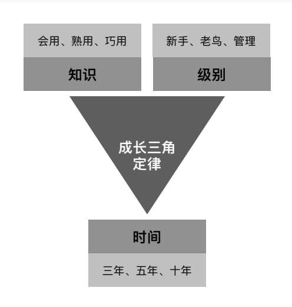

# 后端工程师指南

适合萌新入行和老鸟回炉，没有多余修饰只有干货。忘掉你会编程，重新开始学习。年薪对标30万、50万、80万，对号入座吧！

## 从业经验

入行

熟练工

执行

决策

入行、熟练工、褪去面纱-这就是份工作、沉淀重新出发

这里介绍一下自己的从业经验

## 持续更新

Q: 为什么会有这个仓库，为什么还要再度更新？

A: 现在是为了总结从业经验，帮助其他从业者。五年前是为了总结面试经验，帮助自己跟他人面试。

### 再度更新

遇到了什么问题。

职业生涯阶段性总结和思考。

未来我想干什么。

### 仓库起源

> 从事软件开发，已经接近五个年头了，去年面试中，发现自己依然处于尴尬的位置。简单重复，缺乏挑战的工作，已经没有多大吸引力了，优秀的平台，面试缺屡次碰壁。
人上年纪之后，思维敏感度、记忆力都明显有所下滑。程序开发不要被限制在语言层面，这是大家都懂的道理。但是作为一个 PHP 开发者，很多时候都是缠绕在业务的沟壑，理想和现实总是相差甚大。
去年由于部门重组，本来将近十余人负责的项目，之后只剩两三人负责，各种坑只能靠人肉解决，深感无力。工作可能只是你的一部分，你必须有自己的能力定位。
以前总觉得学什么，做什么都无所谓，需要学习的技术，花点时间快速学习就行，有新的技术出来，赶紧紧跟了解下。但这些年下来，发现自己却没有一样能够拿的出手的，甚至连一个像样的作品也没有。
其实 PHP 的技术栈还是比较广的，在对整个技术栈有一定的掌握之后，可能还需要深挖几个自己喜欢的领域，否则在现今的就业市场里面，没有任何的竞争力。所以可以看到很多招聘者都在感慨，中高级工程师都去哪里了。
面试或者面试他人，无法逃避，那就选择面对。撰写《PHP 面试问答》，构建一个面试体系，而不必慌张的临时准备，时时刻刻都充分准备好，对自己负责，也对别人负责。
结合实际 PHP 面试，系统的汇总面试中的各种各样的问题，尝试提供简洁准确的答案。如果你在 PHP 面试中遇到问题，欢迎提 Issues 交流。
包含网络、数据结构与算法、PHP、Web、MySQL、Redis、Linux、安全、设计模式、架构、自我介绍、离职原因、职业规划、准备问题等部分。
最后，祝愿大家在日后的求职中，都能拿到满意的 offer~~

## 指南体系

### 成长三角定律

认清现状，拒绝幻想。假定一直在后端领域摸爬滚打，理想可达上限是技术总监，现实上限是小领导。我们将职业生涯拆解开来，首先有三个维度，分别是时间、知识、级别。时间维度上，又一共有三个子维度，分别是三年、五年、十年；知识维度上，也是有三个子维度，分别是会用、熟用、巧用；最后级别维度上，依旧是三个维度，分别是新手、老鸟、管理。你会问我为什么要这样划分，我会这样回答你，最小化投入最大化达成目标，帮助你理解职业生涯。

时间维度。据我观察，大部分从业者在入行三年前，普遍跳槽频繁，甚至离开IT行业。而在三年到五年期间，就职公司开始趋于稳定，对于跳槽和改变方向开始变得谨慎。在十年这个时间点，从业方向变得非常稳定了，开始出现大批人就职时间超过五年。因此将时间维度颗粒度分为三年、五年、十年。

知识维度。作为IT从业者，勇于承认不懂，我认为一件很重要的事，不懂只是需要花时间去了解，了解后再通过实践，迭代出最佳实践，最后就变成了擅长的领域专家。这样，对于技术知识也就有了三个层次，会用、熟用、巧用。借用设计模式的过度设计，学习知识其实也存在过度学习，只需要学习相应深度和广度的知识内容。

级别维度。这里不太想用职级，职级是一种人力手段。为了到某个级别，我们想要什么技能，所处生态位最低生存要求什么技能。分为新手、老鸟、管理三个级别。这里的管理没有特指管理岗，有时候即使不是领导也需要参与管理工作。

### 知识模版

学的快、记得牢、可实践

### roadmaps

backend engineer roadmaps

## 序言

> 当年赵文王喜好剑术，门下剑客三千人。在文王跟前日夜比试剑术，每年死上百人，赵国日益衰退，太子十分担忧。于是左右给太子推荐庄子。庄子欣然接受，去见文王，说自己剑术很高明，天下无敌。文王听了非常高兴，召来剑客，准备跟庄子比试。庄子说，且慢，我得先给你讲讲我的三剑。文王表示愿闻其详。庄子就开始讲，臣有三剑，有天子剑，有诸侯剑，有庶人剑。

> "天子之剑，以燕溪石城为锋，齐岱为锷，晋魏为脊，周宋为镡，韩魏为夹；包以四夷，裹以四时，绕以渤海，带以常山；制以五行，论以刑德；开以阴阳，持以春夏，行以秋冬。此剑，直之无前，举之无上，案之无下，运之无旁，上决浮云，下绝地纪。此剑一用，匡诸侯，天下服矣。此天子之剑也。"赵文王听了茫然若有所思，接着问到诸侯之剑怎么样？庄子说道: "诸侯之剑，以知勇士为锋，以清廉士为锷，以贤良士为脊，以忠圣士为镡，以豪杰士为夹。此剑，直之亦无前，举之亦无上，案之亦无下，运之亦无旁；上法圆天以顺三光，下法方地以顺四时，中和民意以安四乡。此剑一用，如雷霆之震也，四封之内，无不宾服而听从君命者矣。此诸侯之剑也。"文王说："那庶人之剑又怎么样呢？"庶人之剑，蓬头突鬓垂冠，曼胡之缨，短后之衣，瞋目而语难。相击于前，上斩颈领，下决肝肺，此庶人之剑，无异于斗鸡，一旦命已绝矣，无所用于国事。今大王有天子之位而好庶人之剑，臣窃为大王薄之。"文王听完面露愧色，回宫闭门反省。三月后，失业的剑客，自杀的自杀，逃亡的逃亡。

不知道大家是否看懂三段古文。天子剑是说，你知道天地之大道，你知道世间之至理，可以趁势而为；诸侯剑是说，你知道人性，因循利导，运用和驾驭有才智的的人可以无往不胜；而庶人剑呢，你一刀我一刀，大家一起拼刺(刀)刀。

这毕竟只是寓言故事。对照现实技术生涯，可以进行三个维度的考量。庶人剑-技术，诸侯剑-泛技术，天子剑-管理。技术让你比划时候知道怎么出招，宿命是熟练工；泛技术让你看懂哪些业务有价值好出业绩，宿命是裁不掉的老油条；管理让你聚焦回人和业务的层面，或许能做点有价值的事情。

要么学习，要么毒打。为什么脏活是他？为什么升职加薪是他？向上管理和向下管理区别？如何拒绝黑活？降本增笑？裁员大动脉？什么是防御性代码？什么是插拔式程序员？

## 目录

### 第一部分: 庶民之剑-技术篇

#### 1、编程语言
- [编程语言简介](./docs/编程语言简介.md)
- [java](./docs/java.md)
- [php](./docs/php.md)
- [go](./docs/go.md)
#### 2、存储
mysql/redis/es/kafka
#### 3、网络
协议/http/soa
#### 4、数据结构与算法
#### 5、设计模式
创建/结构/行为
#### 6、服务器
linux/ecs/容器
#### 7、前端
安卓/ios/小程序/web
#### 8、架构
#### 9、安全
#### 10、面试

### 第二部分: 诸侯之剑-泛技术篇

#### 需求调研
#### 产品文档
#### 产品评审
#### 技术方案
#### 开发排期
#### 需求开发
#### 功能测试
#### 发布上线
#### 数据回收
#### 生态系统

### 第三部分: 天子之剑-管理篇

#### 行业规模

DevOps Market Report 2028. The DevOps market size is anticipated to grow at a CAGR of 119.7% over the forecast period. From an estimated USD 10.4 billion in 2023 to
USD 25.5 billion by 2028. Agile software development and learn programming are the early foundations of many DevOps techniques for
speeding up software development and deployment.

#### 职级标准

实习生、助理工程师、工程师、高级工程师、资深工程师、专家、高级专家、副总监、总监

#### 国家层面

#### 招聘数据

#### 面试别人