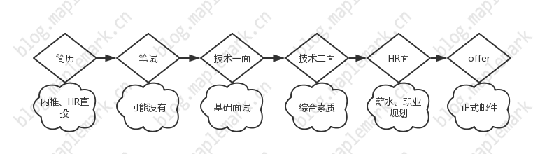
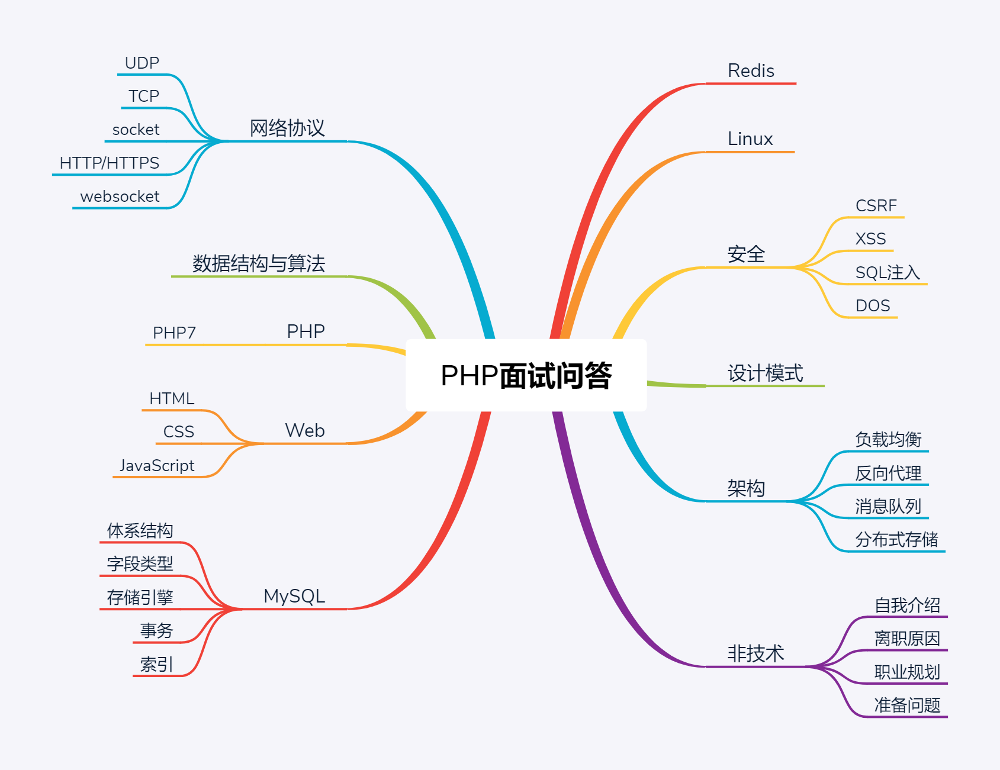

# PHP 面试问答 v2.0

PHP 面试问答 v2.0 版本正在努力撰写中，你可以查看v1.0完成版 [v1.0传送门](https://github.com/colinlet/PHP-Interview-QA/tree/1.0)

## 面试流程

## 技能树

## 前言

从事软件开发，已经接近五个年头了，去年面试中，发现自己依然处于尴尬的位置。简单重复，缺乏挑战的工作，已经没有多大吸引力了，优秀的平台，面试缺屡次碰壁。人上年纪之后，思维敏感度、记忆力都明显有所下滑。

程序开发不要被限制在语言层面，这是大家都懂的道理。但是作为一个 PHP 开发者，很多时候都是缠绕在业务的沟壑，理想和现实总是相差甚大。去年由于部门重组，本来将近十余人负责的项目，之后只剩两三人负责，各种坑只能靠人肉解决，深感无力。

工作可能只是你的一部分，你必须有自己的能力定位。以前总觉得学什么，做什么都无所谓，需要学习的技术，花点时间快速学习就行，有新的技术出来，赶紧紧跟了解下。但这些年下来，发现自己却没有一样能够拿的出手的，甚至连一个像样的作品也没有。其实 PHP 的技术栈还是比较广的，在对整个技术栈有一定的掌握之后，可能还需要深挖几个自己喜欢的领域，否则在现今的就业市场里面，没有任何的竞争力。所以可以看到很多招聘者都在感慨，中高级工程师都去哪里了。

面试或者面试他人，无法逃避，那就选择面对。撰写《 PHP 面试问答》，构建一个面试体系，而不必慌张的临时准备，时时刻刻都充分准备好，对自己负责，也对别人负责。

结合实际 PHP 面试，系统的汇总面试中的各种各样的问题，尝试提供简洁准确的答案。如果你在 PHP 面试中遇到问题，欢迎提 Issues 交流。包含网络协议、数据结构与算法、PHP、Web、MySQL、Redis、Linux、安全、设计模式、架构、自我介绍、离职原因、职业规划、准备问题等部分。

最后，祝愿大家在日后的求职中，都能拿到满意的 offer~~

## 术语对照表

[术语对照表](./术语对照表.md)：顾名思义，帮助联想知识点

## 交流讨论组

</a>

## 问题列表

### [网络协议](./QA.md#网络协议)

- [计算机网络体系结构](./QA.md#计算机网络体系结构)

- [UDP 的主要特点](./QA.md#udp-的主要特点)

- [TCP 的主要特点](./QA.md#tcp-的主要特点)

- [如何让不可靠的 UDP 可靠(了解)](./QA.md#如何让不可靠的-UDP-可靠了解)

- [TCP 握手三次，断开四次，TIME-WAIT](./QA.md#tcp-握手三次断开四次time-wait)

- [TCP 粘包如何解决](./QA.md#tcp-粘包如何解决)

- [UDP、TCP 区别，适用场景](./QA.md#udptcp-区别适用场景)

- 建立 socket 需要哪些步骤

- TCP socket 和 UNIX socket 区别

- 本地 socket 与 网络 socket

- socket 如何实现多进程之间通信的

- [HTTP 状态码](./QA.md#http-状态码)

- [HTTP 请求报文构成](./QA.md#http-请求报文构成)

- [HTTP 优缺点](./QA.md#http-优缺点)

- [HTTPS 通信原理](./QA.md#https-通信原理)

- [HTTP 2.0](./QA.md#http-2.0)

- [DNS 主要作用是什么](./QA.md#dns-主要作用是什么)

- [IPv6 与 IPv4 有什么变化](./QA.md#ipv6-与-ipv4-有什么变化)

- [为什么是心跳机制](./QA.md#为什么是心跳机制)

- [什么是长连接](./QA.md#什么是长连接)

- [epoll](./QA.md#epoll)

### [数据结构与算法](./QA.md#数据结构与算法)

- [衡量、比较算法优劣的指标](./QA.md#衡量比较算法优劣的指标)

- [链表有哪些](./QA.md#链表有哪些)

- [线性结构](./QA.md#线性结构)

- [树](./QA.md#树)

- [散列查找](./QA.md#散列查找)

- [排序](./QA.md#排序)

- [其他](./QA.md#其他)

### PHP

- [echo、print、print_r、var_dump 的区别](./QA.md#echoprintprint_rvar_dump-的区别)

- [单引号和双引号的区别](./QA.md#单引号和双引号的区别)

- [isset 和 empty 的区别](./QA.md#isset-和-empty-的区别)

- [static、self、$this 的区别](./QA.md#staticselfthis-的区别)

- [include、require、include_once、require_once 的区别](./QA.md#includerequireinclude_oncerequire_once-的区别)

- 数组处理函数

- [Cookie 和 Session](./QA.md#cookie-和-session)

- [预定义变量](./QA.md#预定义变量)

- [传值和传引用的区别](./QA.md#传值和传引用的区别)

- [构造函数和析构函数](./QA.md#构造函数和析构函数)

- [魔术方法](./QA.md#魔术方法)

- [public、protected、private、final 区别](./QA.md#publicprotectedprivatefinal-区别)

- [客户端/服务端 IP 获取，了解代理透传 实际IP 的概念](./QA.md#客户端服务端-ip-获取了解代理透传-实际ip-的概念)

- [类的静态调用和实例化调用](./QA.md#类的静态调用和实例化调用)

- [PHP 不实例化调用方法](./QA.md#php-不实例化调用方法)

- [php.ini 配置选项，ini_set 动态设置](./QA.md#phpini-配置选项ini_set-动态设置)

- [如何返回一个301重定向](./QA.md#如何返回一个301重定向)

- [PHP 与 MySQL 连接方式](./QA.md#php-与-mysql-连接方式)

- [MySQL、MySQLi、PDO 区别](./QA.md#mysqlmysqlipdo-区别)

- [MySQL 连接池](./QA.md#mysql-连接池)

- [代码执行过程](./QA.md#代码执行过程)

- [base64 编码原理](./QA.md#base64-编码原理)

- [ip2long 实现](./QA.md#ip2long-实现)

- [MVC 的理解](./QA.md#mvc-的理解)

- [主流 PHP 框架特点](./QA.md#主流-php-框架特点)

- [对象关系映射/ORM](./QA.md#对象关系映射orm)

### Web

- [SEO 有哪些需要注意的](./QA.md#seo-有哪些需要注意的)

- [img 标签的 title 和 alt 有什么区别](./QA.md#img-标签的-title-和-alt-有什么区别)

- [CSS 选择器的分类](./QA.md#css-选择器的分类)

- [CSS sprite 是什么，有什么优缺点](./QA.md#css-sprite-是什么有什么优缺点)

- [display: none 与 visibility: hidden 的区别](./QA.md#display-none-与-visibility-hidden-的区别)

- [display: block 和 display: inline 的区别](./QA.md#display-block-和-display-inline-的区别)

- [CSS 文件、style 标签、行内 style 属性优先级](./QA.md#css-文件style-标签行内-style-属性优先级)

- [link 与 @import 的区别](./QA.md#link-与-import-的区别)

- [盒子模型](./QA.md#盒子模型)

- [容器包含若干浮动元素时如何清理(包含)浮动](./QA.md#容器包含若干浮动元素时如何清理包含浮动)

- [如何水平居中一个元素](./QA.md#如何水平居中一个元素)

- [如何竖直居中一个元素](./QA.md#如何竖直居中一个元素)

- [flex 与 CSS 盒子模型有什么区别](./QA.md#flex-与-css-盒子模型有什么区别)

- [Position 属性](./QA.md#position-属性)

- [PNG,GIF,JPG 的区别及如何选](./QA.md#pnggifjpg-的区别及如何选)

- [为什么把 JavaScript 文件放在 Html 底部](./QA.md#为什么把-javascript-文件放在-html-底部)

- [JavaScript 数据类型](./QA.md#javascript-数据类型)

- [JavaScript 操作 DOM 的方法有哪些](./QA.md#javascript-操作-dom-的方法有哪些)

- [JavaScript 字符串方法有哪些](./QA.md#javascript-字符串方法有哪些)

- [JavaScript 字符串截取方法有哪些？有什么区别](./QA.md#javascript-字符串截取方法有哪些有什么区别)

- [setTimeout 和 setInterval 的区别](./QA.md#settimeout-和-setinterval-的区别)

- [使用 new 操作符实例化一个对象的具体步骤](./QA.md#使用-new-操作符实例化一个对象的具体步骤)

- [如何实现 ajax 请求](./QA.md#如何实现-ajax-请求)

- [同源策略是什么](./QA.md#同源策略是什么)

- [如何解决跨域问题](./QA.md#如何解决跨域问题)

- [引起内存泄漏的操作有哪些](./QA.md#引起内存泄漏的操作有哪些)

- [闭包理解及应用](./QA.md#闭包理解及应用)

- [对 JavaScript 原型的理解](./QA.md#对-javascript-原型的理解)

- [对 JavaScript 模块化的理解](./QA.md#对-javascript-模块化的理解)

- [如何判断网页中图片加载成功或者失败](./QA.md#如何判断网页中图片加载成功或者失败)

- [如何实现懒加载](./QA.md#如何实现懒加载)

- [JSONP 原理](./QA.md#jsonp-原理)

- [Cookie 读写](./QA.md#cookie-读写)

- 从浏览器地址栏输入 URL 到显示页面的步骤

- [Vue.js 双向绑定原理](./QA.md#vuejs-双向绑定原理)

- 如何进行网站性能优化

- [渐进增强](./QA.md#渐进增强)

### MySQL

- CRUD 基础

- char 和 varchar 数据类型区别

- JOIN、LEFT JOIN 、RIGHT JOIN、INNER JOIN

- UNION

- GROUP BY + COUNT + WHERE 组合案例

- 常用 MySQL 函数，如：now()、md5()、concat()、uuid()等

- 了解触发器是什么，说个使用场景

- 常见存储引擎，有什么区别

- 常见索引？有什么特点

- 聚族索引与非聚族索引的区别

- 事务机制

- BTree 与 BTree-/BTree+ 索引原理

- 分表数量级

### Redis

- Redis 特点

- Redis 有哪些数据类型

- 有序集合底层实现？跳跃表和平衡二叉树效率对比

- 一致性哈希

- 如何实现分布式锁

- Redis 如何实现持久化

- 可利用 CPU 多核心

- 内存淘汰机制

- 集群 cluster

### Linux

- 查看 CPU、内存、时间、系统版本等信息

- find 、grep 查找文件

- 批量删除文件

- sed、awk使用

- crontab

- vim快捷键

- 负载查看

- 如何查看 PHP 进程的内存、CPU 占用

- Linux进程

- 进程、线程、协程区别

- 502 大概什么什么原因？ 如何排查 504呢

- 进程间通信几种方式，最快的是哪种？

### 安全

- CSRF 攻击？请描述一个实例

- XSS 攻击

- SQL 注入

- IP 地址能被伪造吗

- include 请求参数

- md5 逆向原理

- DOS 攻击

- 数据库存储用户密码时，应该是怎么做才安全

- 目录权限安全

- disable_functions 关闭高危函数

- 文件上传 PHP 脚本

- eval 函数执行脚本

- 了解 Hash 与 Encrypt 区别

### 设计模式

- Autoload、Composer 原理

- OOP 思想

- 抽象类、接口 分别使用场景

- 依赖注入实现原理

- 单例模式

- 工厂模式

- 观察者模式

- 适配器模式

- 依赖注入模式

- 门面模式

### 架构

- 负载均衡有哪几种，挑一种你熟悉的说明其原理

- 介绍下 nginx

- 反向代理

- nginx 中 fastcgi_pass 监听，unix socket 和 tcp socket 的区别

- 消息队列？RabbitMQ、ActiveMq、Nsq、kafka

- 穿透、雪崩

- DB 主从、读写分离

- 如何保障数据的可用性，即使被删库了也能恢复到分钟级别。你会怎么做

- 数据库连接过多，超过最大值，如何优化架构。从哪些方便处理

- 数据冗余、备份（MySQL增量、全量 原理）

- 画出常见 PHP 应用架构图

- 介绍下 RESTful API

- API 请求如何保证数据不被篡改

- API 版本兼容怎么处理

- 限流（木桶、令牌桶）

- OAuth 2 主要用在哪些场景下

- JWT

- 了解常用语言特性，及不同场景适用性

## 声明

本资料仅供参考，水平有限，难免存在纰漏错误之处

欢迎转载，转载请标明来源出处，谢谢~~

作者：凌枫 Email：colinlets@gmail.com 链接：https://github.com/colinlet/PHP-Interview-QA