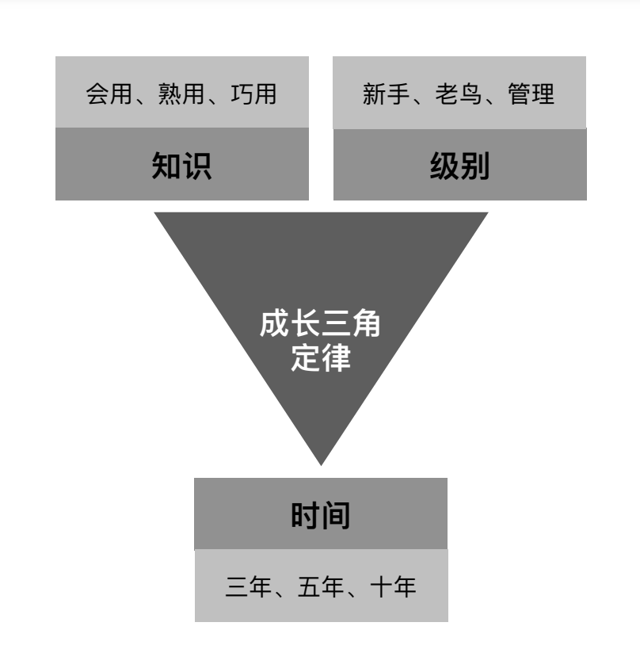

# 后端工程师指南

适合萌新入行、老鸟回炉，没有修饰只有干货。通过指南你可以获得技术/泛技术/管理体系知识，年薪对标30万、50万、80万。

## 从业经验

入行

熟练工

执行

决策

入行、熟练工、褪去面纱-这就是份工作、沉淀重新出发

这里介绍一下自己的从业经验

## 持续更新
5年、10年

仓库起源: 面试痛苦-五年
再度更新: 从业经验总结
面试参考，入行指南，知识体系

## 指南体系

### 成长三角定律

### 知识模版

### roadmaps

backend engineer roadmaps

## 序言

> 当年赵文王喜好剑术，门下剑客三千人。在文王跟前日夜比试剑术，每年死上百人，赵国日益衰退，太子十分担忧。于是左右给太子推荐庄子。庄子欣然接受，去见文王，说自己剑术很高明，天下无敌。文王听了非常高兴，召来剑客，准备跟庄子比试。庄子说，且慢，我得先给你讲讲我的三剑。文王表示愿闻其详。庄子就开始讲，臣有三剑，有天子剑，有诸侯剑，有庶人剑。

> "天子之剑，以燕溪石城为锋，齐岱为锷，晋魏为脊，周宋为镡，韩魏为夹；包以四夷，裹以四时，绕以渤海，带以常山；制以五行，论以刑德；开以阴阳，持以春夏，行以秋冬。此剑，直之无前，举之无上，案之无下，运之无旁，上决浮云，下绝地纪。此剑一用，匡诸侯，天下服矣。此天子之剑也。"赵文王听了茫然若有所思，接着问到诸侯之剑怎么样？庄子说道: "诸侯之剑，以知勇士为锋，以清廉士为锷，以贤良士为脊，以忠圣士为镡，以豪杰士为夹。此剑，直之亦无前，举之亦无上，案之亦无下，运之亦无旁；上法圆天以顺三光，下法方地以顺四时，中和民意以安四乡。此剑一用，如雷霆之震也，四封之内，无不宾服而听从君命者矣。此诸侯之剑也。"文王说："那庶人之剑又怎么样呢？"庶人之剑，蓬头突鬓垂冠，曼胡之缨，短后之衣，瞋目而语难。相击于前，上斩颈领，下决肝肺，此庶人之剑，无异于斗鸡，一旦命已绝矣，无所用于国事。今大王有天子之位而好庶人之剑，臣窃为大王薄之。"文王听完面露愧色，回宫闭门反省。三月后，失业的剑客，自杀的自杀，逃亡的逃亡。

不知道大家是否看懂三段古文。天子剑是说，你知道天地之大道，你知道世间之至理，可以趁势而为；诸侯剑是说，你知道人性，因循利导，运用和驾驭有才智的的人可以无往不胜；而庶人剑呢，你一刀我一刀，大家一起拼刺(刀)刀。

这毕竟只是寓言故事。对照现实技术生涯，可以进行三个维度的考量。庶人剑-技术，诸侯剑-泛技术，天子剑-管理。技术让你比划时候知道怎么出招，宿命是熟练工；泛技术让你看懂哪些业务有价值好出业绩，宿命是裁不掉的老油条；管理让你聚焦回人和业务的层面，或许能做点有价值的事情。

要么学习，要么毒打。为什么脏活是他？为什么升职加薪是他？向上管理和向下管理区别？如何拒绝黑活？降本增笑？裁员大动脉？什么是防御性代码？什么是插拔式程序员？

## 目录

### 第一部分: 庶民之剑-技术篇

#### 1、编程语言
java/php/go
#### 2、存储
mysql/redis/es/kafka
#### 3、网络
协议/http/soa
#### 4、数据结构与算法
#### 5、设计模式
创建/结构/行为
#### 6、服务器
linux/ecs/容器
#### 7、前端
安卓/ios/小程序/web
#### 8、架构
#### 9、安全
#### 10、面试

### 第二部分: 诸侯之剑-泛技术篇

#### 需求调研
#### 产品文档
#### 产品评审
#### 技术方案
#### 开发排期
#### 需求开发
#### 功能测试
#### 发布上线
#### 数据回收
#### 生态系统

### 第三部分: 天子之剑-管理篇

#### 行业规模

DevOps Market Report 2028. The DevOps market size is anticipated to grow at a CAGR of 119.7% over the forecast period. From an estimated USD 10.4 billion in 2023 to
USD 25.5 billion by 2028. Agile software development and learn programming are the early foundations of many DevOps techniques for
speeding up software development and deployment.

#### 职级标准

实习生、助理工程师、工程师、高级工程师、资深工程师、专家、高级专家、副总监、总监

#### 国家层面

#### 招聘数据

#### 面试别人