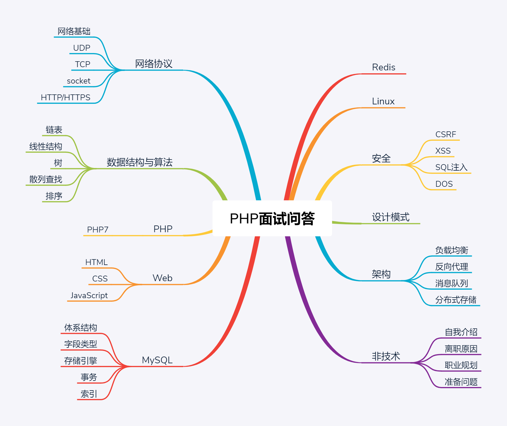

# PHP 面试问答 v2.0

> 结合实际 PHP 面试，汇总面试中的各种各样的问题，尝试提供简洁准确的答案

> 如果你在 PHP 面试遇到问题，欢迎提 Issues 交流

> 包含网络协议、数据结构与算法、PHP、Web、MySQL、Redis、Linux、安全、设计模式、架构、自我介绍、离职原因、职业规划、准备问题等部分

# 面试流程

# 技能树

# 正文

> [开始阅读](./PHP-Interview-QA.md)

# 声明

> 本资料仅供参考，水平有限，难免存在纰漏错误之处

> 欢迎转载，转载请标明来源出处，谢谢~~

> 作者：凌枫 Email：colinlets@gmail.com 链接：https://github.com/colinlet/PHP-Interview-QA