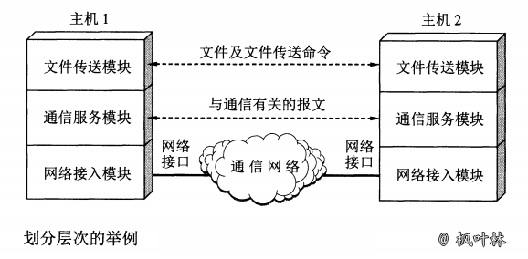
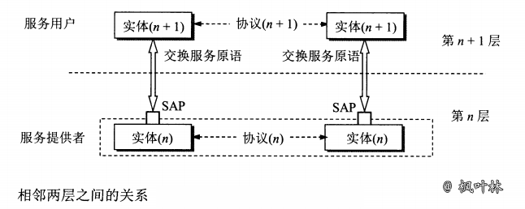
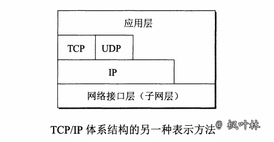

# 计算机网络体系结构

在计算机网络的基本概念中，分层次的体系结构是最基本的

## 计算机网络体系结构的形成

### 分层

相互通信的两个计算机系统必须高度协调工作才行，而这种“协调”是相当复杂的。为了设计这样复杂的计算机网络，最初提出了分层的方法。“`分层`”可将庞大而复杂的问题，转化为若干较小的局部问题，而这些较小的局部问题比较易于研究和处理

### 国际标准

全球经济的发展使得不同网络体系结构的用户迫切要求能够互相交换信息，国际标准化组织 ISO 提出了 OSI。只要遵循 OSI 标准，一个系统就可以和位于世界上任何地方的、也遵循这同一标准的其他任何系统进行通信

现今规则最大的、覆盖全球的、基于 TCP/IP 的互联网并未使用 OSI 标准。在20世纪90年代初期，虽然整套的 OSI 国际标准已制定出来，但基于 TCP/IP 的互联网已抢先在全球相当大的范围成功地运行了，而同时却几乎找不到有厂家生产出符合 OSI 标准的商业产品。OSI 只获得了一些理论研究的成果，市场化方面则彻底失败了

TCP/IP 常被称为是`事实上的国际标准`

## 协议与划分层次

### 网络协议

在计算机网络中要做到有条不紊地交换数据，就必须准守一些事先约定好的规则。这些规则明确了所交换的数据的格式以及有关的同步问题

为进行网络中的数据交换而建立的规则、标准或约定称为`网络协议`。网络协议也可简称为`协议`

**协议组成要素**

- `语法`，即数据与控制信息的结构或格式
- `语义`，即需要发出何种控制信息，完成何种动作以及做出何种响应
- `同步`，即事件实现顺序的详细说明

协议通常有两种不同的形式。一种是使用便于人来阅读和理解的文字描述。另一种是使用让计算机能够理解的程序代码。这两种不同形式的协议都必须能够对网络上的信息交换过程做出精确的解释

### 划分层次

对于非常复杂的计算机网络协议，其结构应该是层次式的

**分层可以带来很多好处**

- `各层之间是独立的`。某一层并不需要知道它的下一层是如何实现的，而仅仅需要知道该层通过层间接口（即界面）所提供的服务
- `灵活性好`。当任何一层发送变化时（例如由于技术的变化），只要层间接口关系保持不变，则在这层以上或以下各层均不受影响
- `结构上可分割开`。各层都可以采用最合适的技术来实现
- `易于实现和维护`。这种结构使得实现和调试一个庞大而又复杂的系统变得易于处理，因为整个的系统已被分解为若干个相对独立的子系统
- `能促进标准化工作`。因为每一层的功能及其所提供的服务都已有了精确的说明

**各层所要完成的功能**

- `差错控制` 使相应层次对等方的通信更加可靠
- `流量控制` 发送端的发送速率必须使接收端来得及接收，不要太快
- `分段和重装` 发送端将要发送的数据块划分为更小的单位，在接收端将其还原
- `复用和分用` 发送端几个高层会话复用一条逻辑连接，数据传送结束后释放连接
- `连接建立和释放` 交换数据前先建立一条逻辑连接，数据传送结束后释放连接

**分层缺点**

有些功能会在不同的层次中重复出现，因而产生了额外开销

**体系结构**

计算机网络的各层及其协议的集合就是网络的`体系结构`。计算机网络的体系结构就是这个计算机网络及其构件所应完成的功能的精确定义

体系结构是抽象的，而实现则是具体的，是真正在运行的计算机硬件和软件

## 具有五层协议的体系结构

### 五层协议

OSI 的七层协议体系结构的概念清楚，理论也较完整，但它既复杂又不实用。TCP/IP 体系结构则不同，但它现在却得到了非常广泛的应用。TCP/IP 是一个四层的体系结构。在学习计算机网络的原理时往往采用折中的办法，即综合 OSI 和 TCP/IP 的优点，采用一种只有五层协议的体系结构，这样既简洁又能将概念阐述清楚

### 各层作用

- 应用层：应用层协议定义的是应用进程间通信和交互的规则
- 运输层：运输层的任务就是负责向`两台主机中进程之间的通信`提供`通用的数据传输`服务
- 网络层：把运输层产生的报文段或用户数据报封装成`分组`或`包`进行传送
- 数据链路层：将网络层交下来的 IP 数据报组装成帧，并在两个相邻结点间的链路上传送
- 物理层：利用物理媒体以`比特`形式传送数据

### 小结

- 把应用层交互的数据单元称为`报文`
- 运输层主要协议：传输控制协议 TCP、用户数据报协议 UDP
- 在 TCP/IP 体系中，由于网络层使用 IP 协议，因此分组也叫 `IP 数据报`，或简称为数据报

## 实体、协议、服务和服务访问点

当研究开放系统中的信息交换时，往往使用`实体`(entity)这一较为抽象的名词表示`任何可发送或接受信息的硬件或软件进程`

协议是控制两个对等实体(或多个实体)进行通信的规则的集合

在协议的控制下，两个对等实体间的通信使得本层能够向上一层提供服务。要实现本层协议，还需要使用下面一层所提供的服务

协议是“水平的”，即协议是控制对等实体之间通信的规则。但服务是“垂直的”，即服务是由下层向上层通过层间接口提供的

### 计算机网络协议特点

协议必须把所有不利的条件事先都估计到，而不能假定一切都是正常的和非常理想的

非常仔细地检查这个协议能否应付各种异常情况

## TCP/IP 的体系结构

TCP/IP 的体系结构比较简单，只有四层

应当指出，技术的发展并不是遵循严格的 OSI 分层概念。实际上现在的互联网使用的 TCP/IP 体系结构有时已经演变成为下图所示的那样，即某些应用程序可以直接使用 IP 层，或甚至直接使用最下面的网络接口层

还有一种方法，就是分层次画出具体的协议表示 TCP/IP 协议族，它的特点是上下两头大而中间小：应用层和网络接口层都有多种协议，而中间的 IP 层很小，上层的各种协议都向下汇聚到一个 IP 协议中

TCP/IP 协议可以为各式各样的应用提供服务，同时 TCP/IP 协议也允许 IP 协议在各式各样的网络构成的互联网上运行。IP 协议在互联网中充当着核心的作用

**《计算机网络体系结构》 原文链接：[https://blog.maplemark.cn/2019/04/计算机网络体系结构.html](https://blog.maplemark.cn/2019/04/计算机网络体系结构.html)**