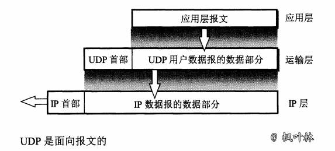

# 用户数据报协议 UDP

## UDP 概述

用户数据报协议 UDP 只在 IP 的数据报服务之上增加了很少一点的功能，这就是复用和分用的功能以及查错检测的功能

### UDP 的主要特点

1. UDP 是`无连接的`，即发送数据之前不需要建立连接(发送数据结束时也没有连接可释放)，减少了开销和发送数据之前的时延
2. UDP 使用`尽最大努力交付`，即不保证可靠交付，主机不需要维持复杂的连接状态表
3. UDP 是`面向报文`的，发送方的 UDP 对应用程序交下来的报文，在添加首部后就向下交付 IP 层。UDP 对应用层交下来的报文，既不合并，也不拆分，而是`保留这些报文的边界`

4. UDP `没有拥塞控制`，网络出现的拥塞不会使源主机的发送速率降低。这对某些实时应用是很重要的
5. UDP 支持一对一、一对多、多对一和多对多的交互通信
6. UDP 的`首部开销小`，只有8个字节，比 TCP 的20个字节的首部要短

### 存在问题

1. 某些实时应用需要使用没有拥塞控制的 UDP，但很多的源主机同时都向网络发送高速率的实时视频流时，网络就有可能发生拥塞，导致大家都无法正常接收。
2. 还有一些使用 UDP 的实时应用，需要对 UDP 的不可靠传输进行适当的改进，以减少数据的丢失。应用进程可以在不影响应用的实时性的前提下，增加一些提高可靠性的措施，如采用前向纠错或重传已丢失的报文

## UDP 的首部格式

用户数据报 UDP 有两个字段：`数据字段`和`首部字段`。首部字段很简单，只有8个字节，由四个字段组成，每个字段都是两个字节

### 首部字段

- `源端口` 源端口号。在需要对方回信时。不需要时可用全0
- `目的端口` 目的端口号。这在终点交付报文时必须使用
- `长度` UDP 用户数据报的长度，其最小值是8(仅有首部)
- `检验和` 检测 UDP 用户数据报在传输中是否有错。有错就丢弃

### 端口分用

当运输层从 IP 层收到 UDP 数据报时，就根据首部中的目的端口，把 UDP 数据报通过相应的端口，上交最后的终点——应用进程

如果接受方 UDP 发现收到的报文中的目的端口号不正确(即不存在对应于该端口号的应用程序)，就丢弃该报文，并由网际控制报文协议 ICMP 发送“端口不可达”差错报文给发送方

### 伪首部

UDP 用户数据报首部中检验和的计算方法有些特殊。在计算检验和时，要在 UDP 用户数据报之前增加 12 个字节的`伪首部`。所谓“伪首部”是因为这种伪首部并不是 UDP 用户数据报真正的首部。只是在计算检验和时，临时添加在 UDP 用户数据报前面，得到一个临时的 UDP 用户数据报。检验和就是按照这个临时用户数据报来计算的。伪首部既不向下传也不向上递交，而仅仅是为了计算检验和

**《用户数据报协议UDP》 原文链接：[https://blog.maplemark.cn/2019/04/用户数据报协议udp.html](https://blog.maplemark.cn/2019/04/用户数据报协议udp.html)**