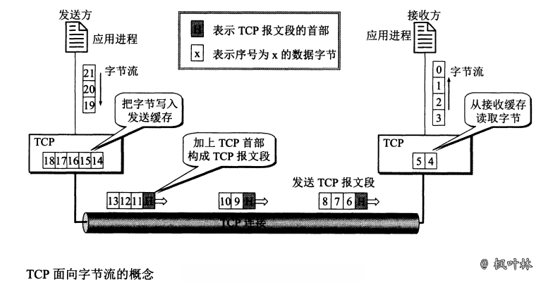
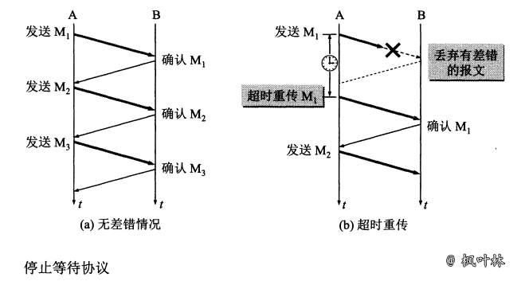
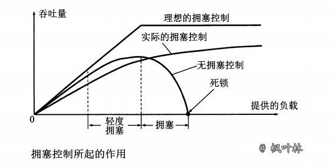
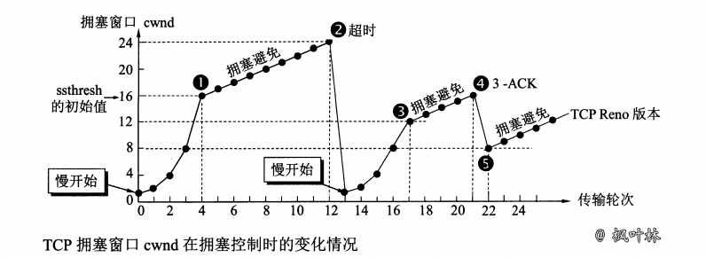
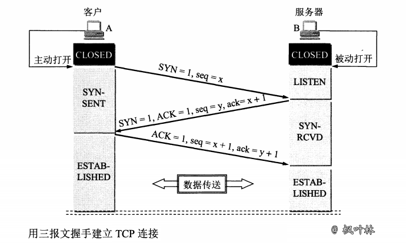
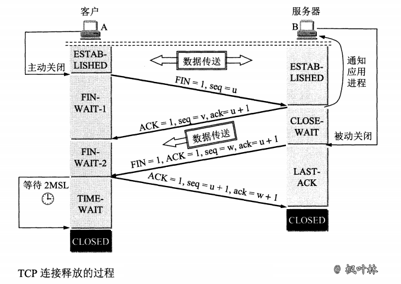

# 传输控制协议 TCP

## 传输控制协议 TCP 概述

### TCP 最主要的特点

- TCP 是`面向连接的运输层协议`。应用程序在使用 TCP 协议之前，必须先建立 TCP 连接。在传送数据完毕后，必须释放已经建立的 TCP 连接
- 每一条 TCP 连接只能有两个`端点`，每一条 TCP 连接只能是`点对点`的(一对一)
- TCP 提供`可靠交付`的服务。通过 TCP 连接传送的数据，无差错、不丢失、不重复，并且按序到达
- TCP 提供`全双工通信`。TCP 允许通信双方的应用进程在任何时候都能发送数据。TCP 连接的两端都设有发送缓存和接受缓存，用来临时存放双向通信的数据
- `面向字节流`。TCP 中的“流”指的是`流入到进程或从进程流出的字节序列`

### 面向字节流

“面向字节流”的含义是：虽然应用程序和 TCP 的交互式一次一个数据块(大小不等)，但 TCP 把应用程序交下来的数据仅仅看成是一连串的`无结构的字节流`。TCP 并不知道所传送的字节流的含义

TCP 不保证接收方应用程序所收到的数据块和发送方应用程序所发出的数据块具有对应大小的关系

> 例如，发送方应用程序交给发送方的 TCP 共10个数据块，但接收方的 TCP 可能只用了4个数据块就把收到的字节流交付上层的应用程序

接收方应用程序收到的字节流必须和发送方应用程序发出的字节流完全一样。接收方的应用程序必须有能力识别收到的字节流，把它还原成有意义的应用层数据

TCP 和 UDP 在发送报文时采用的方式完全不同。TCP 并不关心应用进程一次把多长的报文发送到 TCP 的缓存中，而是根据对方给出的窗口值和当前网络拥塞的程度来决定一个报文段应包含多少个字节(UDP 发送的报文长度是应用进程给出的)。如果应用进程传送到 TCP 缓存的数据块太长，TCP 就可以把它划分短一些再传送。如果应用进程一次只发来一个字节，TCP 也可以等待积累有足够多的字节后再构成报文段发送出去

### TCP 的连接

TCP 把`连接`作为`最基本的抽象`。TCP 的许多特性都与 TCP 是面向连接的这个基本特性有关

TCP 连接的端点叫做`套接字(socket)或插口`，根据 RFC 793 的定义：端口号拼接到(concatenated with) IP 地址即构成了套接字

> 套接字 socket = (IP 地址：端口号)

`每一条 TCP 连接唯一地被通信两端的两个端点(即两个套接字)所确定`

> TCP 连接 ::= {socket1, socket2} = {(IP1: port1), (IP2: port2)}

TCP 连接就是由协议软件所提供的一种抽象。`TCP 连接的端口是个很抽象的套接字`，即( `IP地址`: `端口号`)。同一个 IP 地址可以有多个不同的 TCP 连接，而同一个端口号也可以出现在多个不同的 TCP 连接中

### 易混淆的 socket

同一个名词 socket 却可表示多种不同的意思，以下 socket 的意思跟本文中所引用的 RFC 793 定义的 socket(指端口号拼接到 IP 地址)不同

- 允许应用程序访问连网协议的`应用编程接口 API(Application Programming Interface)`，即运输层和应用层之间的接口，称为 socket API，并简称为 socket
- 在 socket API 中使用的一个`函数名`也叫做 socket
- 调用 socket 函数的`端点`称为 socket，如“创建一个数据报 socket”
- 调用 socket 函数时，其`返回值`称为 socket 描述符，可简称为 socket
- 在操作系统内核中连网协议的 Berkeley 实现，称为 socket `实现`

## 可靠传输的工作原理

### 理想的传输条件

理想的传输条件有以下两个特点

- 传输信道不产生差错
- 不管发送方以多快的速度发送数据，接收方总是来得及处理收到的数据

实际的网络不具备以上两个理想条件。需要使用一些可靠的传输协议，当出现差错时让发送方重传出现差错的数据，同时在接收方来不及处理收到的数据时，及时告诉发送方适当减低发送数据的速度。这样，不可靠的传输信道就能够实现可靠传输了

### 停止等待协议

全双工通信的双方既是发送方也是接收方。把传送的数据单元都称为分组。“停止等待”就是每发完一个分组就停止发送，等待对方的确认。在收到确认后再发送下一个分组

#### 无差错情况

#### 出现差错

只要超过一段时间没有收到确认，就认为刚才发送的分组丢失了，因而重传前面发送过的分组。这就叫做`超时重传`。要实现超时重传，就要在每发送完一个分组时设置一个`超时计时器`

- 发送完一个分组后，`必须暂时保留已发送的分组的副本`(在发生超时重传时使用)。只有在收到相应的确认后才能清除暂时保留的分组副本
- 分组和确认分组都必须进行`编号`。这样才能明确是哪一个发送出去的分组收到了确认，而哪一个分组还没有收到确认
- 超时计时器的重传时间`应当比数据在分组传输的平均往返时间更长一些`

####  确认丢失和确认迟到

使用上述的确认和重传机制，我们就可以`在不可靠的传输网络上实现可靠的通信`

像上述的这种可靠传输协议常称为`自动重传请求 ARQ(Automatic Repeat reQuest)`。重传的请求是自动进行的。接收方不需要请求发送方重传某个出错的分组

#### 信道利用率

停止等待协议的优点是简单，但缺点是信道利用率太低

为了提高传输效率，发送方可以不使用低效率的停止等待协议，而是采用`流水线传输`。流水线传输就是发送方可连续发送多个分组，不必每发完一个分组就停顿下来等待对方的确认。这样可使信道上一直有数据不间断地在传送。这种传输方式可以获得很高的信道利用率

### 连续 ARQ 协议

位于发送窗口内的5个分组都可以连续发送出去，而不需要等待对方的确认。可以提高信道利用率

接收方一般都是采用`累积确认`的方式。接收方不需要对收到的分组逐个发送确认，而是在收到几个分组后，`对按序到达的最后一个分组发送确认`

积累确认有优点也有缺点。优点是：容易实现，即使确认丢失也不必重传。缺点是不能向发送方反映出接收方已经正确收到的所有分组的信息

## TCP 报文段的首部格式

TCP 虽然是面向字节流的，但 TCP 传送的数据单元却是报文段。一个 TCP 报文段分为首部和数据两部分。TCP 报文段首部的前20个字节是固定的，后面有4n字节是根据需要而增加的选项(n是整数)。因此 TCP 首部的最小长度是20字节

### 首部字段

- `源端口`和`目的端口` 各占2个字节，分别写入源端口号和目的端口号
- `序号` 占4字节。序号范围是[0, 232-1]，共232(即4 294 967 296)个序号。序号增加到232-1后，下一个序号就又回到0。在一个 TCP 连接中传送的字节流中的`每一个字节都按顺序编号`
- `确认号` 占4字节，是`期望收到对方下一个报文段的第一个数据字节的序号`
- `数据偏移` 占4字节，它指出 TCP 报文段的数据起始处距离 TCP 报文段的起始处有多远。这个字段实际上是指出 TCP 报文段的首部长度
- `保留` 占6位，保留为今后使用，但目前应置为0

下面有6个`控制位`，用来说明本报文段的性质

- `紧急 URG(URGent)` 当 URG=1 时，表明紧急指针字段有效。它告诉系统此报文段中有紧急数据，应尽快传送(相当于高优先级的数据)，而不是按原先的排队顺序来传送
- `确认 ACK(ACKnowledgment)` 仅当 ACK=1 时确认号字段才有效。当 ACK=0 时，确认号无效。TCP 规定，在连接建立后所有传送的报文段都必须把 ACK 置1
- `推送 PSH(Push)` 当两个应用进程进行交互式的通信时，有时在一端的应用进程希望在键入一个命令后立即就能够收到对方的响应
- `复位 RST(ReSeT)` 当 RST=1 时，表明 TCP 连接中出现严重差错(如由于主机崩溃或其他原因)，必须释放连接，然后再重新建立运输连接
- `同步 SYN(SYNnchronization)` 在连接建立时用来同步序号。当 SYN=1 而 ACK=0 时，表明这是一个连接请求报文段。对方若同意建立连接，则应在响应的报文段中使 SYN=1 和 ACK=1
- `终止 FIN(FINis)` 用来释放一个连接。当 FIN=1 时，表明此报文段的发送发的数据已发送完毕，并要求释放运输连接

- `窗口` 占2字节。窗口值是[0, 216-1]之间的整数。窗口值作为接收方让发送方设置其发送窗口的依旧
- `检验和` 占2字节。检验和字段检验的范围包括首部和数据这两部分
- `紧急指针` 占2字节。紧急指针仅在 URG=1 时才有意义，它指出本报文段中的紧急数据的字节数
- `选项` 长度可变，最长可达40字节

## TCP 可靠传输的实现

### 以字节为单位的滑动窗口

#### 发送窗口构造

TCP 的滑动窗口是以字节为单位的。假定 A 收到了 B `发来`的确认报文段，其中窗口是20字节，而确认号是31(这表明 B 期望收到的下一个序号是31，而序号30为止的数据已经收到了)。根据这两个数据，A 就构造出自己的发送窗口

发送窗口标识：在没有收到 B 的确认的情况下，A 可以连续把窗口内的数据都发送出去。凡是已经发送出去的数据，在未收到确认之前都必须暂时保留，以便在超时重传时使用

#### 发送窗口变化

发送窗口的位置由窗口前沿和后沿的位置共同确定。发送窗口后沿的变化情况有两种，即不动(没有收到新的确认)和前移(收到了新的确认)。发送窗口后沿不可能向后移动，因为不能撤销已收到的确认

发送窗口前沿通常是不断向前移动，但也有可能不动。这对应于两种情况：

- 一是没有收到新的确认，对应通知的窗口大小也不变
- 二是收到了新的窗口单对方通知的窗口缩小了，使得发送窗口前沿正好不动

发送窗口前沿也有可能`向后收缩`。这发生在对方通知的窗口缩小了。但 TCP 的标准`强烈不赞成这样做`。因为很可能发送方在收到这个通知以前已经发送了窗口中的许多数据，现在又要收缩窗口，不让发送这些数据，这样就会产生一些错误

要描述一个发送窗口的状态需要三个指针：P1，P2，P3。指针都指向字节的序号。这三个指针指向的几个部分的意义如下：

- 小于 P1 的是已发送并已收到确认的部分，而大于 P3 的是不允许发送的部分
- P3 - P1 = `A 的发送窗口`
- P2 - P1 已发送但尚未收到确认的字节数
- P3 - P2 允许发送但当前尚未发送的字节数(又称为`可用窗口`或`有效窗口`)

B 的接收窗口大小是20。在接收窗口外面，到30号为止的数据是已经发送过确认，并且已经交付主机了。因此在 B 可以不再保留这些数据。接收窗口内的序号(31\~50)是允许接收的。在上图中，B 收到了序号为32和33的数据。这些数据没有按序到达，因为序号为31的数据没有收到(也许丢失了，也许滞留在网络中的某处)。请注意，B 只能对按序收到的数据中的最高序号给出确认，因此 B 发送的确认报文段中的确认号仍然是31(即期望收到的序号)，而不是32或33

现在假定 B 收到了序号为31的数据，并把序号为31\~33的数据交付主机，然后 B 删除这些数据。接着把接收窗口向前移动3个序号，同时给 A 发送确认，其中窗口值仍为20，但确认号是34。这表明 B 已经收到了到序号33为止的数据。B 还收到了序号为37，38和40的数据，但这些都没有按序到达，只能先暂存在接收窗口中。A 收到 B 的确认后，就可以把发送窗口向前滑动3个序号，但指针 P2 不动。现在 A 的可用窗口增大了，可发送的序号范围是42\~53

A 在继续发送完序号42\~53的数据后，指针 P2 向前移动和 P3 重合。发送窗口内的序号都已用完，但还没有再收到确认。由于 A 的发送窗口已满，可用窗口已减小到零，因此必须停止发送。发送窗口内所有的数据都已正确到达 B，B 也早已发出了确认。但所有这些确认都滞留在网络中。在没有收到 B 的确认时，A 不能猜测：”或许 B 收到了吧！“为了保证可靠传输，A 只能认为 B 还没有收到这些数据。于是，A 在经过一段时间后(由超时计时器控制)就重传这部分数据，重新设置超时计时器，直到收到 B 的确认为止。如果 A 收到确认号落在发送窗口内，那么 A 就可以发送窗口继续向前滑动，并发送新的数据

#### 缓存和窗口

发送方维持的发送缓存和发送窗口，以及接收方维持的接收缓存和接收窗口

发送缓存用来暂时存放：

- 发送应用程序传送给对方 TCP 准备发送的数据
- TCP 已发送出但尚未收到确认的数据

已被确认的数据应当从发送缓存中删除，因此发送缓存和发送窗口的后沿是重合的。发送应用程序必须控制写入缓存的速率，不能太快，否则发送缓存就会没有存放数据的空间

接收缓存用来暂时存放：

- 按序到达的、但尚未被接收应用程序读取的数据
- 未按序到达的数据

收到的分组被检测出有差错，则丢弃。接收应用程序来不及读取收到的数据，接收缓存最终就会被填满，使接收窗口减小到零。接收应用程序能够及时从接收缓存中读取收到的数据，接收窗口就可以增大，最大亦不能超过接收缓存的大小

要点小结：

- 虽然 A 的发送窗口是根据 B 的接收窗口设置的，但在同一时刻，A 的发送窗口并不总是和 B 的接收窗口一样大。通过网络传送窗口值需要经历一定的时间滞后，该时间并不确定的
- 对于不按序到达的数据，TCP 通常是先临时存放在接收窗口，等字节流中所缺少的字节收到后，在`按序交付上层的应用进程`
- TCP 要求接收方必须有累积确认的功能，这样可以减少传输开销

### 超时重传时间的选择

TCP 的发送方在规定的时间内没有收到确认就要重传已发送的报文段。这种重传的概念是很简单的，但重传时间的选择却是 TCP 最复杂的问题之一

由于 TCP 的下层是互联网环境，发送的报文段可能只经过一个高速率的局域网，也可能经过多个低速率的网络，并且每个 IP 数据报所选择的路由还可能不同。如果把超时重传时间设置得太短，就会引起很多报文段的不必要的重传，使网络负荷增大。但若把超时重传时间设置的过长，则又使网络的空闲时间增大，降低了传输效率

TCP 采用了一种自适应算法，它记录一个报文段发出的时间，以及收到相应的确认的时间。这两个时间之差就是`报文段的往返时间 RTT`

> 新的 RTTs = (1 - α) x (旧的 RTTs) + α x (新的 RTT 样本)

RTT：报文段往返时间
RTTs：加权平均往返时间
α： 0 ≤ α < 1，RFC 6298 推荐的 α 值为 1/8，即 0.125

> RTO = RTTs + 4 x RTTD

RTO：超时重传时间
RTTD：RTT 的偏差的加权平均值

> 新的 RTTD = (1 - β) x (旧的 RTTD) + β x |RTTs - 新的 RTT 样本|

β：小于1的系数，推荐值是 1/4，即 0.25

## TCP 流量控制

### 利用滑动窗口实现流量控制

流量控制(flow control)：让发送方的发送速率不要太快，要让接收方来得及接收

利用滑动窗口机制可以很方便地在 TCP 连接上实现对发送方的流量控制

`发送方的发送窗口不能超过接收方给出的接收窗口的数值`。TCP 的`窗口单位是字节，不是报文段`

避免死锁：TCP 为每一个连接设有一个`持续计时器(persistence timer)`。只要 TCP 连接的一方收到对方的零窗口通知，就启动持续计时器。若持续计时器设置的时间到期，就发送一个零窗口`探测报文段`(仅携带1字节的数据)，而对方就在确认这个探测报文段时给出了现在的窗口值。如果窗口仍是零，那么收到这个报文段的一方就重新设置持续计时器。如果窗口不是零，那么死锁的僵局就可以打破了

### TCP 的传输效率

#### 发送机制

- TCP 维持一个变量，它等于`最大报文段长度 MSS`。只要缓存中存放的数据达到 MSS 字节时，就组装成一个 TCP 报文段发送出去
- 由发送方的应用进程指明要求发送报文段，即 TCP 支持的`推送(push)`操作
- 发送方的一个计时器期限到了，这时把当前已有的缓存数据装入报文段(但长度不能超过 MSS)发送出去

#### Nagle 算法

> 在 TCP 的实现中广泛使用 Nagle 算法

若发送应用进程把要发送的数据逐个字节地送到 TCP 的发送缓存，则发送方就把第一个数据字节先发送出去，把后面到达的数据字节都缓存起来。当发送方收到对第一个数据字符的确认后，再把发送缓存中的所有数据组装成一个报文段发送出去，同时继续对随后到达的数据进行缓存。只有在收到对前一个报文段的确认后才继续发送下一个报文段。当数据达到较快而网络速率较慢时，用这样的方法可明显地减少所用的网络宽带。Nagle 算法还规定，当到达的数据已达到发送窗口大小的一半或已达到报文段的最大长度时，就立即发送一个报文段。这样可以有效提高网络的吞吐量

#### 糊涂窗口综合征

> TCP 接收方的缓存已满，仅剩一个字节，并还将保持这种状态持续一段时间。导致发送方只能发送一个字节。导致网络的效率很低

为了解决这个问题，可以`让接收方等待一段时间`，使得或者接受缓存已有足够空间容纳一个最长的报文段，或者`等到接受缓存已有一半空闲的空间`。只要出现这两种情况之一，接收方就发出确认报文，并向发送方通知当前的窗口大小。发送方也不要发送大小的报文段，而是把数据积累成足够大的报文段，或达到接收方缓存的空间的一半大小

## TCP 的拥塞控制

### 拥塞控制的一般原理

在计算机网络中的链路容量(即宽带)、交换结点中的缓存和处理机等，都是网络资源。在某段时间，若对网络中某一资源的需求超过了该资源所能提供的可用部分，网络的性能就要变坏。这种情况就叫做`拥塞`(congestion)

`拥塞控制`就是`防止过多的数据注入到网络中，这样可以使网络中的路由器或链路不致过载`。拥塞控制所要做的都是一个前提，就是`网络能够承受现有的网络负荷`

### TCP 的拥塞控制方法

TCP 进行拥塞控制的算法有四种，即`慢开始`(slow-start)、`拥塞避免`(congestion avoidance)、`快重传`(fast retransmit)和`快恢复`(fast recovery)

#### 慢开始

当主机开始发送数据时，由于并不清楚网络的负荷情况，如果立即把大量数据字节注入到网络，就有可能引起网络发生拥塞。经验证明，较好的方法是先探测一下，即`由小到大逐渐增大发送窗口`，也就是说，`由小到大逐渐增大拥塞窗口数值`

cwnd：发送方的拥塞窗口，开始发送方设置 cwnd = 1

#### 拥塞避免

让拥塞窗口 cwnd 缓慢地增大，即每经过一个往返时间 RTT 就把发送方的拥塞窗口 cwnd 加1，而不是像慢开始阶段那样加倍增加。因此在拥塞避免阶段就有“`加法增大`” AI(Additive Increase)的特点。这表明在拥塞避免阶段，拥塞窗口 cwnd `按线性规律缓慢增长`，比慢开始算法的拥塞窗口增长速率缓慢得多

“拥塞避免”并非完全能够避免拥塞，而是把拥塞窗口控制为按线性规律增长，`使网络比较不容易出现拥塞`

在执行慢开始算法时，发送方每收到一个对新报文段的确认 ACK，就把拥塞窗口值加1，然后开始下一轮的传输。因此拥塞窗口 cwnd 随着传输轮次按指数规律增长。当拥塞窗口 cwnd 增长到慢开始门限值 ssthresh 时，就改成执行拥塞避免算法，拥塞窗口按线性规律增长

ssthresh：慢开始门限，一般的，会有一个初始值，下图中为16个报文段

当拥塞窗口 cwnd = 24 时，网络出现了超时，发送方判断为网络拥塞。于是调整门限值 ssthresh = cwnd / 2 = 12，同时设置拥塞窗口 cwnd = 1，进入慢开始阶段

#### 快重传

采用快重传算法可以让发送方`尽早知道发生了个别报文段的丢失`。快重传算法首先要求接收方不要等待自己发送数据时才进行捎带确认，而是要`立即发送确认`，即使收到了`失序的报文段`也要立即发出对已收到的报文段的重复确认

#### 快恢复

发送方知道当前只是丢失了个别的报文段。于是不启动慢开始，而是执行`快恢复`算法。这时，发送方调整门限值 ssthresh = cwnd / 2 = 8，同时设置拥塞窗口 cwnd = ssthresh = 8，并开始执行拥塞避免算法

TCP Reno 版本：区别于老的 TCP Tahao 版本

## TCP 的运输连接管理

TCP 是面向连接的协议。运输连接是用来传送 TCP 报文的。TCP 运输连接的建立和释放是每一次面向连接的通信中必不可少的过程。运输连接有三个阶段，`连接建立`、`数据传送`和`连接释放`。运输的连接管理就是使运输连接的建立和释放都能够正常地进行

在 TCP 连接建立过程中要解决以下三个问题：

- 要使每一方能够确知对方的存在
- 要允许双方协商一些参数(最大窗口值、是否使用窗口扩大选项和时间戳选项以及服务质量等)
- 能够对运输实体资源(缓存大小、连接表中的项目等)进行分配

### TCP 的连接建立

TCP 建立连接的过程叫做握手，握手需要在客户和服务器之间交换三个 TCP 报文段

#### 连接建立过程

1. 最初客户/服务器的 TCP 进程都处于 `CLOSED(关闭)`状态。在本实例中，A `主动打开连接`，而 B `被动打开连接`
2. B 的 TCP 服务器进程先创建`传输控制块` TCB，并处于 `LISTEN(收听)` 状态，等待客户的连接请求
3. A 的 TCP 客户进程创建`传输控制模块` TCB。并向 B 发出连接请求报文段，首部中的同部位 SYN = 1，选择一个初始序号 seq = x。TCP 客户端进程进入 `SYN-SENT(同步已发送)` 状态。TCP 规定，SYN 报文段(即 SYN = 1 的报文段)不能携带数据，但要`消耗一个序号`
4. B 收到连接请求报文段后，如同意建立连接，则向 A 发送确认。在确认报文段中应把 SYN 位和 ACK 位都置1，确认号是 ack = x + 1，同时也为自己选择一个初始序号 seq = y。这时 TCP 服务器进程进入 `SYN-RCVD(同步收到)` 状态。这个报文段也不能携带数据，但同样`要消耗掉一个序号`
5. TCP 客户进程收到 B 的确认后，还要向 B 给出确认。确认报文段的 ACK 置1，确认号 ack = y + 1，而自己的序号 seq = x + 1。TCP 的标准规定，ACK 报文段可以携带数据。但`如果不携带数据则不消耗序号`，在这种情况下，下一个数据报文段的序号仍是 seq = x + 1。这时，TCP 连接已经建立，A 进入 `ESTABLISHED(已建立连接)` 状态
6. 当 B 收到 A 的确认后，也进入 `ESTABLISHED` 状态

> `传输控制块` TCB(Transmission Control Block)存储了每一个连接中的一些重要信息，如：TCP 连接表，指向发送和接收缓存的指针，指向重传队列的指针，当前的发送和接收序号等等

#### 四报文握手

B 发送给 A 的报文段，可拆成两个报文段。先发送一个确认报文段(ACK = 1，ack = x + 1)，然后再发送一个同步报文段(SYN = 1，seq = y)。这样的过程就变成了`四报文握手`，与三报文握手效果一致

#### 异常情况

为什么 A 最后还要发送一次确认呢？这主要是为了防止已失效的连接请求报文段突然又传到了 B，因而产生错误

正常情况：A 发出连接请求，但因连接请求报文丢失而未收到确认。于是 A 再重传一次连接请求。后来收到了确认，建立了连接。数据传输完毕后，就释放了连接。A 共发送了两个连接请求报文段，其中第一个丢失，第二个到达了 B，没有“已失效的连接请求报文段”

异常情况：A 发出的第一个连接请求报文段并没有丢失，而是在某些网络结点长时间滞留了，以致延误到连接释放以后的某个时间才到达 B。本来这是一个早已失效的报文段。但 B 收到此失效的连接请求报文段后，就误认为是 A 又发出一次新的连接请求。于是就向 A 发出确认报文段，同意建立连接。假定不采用报文握手，那么只要 B 发出确认，新的连接就建立了。

> 现在 A 并没有发出建立连接的请求，因此不会理睬 B 的确认，也不会向 B 发送数据。但 B 却以为新的运输连接已经建立了，并一直等待 A 发来数据。B 的`许多资源就这样被浪费了`。

> 采用三报文握手的办法，可以防止上述现象的发生

### TCP 的连接释放

#### 连接释放过程

1. A 的应用进程先向其 TCP 发出连接释放报文段，并停止再发送数据，主动关闭 TCP 连接。A 把连接释放报文段首部的终止控制位 FIN 置1，其序号 seq = u，它等于前面已传送过的数据的最后一个字节的序号加1。这时 A 进入 `FIN-WAIT-1(终止等待1)` 状态，等待 B 的确认。TCP 规定，FIN 报文段即使不携带数据，也消耗一个序号
2. B 收到连接释放报文段后即发出确认，确认号是 ack = u + 1，而这个报文段自己的序号是 v，等于 B 前面已传送过的数据的最后一个字节的序号加1。B随即进入 `CLOSE-WAIT(关闭等待)` 状态。TCP 服务器进程这时应通知高层应用进程，因而从 A 到 B 这个方向的连接就释放了，这时的 TCP 连接处于 `半关闭(half-close)` 状态，即 A 已经没有数据要发送了，但 B 若发送数据，A 仍要接收。也就是说，从 B 到 A 这个方向的连接并未关闭，这个状态可能会持续一段时间
3. A 收到来自 B 的确认后，就进入 `FIN-WAIT-2(终止等待2)` 状态，等待 B 发出的连接释放报文段
4. 若 B 已经没有要向 A 发送的数据，其应用进程就通知 TCP 释放连接。这时 B 发出的连接释放报文段必须使 FIN = 1。现假定 B 的序号为 w(在半关闭状态 B 可能又发送了一些数据)。B 还必须重复上次已发送过的确认号 ack = u + 1。这时 B 就进入 `LAST-ACK(最后确认)`状态，等待 A 的确认
5. A 在收到 B 的连接释放报文段后，必须对此发出确认。在确认报文段中把 ACK 置1，确认号 ack = w + 1，而自己的序号是 seq = u + 1(根据 TCP 标准，前面发送过的 FIN 报文段要消耗一个序号)。然后进入到 `TIME-WAIT(时间等待)`状态。此时 TCP 连接还没有释放掉。必须经过`时间等待计时器(TIME-WAIT timer)`设置的时间2MSL后，A 才进入到 `CLOSED` 状态
6. 当 A 撤销相应的传输控制块 TCB 后，就结束了这次的 TCP 连接

> 时间 MSL 叫做`最长报文段寿命`(Maximum Segment Lifetime)，RFC 793建议设为2分钟。但这完全是从工程上来考虑的，对于现在的网络，MSL = 2分钟可能太长了一些

#### TIME-WAIT 等待时间

为什么 A 在 TIME-WAIT 状态必须等待 2MSL 的时间呢？

为了保证 A 发送的最后一个 ACK 报文段能够到达 B。这个 ACK 报文段有可能丢失，因而使处在 LAST-ACK 状态的 B 收不到对已发送的 FIN + ACK 报文段的确认。B 会超时 重传这个 FIN + ACK 报文段，而 A 就能在 2MSL 时间内收到这个重传的 FIN + ACK 报文段。接着 A 重传一次确认，重新启动 2MSL 计时器。最后，A 和 B 都正常进入到 CLOSED 状态。如果 A 在 TIME-WAIT 状态不等待一段时间，而是在发完 ACK 报文段后立即释放连接，那么就无法收到 B 重传的 FIN + ACK 报文段，因而也不会再发送一次确认报文段。这样，B 就无法安装正常步骤进入 CLOSED 状态

防止前面提到的“已失效的连接请求报文段”出现在本连接中。A 在发送完最后一个 ACK 报文段后，再经过时间 2MSL，就可以使本连接持续的时间内所产生的所有报文段都从网络中消失。这样就可以使下一个新的连接中不会出现这种旧的连接请求报文段

B 只要收到 A 发出的确认，就进入 CLOSED 状态。同样，B 在撤销相应的传输控制 TCB 后，就结束了这次的 TCP 连接。B 结束 TCP 连接的时间要比 A 早一些

`保活计时器(keepalive timer)`：服务器每收到一次客户的数据，就重新设置保活计时器，时间的设置通常是两小时。若两小时没有收到客户的数据，服务器就发送一个探测报文段，以后则每隔75秒发送一次。若一连发送10个探测报文段后仍无客户的响应，服务器就认为客户端出了故障，接着就关闭这个连接

### TCP 的有限状态机

为了更清晰地看出 TCP 连接的各种状态之间的关系，下图为 TCP 的有限状态机。图中每一个方框即 TCP 可能具有的状态。每个方框中的大写英文字符串是 TCP 标准所使用的 TCP 连接状态名。状态之间的箭头表示可能发生的状态变迁。箭头旁边的字，表明引起这种变迁的原因，或表明发生状态变迁后又出现什么动作。请注意图中有三种不同的箭头。`粗实线箭头`表示对`客户进程的正常变迁`。`粗虚线箭头`表示对`服务器进程的正常变迁`。另一种`细线箭头`表示`异常变迁`

**《TCP协议详解》原文链接：[https://blog.maplemark.cn/2019/04/tcp协议详解.html](https://blog.maplemark.cn/2019/04/tcp协议详解.html)**