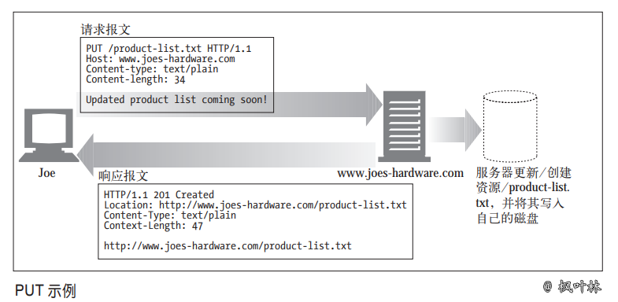
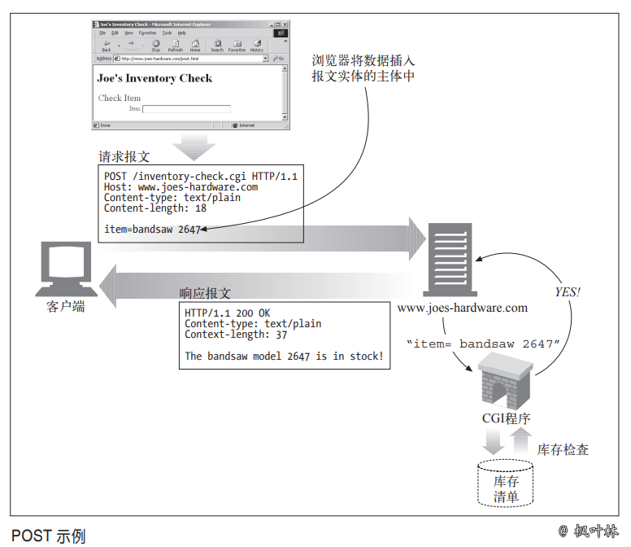
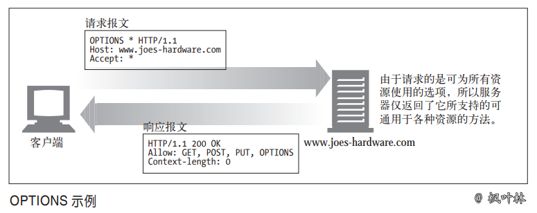
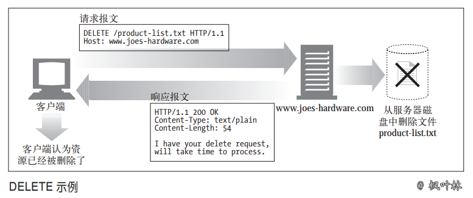

# HTTP方法详解

## 常见的 HTTP 方法

HTTP 请求方法用于告诉服务器要做什么。HTTP 规范中定义了一组常用的请求方法。

> 例如：GET 方法负责从服务器获取文档，POST 方法会向服务器发送需要处理的数据，OPTIONS 方法用于确定服务器的一般功能，或者服务器处理特定资源的能力

下图描述了7种 HTTP 方法，并不是所有服务器都实现了所有7种方法。有些方法的请求报文中有主体，有些则无主体的请求

由于 HTTP 设计易于扩展，除这些方法，其他服务器可能还会实现一些自己的请求方法。这些附加的方法是对 HTTP 规范的扩展，被称为`扩展方法`

## 安全方法

HTTP 定义了一组被称为`安全方法`的方法。GET 方法和 HEAD 方法都被认为是安全的，这就意味着使用 GET 或 HEAD 方法的 HTTP 请求都不会产生什么动作

不产生动作，在这里意味着 HTTP 请求不会在服务器上产生什么结果。例如，你在 Colin 的五金商店购物时，点击了“提交购买”按钮。点击按钮时会提交一个带有信用卡信息的 POST 请求，那么在服务器上，就会为你执行一个动作。在这种情况下，为购买行为支付信用卡就是所执行的动作

安全方法并不一定是什么动作都不执行的（实际上，这是由 Web 开发者决定的）。使用安全方法的目的就是当使用可能引发某一动作的不安全方法时，`允许 HTTP 应用程序开发者通知用户`。在 Colin 的五金商店的例子中，你的 Web 浏览器可能会弹出一条警告消息，说明你正在用不安全的方法发起请求，这样可能会在服务器上引发一些事件（比如用你的信用卡支付费用）

## 方法详解

### GET 方法

GET 是最常用的方法。通常用于请求服务器发送某个资源。HTTP/1.1 要求服务器实现此方法

### HEAD 方法

HEAD 方法与 GET 方法的行为很类似，但服务器在响应中只返回首部。不会返回实体的主体部分。这就允许客户端在未获取实际资源的情况下，对资源的首部进行检查。使用 HEAD，可以：

- 在不获取资源的情况下了解资源的情况(比如，判断其类型)
- 通过查看响应中的状态码，看看某个对象是否存在
- 通过查看首部，测试资源是否被修改了

服务器开发者必须确保返回的首部与 GET 请求所返回的首部完全相同。遵循 HTTP/1.1 规范，就必须实现 HEAD 方法

### PUT 方法

与 GET 从服务器读取文档相反，PUT 方法会向服务器写入文档。有些发布系统允许用户创建 Web 页面，并用 PUT 直接将其安装到 Web 服务器上去

PUT 方法的语义就是让服务器用请求的主体部分来创建一个由所请求的 URL 命名的新文档，或者，如果那个 URL 已经存在的话，就用这个主体来替代它。

因为 PUT 允许用户对内容进行修改，所以很多 Web 服务器都要求在执行 PUT 之前，用密码登录

### POST 方法

POST 方法起初是用来向服务器输入数据的。实际上，通常会用它来支持 HTML 的表单。表单中填好的数据通常会被送给服务器，然后由服务器将其发送到它要去的地方（比如，送到一个服务器网关程序中，然后由这个程序对其进行处理）

### TRACE 方法

客户端发起一个请求时，这个请求可能要穿过防火墙、代理、网关或其他一些应用程序。每个中间节点都可能会`修改原始的 HTTP 请求`。TRACE 方法允许客户端在最终将请求发送给服务器时，看看它变成了什么样子

TRACE 请求会在目的服务器端发起一个“环回”诊断。行程最后一站的服务器会弹回一条 TRACE 响应，并在响应主体中携带它收到的原始请求报文。这样客户端就可以查看在所有中间 HTTP 应用程序组成的请求/响应链上，原始报文是否，以及如何被毁坏或修改过 TRACE 方法主要用于诊断；也就是说，用于验证请求是否如愿穿过了请求/响应链。它也是一种很好的工具，可以用来查看代理和其他应用程序对用户请求所产生效果

尽管 TRACE 可以很方便地用于诊断，但它确实也有缺点，它假定中间应用程序对各种不同类型请求（不同的方法——GET、HEAD、POST 等）的处理是相同的。很多 HTTP 应用程序会根据方法的不同做出不同的事情——比如，代理可能会将 POST 请求直接发送给服务器，而将 GET 请求发送给另一个 HTTP 应用程序（比如Web 缓存）。TRACE 并不提供区分这些方法的机制。通常，中间应用程序会自行决定对 TRACE 请求的处理方式

TRACE 请求中不能带有实体的主体部分。TRACE 响应的实体主体部分包含了响应服务器收到的请求的精确副本

### OPTIONS

OPTIONS 方法请求 Web 服务器告知其支持的各种功能。可以询问服务器通常支持哪些方法，或者对某些特殊资源支持哪些方法。（有些服务器可能只支持对一些特殊类型的对象使用特定的操作）

这为客户端应用程序提供了一种手段，使其不用实际访问那些资源就能判定访问各种资源的最优方式

### DELETE

DELETE 方法所做的事情就是请服务器删除请求 URL 所指定的资源。但是，客户端应用程序无法保证删除操作一定会被执行。因为 HTTP 规范允许服务器在不通知客户端的情况下撤销请求

### 扩展方法

HTTP 被设计成字段可扩展的，这样新的特性就不会使老的软件失效了。扩展方法指的就是没有在 HTTP/1.1 规范中定义的方法。服务器会为它所管理的资源实现一些 HTTP 服务，这些方法为开发者提供了一种扩展这些 HTTP 服务能力的手段。下图列出了一些常见的扩展方法实例。这些方法就是 WebDAV HTTP 扩展包含的所有方法，这些方法有助于通过 HTTP 将 Web 内容发布到 Web 服务器上去

并不是所有的扩展方法都是在正式规范中定义的，认识到这一点很重要。如果你定义了一个扩展方法，很可能大部分 HTTP 应用程序都无法理解。同样，你的 HTTP应用程序也可能会遇到一些其他应用程序在用的，而它并不理解的扩展方法

在这些情况下，最好对扩展方法宽容一些。如果能够在不破坏端到端行为的情况下将带有未知方法的报文传递给下游服务器，代理应尝试传递这些报文。如果可能破坏端到端行为则应以 501 Not Implemented（无法实现）状态码进行响应。最好按惯例“对所发送的内容要求严一点，对所接收的内容宽容一些”来处理扩展方法（以及一般的 HTTP 扩展）

**《HTTP方法详解》 原文链接：[https://blog.maplemark.cn/2019/04/http方法详解.html](https://blog.maplemark.cn/2019/04/http方法详解.html)**