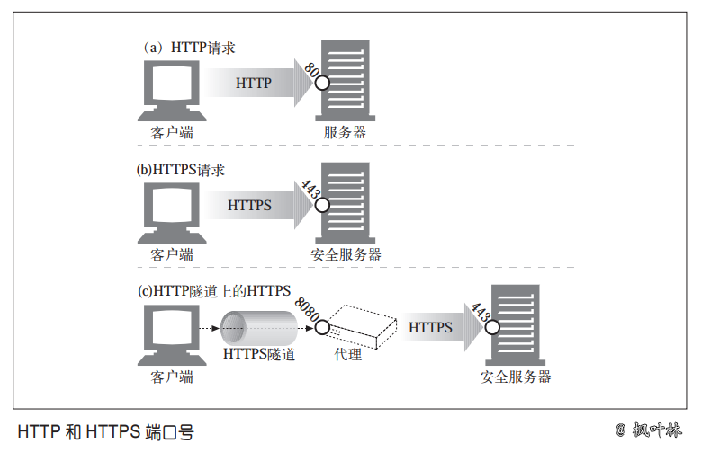
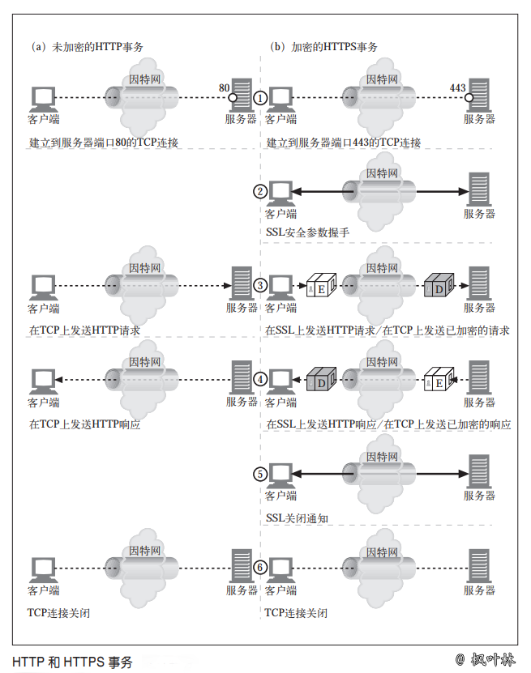

# HTTPS 细节介绍

HTTPS 是最常见的 HTTP `安全版本`。它得到了很广泛的应用，所有主要的商业浏览器和服务器上都提供 HTTPS。HTTPS 将 HTTP 协议与一组强大的对称、非对称和基于证书的加密技术结合在一起，使得 HTTPS 不仅很安全，而且很灵活，很容易在处于无序状态的、分散的全球互联网上进行管理

HTTPS 加速了因特网应用程序的成长，已经成为基于 Web 的电子商务快速成长的主要推动力。在广域网中对分布式 Web 应用程序的安全管理方面，HTTPS 也是非常重要的

## HTTPS 概述

HTTPS 就是在安全的传输层上发送的 HTTP。HTTPS 没有将未加密的 HTTP 报文发送给 TCP，并通过世界范围内的因特网进行传输，它在将 HTTP 报文发送给 TCP 之前，先将其发送给了一个安全层，对其进行加密

现在，HTTP 安全层是通过 SSL 及其现代替代协议 TLS 来实现的。我们遵循常见的用法，用术语 SSL 来表示 SSL 或者 TLS

## HTTPS 方案

现在，安全 HTTP 是可选的。因此，对 Web 服务器发起请求时，我们需要有一种方式来告知 Web 服务器去执行 HTTP 的安全协议版本。这是在 URL 的方案中实现的。通常情况下，非安全 HTTP 的 URL 方案前缀为 http，如下所示：

> http://blog.maplemark.cn

在安全 HTTPS 协议中，URL 的方案前缀为 https，如下所示：

> https://blog.maplemark.cn

请求一个客户端（比如 Web 浏览器）对某 Web 资源执行某事务时，它会去检查 URL 的方案

- 如果 URL 的方案为 http，客户端就会打开一条到服务器端口 80（默认情况下）
的连接，并向其发送老的 HTTP 命令
- 如果 URL 的方案为 https，客户端就会打开一条到服务器端口 443（默认情况下）
的连接，然后与服务器“握手”，以二进制格式与服务器交换一些 SSL 安全参数，
附上加密的 HTTP 命令

SSL 是个二进制协议，与 HTTP 完全不同，其流量是承载在另一个端口上的（SSL 通常是由端口 443 承载的）。如果 SSL 和 HTTP 流量都从端口 80 到达，大部分 Web 服务器会将二进制 SSL 流量理解为错误的 HTTP 并关闭连接。将安全服务进一步整合到 HTTP 层中去就无需使用多个目的端口了，在实际中这样不会引发严重的问题

## 建立安全传输

在未加密 HTTP 中，客户端会打开一条到 Web 服务器端口 80 的 TCP 连接，发送一条请求报文，接收一条响应报文，关闭连接

由于 SSL 安全层的存在，HTTPS 中这个过程会略微复杂一些。在 HTTPS 中，客户端首先打开一条到 Web 服务器端口 443（安全 HTTP 的默认端口）的连接。一旦建立了 TCP 连接，客户端和服务器就会初始化 SSL 层，对加密参数进行沟通，并交换密钥。握手完成之后，SSL 初始化就完成了，客户端就可以将请求报文发送给安全层了。在将这些报文发送给 TCP 之前，要先对其进行加密

## SSL 握手

在发送已加密的 HTTP 报文之前，客户端和服务器要进行一次 SSL 握手，在这个握手过程中，它们要完成以下工作

- 交换协议版本号
- 选择一个两端都了解的密码
- 对两端的身份进行认证
- 生成临时的会话密钥，以便加密信道

在通过网络传输任何已加密的 HTTP 数据之前，SSL 已经发送了一组握手数据来建立通信连接了

这是 SSL 握手的简化版本。根据 SSL 的使用方式，握手过程可能会复杂一些，但总
的思想就是这样

## 服务器证书

SSL 支持双向认证，将服务器证书承载回客户端，再将客户端的证书回送给服务器。而现在，浏览时并不经常使用客户端证书。大部分用户甚至都没有自己的客户端证书。服务器可以要求使用客户端证书，但实际中很少出现这种情况。

另一方面，安全 HTTPS 事务总是要求使用服务器证书的。在一个 Web 服务器上执行安全事务，比如提交信用卡信息时，你总是希望是在与你所认为的那个组织对话。由知名权威机构签发的服务器证书可以帮助你在发送信用卡或私人信息之前评估你对服务器的信任度。

服务器证书是一个显示了组织的名称、地址、服务器 DNS 域名以及其他信息的 X.509 v3 派生证书。你和你所用的客户端软件可以检查证书，以确保所有的信息都是可信的

## 站点证书的有效性

SSL 自身不要求用户检查 Web 服务器证书，但大部分现代浏览器都会对证书进行简单的完整性检查，并为用户提供进行进一步彻查的手段。网景公司提出的一种 Web 服务器证书有效性算法是大部分浏览器有效性验证技术的基础。

- 日期检测

首先，浏览器检查证书的起始日期和结束日期，以确保证书仍然有效。如果证书过期了，或者还未被激活，则证书有效性验证失败，浏览器显示一条错误信息

- 签名颁发者可信度检测

每个证书都是由某些证书颁发机构（CA）签发的，它们负责为服务器担保。证书有不同的等级，每种证书都要求不同级别的背景验证。比如，如果申请某个电子商务服务器证书，通常需要提供一个营业的合法证明

任何人都可以生成证书，但有些 CA 是非常著名的组织，它们通过非常清晰的流程来验证证书申请人的身份及商业行为的合法性。因此，浏览器会附带一个签名颁发机构的受信列表。如果浏览器收到了某未知（可能是恶意的）颁发机构签发的证书，那它通常会显示一条警告信息。有些证书会携带到受信 CA 的有效签名路径，浏览器可能会选择接受所有此类证书。换句话说，如果某受信 CA 为“Sam 的签名商店”签发了一个证书，而 Sam 的签名商店也签发了一个站点证书，浏览器可能会将其作为从有效 CA 路径导出的证书接受

- 签名检测

一旦判定签名授权是可信的，浏览器就要对签名使用签名颁发机构的公开密钥，并将其与校验码进行比较，以查看证书的完整性

- 站点身份检测

为防止服务器复制其他人的证书，或拦截其他人的流量，大部分浏览器都会试着去验证证书中的域名与它们所对话的服务器的域名是否匹配。服务器证书中通常都包含一个域名，但有些 CA 会为一组或一群服务器创建一些包含了服务器名称列表或通配域名的证书。如果主机名与证书中的标识符不匹配，面向用户的客户端要么就去通知用户，要么就以表示证书不正确的差错报文来终止连接

**《HTTPS细节介绍》 原文链接：[http://blog.maplemark.cn/2019/05/https细节介绍.html](http://blog.maplemark.cn/2019/05/https细节介绍.html)**