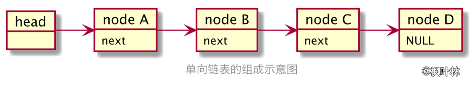
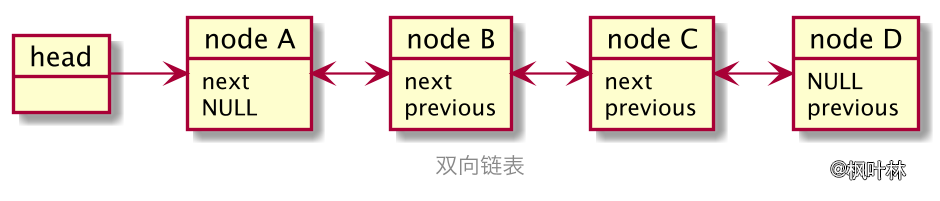
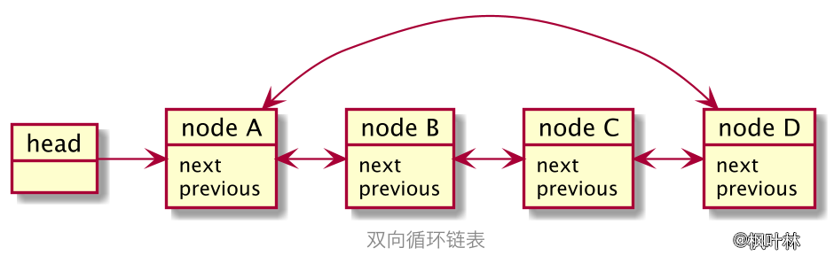

# 数据结构实现基础

## 引子

### 数据统计

例子：在日常数据处理中，经常碰到需要对一组数据进行基本的统计分析，包含这些操作：平均数、最大值、最小值、中位数、标准差、方差等。这类统计可能发生在各种情况，比如学生成绩统计、家庭开支情况、GDP 统计等等，都会涉及到这类数据统计。

为每个具体应用都编写一个程序不会是一个好方法，程序都具有很大的相似性。数据结构的处理方法是从这些具体应用中`抽象出共性的数据组织与操作方法`，进而采用某种具体的程序设计语言`实现相应的数据存储与操作`

数据抽象

- 类型名称：统计数据集
- 数据对象集：N 个元素 {x<sub>1</sub>, x<sub>2</sub>, ... , x<sub>N</sub>} 的集合 S
- 操作集：
1. ElementType Average(S, N)：求 S 中 N 个元素的平均值
2. ElementType Max(S, N)：求 S 中 N 个元素的最大值
3. ElementType Min(S, N)：求 S 中 N 个元素的最小值
4. ElementType Median(S, N)：求 S 中 N 个元素的中位数

### 数据存储

数据组织的基本存储方式主要是利用数组和链表方式来实现的，包括很复杂的数据结构，如图、树，也都不外乎应用数组和链表来实现

- 若要实现的操作不是基本统计，而是集合运算，需要判断元素是否属于集合、对集合进行并和交运算、元素插入集合等。这些操作虽然在简单数组也可以实现，但是效率不高，使用树的组织方式可以更方便的实现集合的上述运算。
- 若除了基本的统计操作外，还需要动态的维护一个集合，即经常往集合里加入/删除元素，那应该设计多大的数组来保存这些元素呢，太大浪费空间，太小不够用。使用链表来保存数据或许更适合，但是链表也有缺点，链表需要记录后续节点地址，跟数组存储相比，链表需要更多的存储空间，同时程序实现也比数组更加复杂。

数据结构的存储实现跟所需要的操作密切相关，`没有最好的存储方式，只有最合适的存储方式`。

### 操作实现

- 在确定数据的存储方式后，数据结构涉及的另一个问题是相关的操作如何实现。这些操作的实现需要利用程序设计语言提供的另一个功能，即`流程设计功能`。

- 在任何高级程序设计语言都提供了一种的基本流程控制语句，即分支控制语句和循环控制语句。分支控制结构、循环控制结构加上程序自然的语句顺序执行结构，是实现任何算法流程的基本结构。

- 在程序中，我们可以将程序的某个基本功能设计为函数，这一方面降低了程序设计的复杂性，另一方面也提高了程序设计的重用性。递归是数据结构算法设计的很重要的手段。

## 数据结构存储基础

变量是数据存储的基本单位，而变量是有类型的，例如：整型、浮点型、字符型、布尔型

### 数组

数组是最基本的构造类型，它是一组相同类型数据的有序集合

### 指针

指针变量用于存放变量的地址，通过指针就能间接访问那个变量

### 结构体

结构类型是一种允许把一些数据分量聚合成一个整体的数据类型，它能够把有内在联系的不同类型的数据统一成一个整体，使它们相互关联。同时，结构又是一个变量的集合，可以按照与成员类型变量相同的操作方法单独使用其变量成员。结构与数组的区别在于，数组的所有元素必须是相同类型的，而结构的成员可以是不同的数据类型。

```text
struct 结构名 {
	类型名 结构成员名 1;
	类型名 结构成员名 2;
	......
	类型名 结构成员名 n;
};
```

### 链表

链表使一种常见而重要的基础数据结构，也是实现复杂数据结构的重要手段。它不按照线性的顺序存储数据，而是由若干个同一结构类型的"结点"依次串联而成的，即每一个结点里保存着下一个结点的地址。使用链表结构可以克服数据需要预先知道数据大小的缺点，可以充分利用计算机内存空间，实现灵活的内存动态管理。但链表失去了数组方便随机存储的优点，同时链表由于增加了结点的指针域，空间开销比较大。

### 单向链表

#### 单向链表的结构



```php
//单向链表结点
class node
{
	public $data;
	public $next;

	/**
	 * @param $p1 结点数据
	 * @param $p2 下一个结点
	 */
	public function __construct($p1, $p2)
	{
		$this->data = $p1;
		$this->next = $p2;
	}
}
```

#### 单向链表的常见操作

- 链表的建立

应用链表进行程序设计时，往往需要先建立一个链表，建立链表的过程实际上就是不断在链表中插入结点的过程

```php
class singleLinkList
{
	/**
	 * @param $n int 结点数目
	 * @return $head obj 头结点
	 */
	public function create($n)
	{
		$head = new node(0, null);
		for ($i=$n; $i > 0; $i--) { 
			$newNode = new node($i, null);
			$newNode->next = $head->next;
			$head->next = $newNode;
		}
		return $head;
	}
}
```

- 插入结点

在单向链表 head 的某个结点 p 之后插入一新结点：找到正确位置 p，申请新结点 t 并对 t 的结点信息赋值，最后将 t 插入在 p 之后

- 删除结点

从单向链表 head 中删除一个结点：找到被删除结点的前面一个结点 p，删除 p 之后的结点

- 单向链表的遍历

对单向链表最常见的处理方式：逐个查看链表中每个结点的数据并进行处理

### 双向链表



在单向链表基础上增加指向前驱单元指针的链表叫做`双向链表`。结点增加指向其前驱结点的指针，将牺牲一部分空间代价，前驱单元查找可以不必从链头开始查找

```php
//双向链表结点
class node
{
	public $data;
	public $next;
	public $previous;

	/**
	 * @param $p1 结点数据
	 * @param $p2 下一个结点
	 * @param $p3 前一个结点
	 */
	public function __construct($p1, $p2, $p3)
	{
		$this->data = $p1;
		$this->next = $p2;
		$this->previous = $p3;
	}
}
```

### 双向循环链表



将双向链表最后一个单元的 Next 指针指向链表的第一个单元，而第一个单元的 Previous 指针指向链表的最后一个单元，这样构成的链表称为`双向循环链表`

## 流程控制基础

程序设计语言除了能表达各种各样的数据外，还必须提供一种手段来表达数据处理的过程，即`程序的控制过程`。程序的控制过程通过程序中的一系列语句来实现。

按照结构化程序设计的观点，任何程序都可以将程序模块通过三种基本的控制结构进行组合来实现。这三种基本的控制结构是`顺序`、`分支`、`循环`。

**《数据结构实现基础》 原文链接：[https://blog.maplemark.cn/2019/07/数据结构实现基础.html](https://blog.maplemark.cn/2019/07/数据结构实现基础.html)**