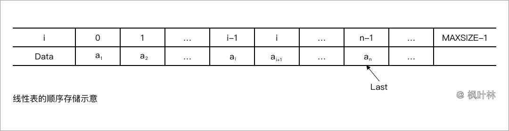
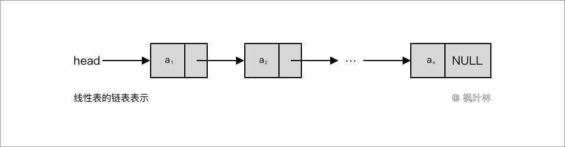
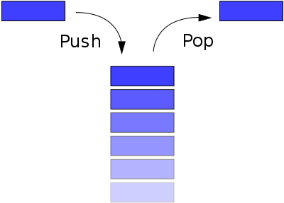

# 线性结构

在数据的逻辑结构中，有种常见而且简单的结构是`线性结构`，即数据元素之间构成一个`有序`的序列。

## 线性表的定义与实现

### 线性表的定义

线性表(Linear List)是由同一类型的数据元素构成的有序序列的线性结构。线性表中的元素的个数称为线性表的长度；当线性表中没有元素时，称为空表；表的起始位置称为表头；表的结束位置称为表尾。

类型名称：线性表(List)

操作集：
- 1.MakeEmpty：初始化新的空线性表
- 2.FindKth：根据指定的位序，返回相应元素
- 3.Find：查找特定元素
- 4.Insert：指定位序，插入元素
- 5.Delete：删除指定位序的元素
- 6.Length：返回线性表的长度

### 线性表的顺序存储实现

线性表的顺序存储是指在内存中用地址连续的一块存储空间顺序存放线性表的各元素。考虑到线性表的运算有插入、删除等，即表的长度是动态可变的，因此，数组的容量需要设计得足够大。



> MAXSIZE：根据实际问题定义的足够大的整数

> Last：记录当前线性表中最后一个元素在数组中的位置

#### 初始化

顺序表的初始化即构造一个空表。首先动态分配表结构所需要的存储空间，然后将表中的指针置为空，表示表中没有数据元素。

#### 查找

顺序存储的线性表中，查找主要是指在线性表中查找给定值相同的数据元素。由于线性表的元素都存储在数组中，所以这个查找过程实际上就是在数组的顺序查找。查找的平均时间复杂度为O(n)。

#### 插入

顺序表的插入是指在表的第 i 个位序上插入一个值为 X 的新元素。首先将位序之后的元素向后移动，为新元素让出位置；将新元素置入；修改表长度。

#### 删除

顺序表的删除是指将表中指定位序的元素从线性表中去掉，删除后并改变表长度。将指定位序的元素删除，并将位序之后的元素向前移动；修改表长度。

> 由于顺序表的存储特点是用物理上的相邻实现了逻辑上的相邻，它要求用连续的存储单元顺序存储线性表中的各元素，因此，对顺序表插入、删除时需要通过移动数据元素来实现，运行效率影响较大。

### 线性表的链式存储实现

使用链表结构可以克服数组表示线性表的缺陷。下图为单向链表的图示表示形式，它有 n 个数据单元，每个数据单元由数据域和链接域两部分组成。数据域用来存放数值，链接域是线性表数据单元的结构指针。



```php
//结点的结构定义
class node
{
	public $data;
	public $next;

	/**
	 * @param $p1 结点数据
	 * @param $p2 下一个结点
	 */
	public function __construct($p1, $p2)
	{
		$this->data = $p1;
		$this->next = $p2;
	}
}
```

#### 求表长

从链表的第一个元素起，从头到尾遍历一遍。

#### 查找

线性表的查找有两种：按序号查找、按值查找

- 按序号查找

从链表的第一个元素起，判断结点序号是否相同，相同则返回结点值，不同则继续，没有则返回错误信息。

- 按值查找

从头到尾遍历，知道找到为止；从链表的第一个元素结点起，判断当前结点的值是否相等；若是，则返回结点位置，否则继续，知道表结束为止；找不到则返回错误信息。

#### 插入

线性表的插入是在指定位序前插入一个新元素。在插入位序为1是，代表插入到链表的头；当位序为表尾时，代表插入到链表最后。新增节点，节点值为新元素值，节点指向指针地址根据位序赋予，链表保持。

#### 删除

单向链表中删除指定位序元素，首先需要找到被删除结点的前一个元素，然后再删除结点并释放空间。

## 堆栈

`堆栈`(Stack)是具有一定约束的线性表，插入和删除操作都作用在一个称为栈顶(Top)的端点位置。



### 表达式求值

表达式求值是程序设计语言编译中的一个基本问题，即编译程序要将源程序中描述的表达式转换为正确的机器指令序列或直接求出常量表达式的值。要实现表达式求值，首先需要理解一个表达式，主要是运算的先后顺序。

### 抽象数据类型

类型名称：堆栈(Stack)
数据对象集：一个有0个或多个元素的有穷线性表
操作集：
- 1.CreateStack：生成空堆栈
- 2.IsFull：判断堆栈是否已满
- 3.Push：将元素压入堆栈
- 4.IsEmpty：判断堆栈是否为空
- 5.Pop：删除并返回栈顶元素

### 堆栈的实现

由于栈是线性表，因而栈的存储结构可采用顺序和链式两种形式。顺序存储的栈称为顺序栈，链式存储的栈称为链栈。

#### 栈的顺序存储实现

栈的顺序存储结构通常由一个一维数组和一个记录栈顶元素位置的变量组成，另外我们还可以用一个变量来存储堆栈的最大容量，这样方便判断什么时候堆栈是满的。

#### 栈的链式存储实现

栈的链式存储结构(链栈)与单链表类似，但其操作受限制，插入和删除操作只能在链栈的栈顶进行。栈顶指针就是链表的头指针。

### 堆栈应用：表达式求值

## 队列

`队列`(Queue)是一个有序线性表，队列的插入和删除操作分别在线性表的两个不同端点进行的。先进先出特点。

### 队列的定义

类型名称：队列(Queue)
数据对象集：一个有0个或多个元素的又穷线性表
操作集：
- 1.CreateQueue：生成空队列
- 2.IsFull：判断队列是否已满
- 3.AddQ：将新元素压入队列
- 4.IsEmpty：判断队列是否为空
- 5.DeleteQ：删除并返回队列头元素

### 队列的实现

#### 队列的顺序存储实现

队列最简单的表示方法是用数组。用数组存储队列有许多种具体的方法。一般可以选择将队列头放数组下标小的位置，而将队列尾放在数组下标大的位置，并用两个变量分别指示队列的头和尾。

#### 队列的链式存储实现

队列与堆栈一样，也可以采用链式存储结构，但队列的头必须指向链表的头结点，队列的尾指向链表的尾结点