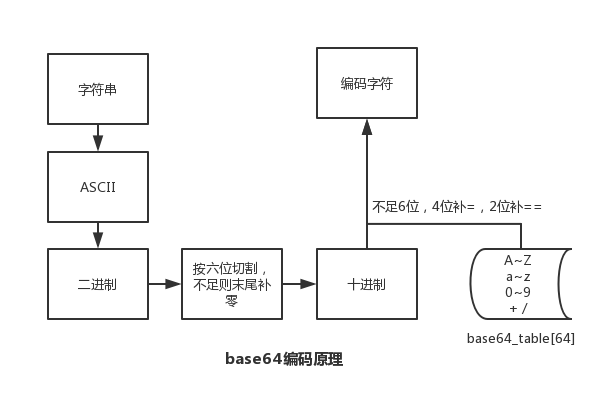
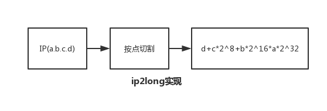

# 问题与简答

## PHP 篇

### echo、print、print_r、var_dump 区别

> `echo`和`print`是语言结构、`print_r`和`var_dump`是普通函数

- echo：输出一个或多个字符串

- print：输出字符串

- print_r：打印关于变量的易于理解的信息

- var_dump：打印关于变量的易于理解的信息(带类型)

拓展阅读 [《echo、print、print_r、var_dump区别》](./03.echo、print、print_r、var_dump区别.md)

### 单引号和双引号的区别

双引号可以被分析器解析，单引号则不行

###### 详细

0. 单引号不能解析变量 
1. 单引号不能解析转义字符,只能解析单引号和反斜线本身
2. 变量和变量,变量和字符串,字符串和字符串之间可以用.连接 
3. 双引号可以解析变量,变量可以使用特殊字符和{}包含
4. 双引号可以解析所有转义字符
5. 也可以使用.来连接
最重要的是单引号比双引号效率高


### isset 和 empty 的区别

isset：检测变量是否已设置并且非 NULL

empty：判断变量是否为空，变量为 0/false 也会被认为是空；变量不存在，不会产生警告

### static、self、$this 的区别

static：static 可以用于静态或非静态方法中，也可以访问类的静态属性、静态方法、常量和非静态方法，但不能访问非静态属性

self：可以用于访问类的静态属性、静态方法和常量，但 self 指向的是当前定义所在的类，这是 self 的限制

$this：指向的是实际调用时的对象，也就是说，实际运行过程中，谁调用了类的属性或方法，$this 指向的就是哪个对象。但 $this 不能访问类的静态属性和常量，且 $this 不能存在于静态方法中

### include、require、include_once、require_once 的区别

require 和 include 几乎完全一样，除了处理失败的方式不同之外。require 在出错时产生 E_COMPILE_ERROR 级别的错误。换句话说将导致脚本中止而 include 只产生警告（E_WARNING），脚本会继续运行

include_once 语句在脚本执行期间包含并运行指定文件。此行为和 include 语句类似，唯一区别是如果该文件中已经被包含过，则不会再次包含。如同此语句名字暗示的那样，只会包含一次

### 常见数组函数

array_count_values — 统计数组中所有的值

array_flip — 交换数组中的键和值

array_merge — 合并一个或多个数组

array_multisort — 对多个数组或多维数组进行排序

array_pad — 以指定长度将一个值填充进数组

array_pop — 弹出数组最后一个单元(出栈)

array_push — 将一个或多个单元压入数组的末尾(入栈)

array_rand — 从数组中随机(伪随机)取出一个或多个单元

array_keys — 返回数组中部分的或所有的键名

array_values — 返回数组中所有的值

count — 计算数组中的单元数目，或对象中的属性个数

sort — 对数组排序

### Cookie 和 Session

Cookie：PHP 透明的支持 HTTP cookie 。cookie 是一种远程浏览器端存储数据并以此来跟踪和识别用户的机制

Session：会话机制(Session)在 PHP 中用于保持用户连续访问Web应用时的相关数据

### 预定义变量

对于全部脚本而言，PHP 提供了大量的预定义变量

超全局变量 — 超全局变量是在全部作用域中始终可用的内置变量

```text
$GLOBALS — 引用全局作用域中可用的全部变量
$_SERVER — 服务器和执行环境信息
$_GET — HTTP GET 变量
$_POST — HTTP POST 变量
$_FILES — HTTP 文件上传变量
$_REQUEST — HTTP Request 变量
$_SESSION — Session 变量
$_ENV — 环境变量
$_COOKIE — HTTP Cookies
$php_errormsg — 前一个错误信息
$HTTP_RAW_POST_DATA — 原生POST数据
$http_response_header — HTTP 响应头
$argc — 传递给脚本的参数数目
$argv — 传递给脚本的参数数组
```

- 超全局变量

PHP 中的许多预定义变量都是“超全局的”，这意味着它们在一个脚本的全部作用域中都可用。在函数或方法中无需执行 global $variable; 就可以访问它们

超全局变量：$GLOBALS、$\_SERVER、$\_GET、$\_POST、$\_FILES、$\_COOKIE、$\_SESSION、$\_REQUEST、$\_ENV

### 传值和传引用的区别

传值导致对象生成了一个拷贝，传引用则可以用两个变量指向同一个内容

### 构造函数和析构函数

构造函数：PHP 5 允行开发者在一个类中定义一个方法作为构造函数。具有构造函数的类会在每次创建新对象时先调用此方法，所以非常适合在使用对象之前做一些初始化工作

析构函数：PHP 5 引入了析构函数的概念，这类似于其它面向对象的语言，如 C++。析构函数会在到某个对象的所有引用都被删除或者当对象被显式销毁时执行

### 魔术方法

\_\_construct()， \_\_destruct()， \_\_call()， \_\_callStatic()， \_\_get()， \_\_set()， \_\_isset()， \_\_unset()， \_\_sleep()， \_\_wakeup()， \_\_toString()， \_\_invoke() 等方法在 PHP 中被称为"魔术方法"（Magic methods）

### public、protected、private、final 区别

对属性或方法的访问控制，是通过在前面添加关键字 public（公有），protected（受保护）或 private（私有）来实现的。被定义为公有的类成员可以在任何地方被访问

PHP 5 新增了一个 final 关键字。如果父类中的方法被声明为 final，则子类无法覆盖该方法。如果一个类被声明为 final，则不能被继承

### 客户端/服务端 IP 获取，了解代理透传 实际IP 的概念

客户端IP: $\_SERVER['REMOTE_ADDR']

服务端IP: $\_SERVER['SERVER_ADDR']

客户端IP(代理透传): $\_SERVER['HTTP_X_FORWARDED_FOR']

### 类的静态调用和实例化调用

- 占用内存

静态方法在内存中只有一份，无论调用多少次，都是共用的

实例化不一样，每一个实例化是一个对象，在内存中是多个的

- 不同点

静态调用不需要实例化即可调用

静态方法不能调用非静态属性，因为非静态属性需要实例化后，存放在对象里

静态方法可以调用非静态方法，使用 self 关键字。php 里，一个方法被 `self::` 后，自动转变为静态方法

调用类的静态函数时不会自动调用类的构造函数

### 接口和抽象的区别
抽象用于描述不同的事物，接口用于描述事物的行为。

### PHP 不实例化调用方法

静态调用、使用 PHP 反射方式

### php.ini 配置选项

- 配置选项

|名字|默认|备注|
|-|-|-|
|short_open_tag|"1"|是否开启缩写形式(`<? ?>`)|
|precision|"14"|浮点数中显示有效数字的位数|
|disable_functions|""|禁止某些函数|
|disable_classes|""|禁用某些类|
|expose_php|""|是否暴露 PHP 被安装在服务器上|
|max_execution_time|30|最大执行时间|
|memory_limit|128M|每个脚本执行的内存限制|
|error_reporting|NULL|设置错误报告的级别 `E_ALL` & ~`E_NOTICE` & ~`E_STRICT` & ~`E_DEPRECATED`|
|display_errors|"1"|显示错误|
|log_errors|"0"|设置是否将错误日志记录到 error_log 中|
|error_log|NULL|设置脚本错误将被记录到的文件|
|upload_max_filesize|"2M"|最大上传文件大小|
|post_max_size|"8M"|设置POST最大数据限制|

```shell
php -ini | grep short_open_tag //查看 php.ini 配置
```

- 动态设置

```php
ini_set(string $varname , string $newvalue);

ini_set('date.timezone', 'Asia/Shanghai'); //设置时区
ini_set('display_errors', '1'); //设置显示错误
ini_set('memory_limit', '256M'); //设置最大内存限制
```

### php-fpm.conf 配置

|名称|默认|备注|
|-|-|-|
|pid||PID文件的位置|
|error_log||错误日志的位置|
|log_level|notice|错误级别 alert:必须立即处理、error:错误情况、warning:警告情况、notice:一般重要信息、debug:调试信息|
|daemonize|yes|设置 FPM 在后台运行|
|listen|ip:port、port、/path/to/unix/socket|设置接受 FastCGI 请求的地址|
|pm|static、ondemand、dynamic|设置进程管理器如何管理子进程|
|request_slowlog_timeout|'0'|慢日志记录阀值|
|slowlog||慢请求的记录日志|

### 502、504 错误产生原因及解决方式

#### 502

502 表示网关错误，当 PHP-CGI 得到一个无效响应，网关就会输出这个错误

- `php.ini` 的 memory_limit 过小
- `php-fpm.conf` 中 max_children、max_requests 设置不合理
- `php-fpm.conf` 中 request_terminate_timeout、max_execution_time 设置不合理
- php-fpm 进程处理不过来，进程数不足、脚本存在性能问题

#### 504

504 表示网关超时，PHP-CGI 没有在指定时间响应请求，网关将输出这个错误

- Nginx+PHP 架构，可以调整 FastCGI 超时时间，fastcgi_connect_timeout、fastcgi_send_timeout、fastcgi_read_timeout

#### 500

php 代码问题，文件权限问题，资源问题

#### 503

超载或者停机维护

### 如何返回一个301重定向

```php
header('HTTP/1.1 301 Moved Permanently');
header('Location: https://blog.maplemark.cn');
```

### PHP 与 MySQL 连接方式

#### MySQL

```php
$conn = mysql_connect('127.0.0.1:3306', 'root', '123456');
if (!$conn) {
    die(mysql_error() . "\n");
}
mysql_query("SET NAMES 'utf8'");
$select_db = mysql_select_db('app');
if (!$select_db) {
    die(mysql_error() . "\n");
}
$sql = "SELECT * FROM `user` LIMIT 1";
$res = mysql_query($sql);
if (!$res) {
    die(mysql_error() . "\n");
}
while ($row = mysql_fetch_assoc($res)) {
    var_dump($row);
}
mysql_close($conn);
```

#### MySQLi

```php
$conn = @new mysqli('127.0.0.1:3306', 'root', '123456');
if ($conn->connect_errno) {
    die($conn->connect_error . "\n");
}
$conn->query("set names 'utf8';");
$select_db = $conn->select_db('user');
if (!$select_db) {
    die($conn->error . "\n");
}
$sql = "SELECT * FROM `user` LIMIT 1";
$res = $conn->query($sql);
if (!$res) {
    die($conn->error . "\n");
}
while ($row = $res->fetch_assoc()) {
    var_dump($row);
}
$res->free();
$conn->close();
```

#### PDO

```php
$pdo = new PDO('mysql:host=127.0.0.1:3306;dbname=user', 'root', '123456');
$pdo->exec("set names 'utf8'");
$sql = "SELECT * FROM `user` LIMIT 1";
$stmt = $pdo->prepare($sql);
$stmt->bindValue(1, 1, PDO::PARAM_STR);
$rs = $stmt->execute();
if ($rs) {
    while ($row = $stmt->fetch(PDO::FETCH_ASSOC)) {
        var_dump($row);
    }
}
$pdo = null;
```

### MySQL、MySQLi、PDO 区别

#### MySQL

- 允许 PHP 应用与 MySQL 数据库交互的早期扩展
- 提供了一个面向过程的接口，不支持后期的一些特性

#### MySQLi

- 面向对象接口
- prepared 语句支持
- 多语句执行支持
- 事务支持
- 增强的调试能力

#### PDO

- PHP 应用中的一个数据库抽象层规范
- PDO 提供一个统一的 API 接口，无须关心数据库类型
- 使用标准的 PDO API，可以快速无缝切换数据库

### 数据库持久连接

把 PHP 用作多进程 web 服务器的一个模块，这种方法目前只适用于 Apache。

对于一个多进程的服务器，其典型特征是有一个父进程和一组子进程协调运行，其中实际生成 web 页面的是子进程。每当客户端向父进程提出请求时，该请求会被传递给还没有被其它的客户端请求占用的子进程。这也就是说当相同的客户端第二次向服务端提出请求时，它将有可能被一个不同的子进程来处理。在开启了一个持久连接后，所有请求 SQL 服务的后继页面都能够重用这个已经建立的 SQL Server 连接。

### 代码执行过程

PHP 代码 => 启动 php 及 zend 引擎，加载注册拓展模块 => 对代码进行词法/语法分析 => 编译成opcode(opcache) => 执行 opcode

> PHP7 新增了抽象语法树(AST)，在语法分析阶段生成 AST，然后再生成 opcode 数组

### base64 编码原理



### ip2long 实现




```
124.205.30.150=2093817494

list($p1,$p2,$p3,$p4) = explode('.','124.205.30.150');

$realNum = ($p1<<24)+($p2<<16)+($p3<<8)+$p4;
```

### MVC 的理解

MVC 包括三类对象。模型 Model 是应用对象，视图 View 是它在屏幕上的表示，控制器 Controller 定义用户界面对用户输入的响应方式。不使用 MVC，用户界面设计往往将这些对象混在一起，而 MVC 则将它们分离以提高灵活性和复用性

### 主流 PHP 框架特点

#### Laravel

易于访问，功能强大，并提供大型，强大的应用程序所需的工具

- 简单快速的路由引擎
- 强大的依赖注入容器
- 富有表现力，直观的数据库 ORM
- 提供数据库迁移功能
- 灵活的任务调度器
- 实时事件广播

#### Symfony

- Database engine-independent
- Simple to use, in most cases, but still flexible enough to adapt to complex cases
- Based on the premise of convention over configuration--the developer needs to configure only the unconventional
- Compliant with most web best practices and design patterns
- Enterprise-ready--adaptable to existing information technology (IT) policies and architectures, and stable enough for long-term projects
- Very readable code, with phpDocumentor comments, for easy maintenance
- Easy to extend, allowing for integration with other vendor libraries

#### CodeIgniter

- 基于模型-视图-控制器的系统
- 框架比较轻量
- 全功能数据库类，支持多个平台
- Query Builder 数据库支持
- 表单和数据验证
- 安全性和 XSS 过滤
- 全页面缓存

#### ThinkPHP

- 采用容器统一管理对象
- 支持 Facade
- 更易用的路由
- 注解路由支持
- 路由跨域请求支持
- 验证类增强
- 配置和路由目录独立
- 取消系统常量
- 类库别名机制
- 模型和数据库增强
- 依赖注入完善
- 支持 PSR-3 日志规范
- 中间件支持
- 支持 Swoole/Workerman 运行

### 对象关系映射/ORM

#### 优点

- 缩短编码时间、减少甚至免除对 model 的编码，降低数据库学习成本
- 动态的数据表映射，在表结构发生改变时，减少代码修改
- 可以很方便的引入附加功能(cache 层)

#### 缺点

- 映射消耗性能、ORM 对象消耗内存
- SQL 语句较为复杂时，ORM 语法可读性不高(使用原生 SQL)

### 链式调用实现

类定义一个内置变量，让类中其他定义方法可访问到

### 异常处理

set_exception_handler — 设置用户自定义的异常处理函数

使用 try / catch 捕获

### 串行、并行、并发的区别
串行：执行多个任务时，各个任务按顺序执行，完成一个之后才能进行下一个
并行：多个任务在同一时刻执行
并发：同一时刻需要执行多个任务

### 同步与异步的理解
**同步和异步是一种消息通信机制**。其关注点在于 `被调用者返回` 和 `结果返回` 之间的关系，描述对象是被调用对象的行为。

### 阻塞与非阻塞的理解
**阻塞和非阻塞是一种业务流程处理方式**。其关注点在于调用发生时 `调用者状态` 和 `被调用者返回结果` 之间的关系，描述对象是等待结果时候调用者的状态。

### 同步阻塞与非同步阻塞的理解
同步阻塞：打电话问老板有没有某书（调用），老板说查一下，让你别挂电话（同步），你一直等待老板给你结果，什么事也不做（阻塞）。

同步非阻塞：打电话问老板有没有某书（调用），老板说查一下，让你别挂电话（同步），等电话的过程中你还一边嗑瓜子（非阻塞）。

### 异步阻塞与异步非阻塞的理解
异步阻塞：打电话问老板有没有某书（调用），老板说你先挂电话，有了结果通知你（异步），你挂了电话后（结束调用）, 除了等老板电话通知结果，什么事情也不做（阻塞）。

异步非阻塞：打电话问老板有没有某书（调用），老板说你先挂电话，有了结果通知你（异步），你挂电话后（结束调用），一遍等电话，一遍嗑瓜子。（非阻塞）

### 如何实现异步调用

```php
$fp = fsockopen("blog.maplemark.cn", 80, $errno, $errstr, 30);
if (!$fp) {
    echo "$errstr ($errno)<br />\n";
} else {
    $out = "GET /backend.php  / HTTP/1.1\r\n";
    $out .= "Host: blog.maplemark.cn\r\n";
    $out .= "Connection: Close\r\n\r\n";
    fwrite($fp, $out);
    /*忽略执行结果
    while (!feof($fp)) {
        echo fgets($fp, 128);
    }*/
    fclose($fp);
}
```

### 多进程同时写一个文件

加锁、队列

### PHP 进程模型，进程通讯方式，进程线程区别

消息队列、socket、信号量、共享内存、信号、管道

### PHP 支持回调的函数，实现一个

array_map、array_filter、array_walk、usort

is_callable + callbacks + 匿名函数实现

### 发起 HTTP 请求有哪几种方式，它们有何区别

cURL、file_get_contents、fopen、fsockopen

### php for while foreach 迭代数组时候，哪个效率最高

### 弱类型变量如何实现

PHP 中声明的变量，在 zend 引擎中都是用结构体 zval 来保存，通过共同体实现弱类型变量声明

### PHP 拓展初始化

- 初始化拓展

```shell
$ php /php-src/ext/ext_skel.php --ext
```

- 定义拓展函数

zend_module_entry 定义 Extension name 编写 PHP_FUNCTION 函数

- 编译安装

```shell
$ phpize $ ./configure $ make && make install
```

### 如何获取扩展安装路径

### 垃圾回收机制

引用计数器

### Trait

自 PHP 5.4.0 起，PHP 实现了一种代码复用的方法，称为 trait

### yield 是什么，说个使用场景 yield、yield 核心原理是什么

一个生成器函数看起来像一个普通的函数，不同的是普通函数返回一个值，而一个生成器可以yield生成许多它所需要的值。

yield核心原理: PHP在使用生成器的时候，会返回一个Generator类的对象。每一次迭代，PHP会通过Generator实例计算出下一次需要迭代的值。简述即yield用于生成值。

yield使用场景：读取大文件、大量计算。

yield好处：节省内存、优化性能

### traits 与 interfaces 区别 及 traits 解决了什么痛点

### 如何 foreach 迭代对象、如何数组化操作对象 $obj[key]、如何函数化对象 $obj(123);

### Swoole 适用场景，协程实现方式

Swoole 是一个使用 C++ 语言编写的基于异步事件驱动和协程的并行网络通信引擎，为 PHP 提供协程、高性能网络编程支持。提供了多种通信协议的网络服务器和客户端模块，可以方便快速的实现 TCP/UDP服务、高性能Web、WebSocket服务、物联网、实时通讯、游戏、微服务等，使 PHP 不再局限于传统的 Web 领域。


协程可以简单理解为线程，只不过这个线程是用户态的，不需要操作系统参与，创建销毁和切换的成本非常低，和线程不同的是协程没法利用多核 cpu 的，想利用多核 cpu 需要依赖 Swoole 的多进程模型。
在底层实现上是单线程的，因此同一时间只有一个协程在工作，协程的执行是串行的。
采用 CSP 编程模型，即不要以共享内存的方式来通信，相反，要通过通信来共享内存。
swoole4.0采用双栈方式，通过栈桢切换来实现协程；即遇到IO等待就切换到。

#### swoole的进程模型

同一台主机上两个进程间通信 (简称 IPC) 的方式有很多种，在 Swoole 中使用了 2 种方式 Unix Socket 和 sysvmsg。

swoole启动后会生成master进程、reactor线程、worker进程、task进程以及manager进程

master进程是一个多线程进程，会生成多个reactor线程
reactor线程负载网络监听、数据收发
work进程处理reactor线程投递的请求数据
task进程处理work进程投递的任务
manager进程用于管理work进程和task进程

### PHP 数组底层实现 （HashTable + Linked list）

PHP 数组底层依赖的散列表数据结构，定义如下（位于 Zend/zend_types.h）。

数据存储在一个散列表中，通过中间层来保存索引与实际存储在散列表中位置的映射。

由于哈希函数会存在哈希冲突的可能，因此对冲突的值采用链表来保存。

哈希表的查询效率是o（1），链表查询效率是o（n）；因此PHP数据索引速度很快；但是相对比较占用空间。

### Copy on write 原理，何时 GC

### 如何解决 PHP 内存溢出问题

### ZVAL

### HashTable

### PHP7 新特性

标量类型声明、返回值类型声明、通过 define() 定义常量数组、匿名类、相同命名空间类一次性导入

### PHP7 底层优化

ZVAL 结构体优化，占用由24字节降低为16字节

内部类型 zend_string，结构体成员变量采用 char 数组，不是用 char*

PHP 数组实现由 hashtable 变为 zend array

函数调用机制，改进函数调用机制，通过优化参数传递环节，减少了一些指令

### PSR 介绍，PSR-1, 2, 4, 7

### Xhprof 、Xdebug 性能调试工具使用

### 字符串、数字比较大小的原理，注意 0 开头的8进制、0x 开头16进制

### BOM 头是什么，怎么除去

WINDOWS自带的记事本，在保存一个以 UTF-8 编码的文件时，会在文件开始的地方插入三个不可见的字符（0xEF 0xBB 0xBF，即BOM）；它是一串隐藏的字符，用于让记事本等编辑器识别这个文件是否以UTF-8编码。
去除方法：$result = trim($result, "\xEF\xBB\xBF");

### 模板引擎是什么，解决什么问题、实现原理（Smarty、Twig、Blade）


### 写一个函数，尽可能高效的从一个标准 URL 中取出文件的扩展名
parse_str,explode
