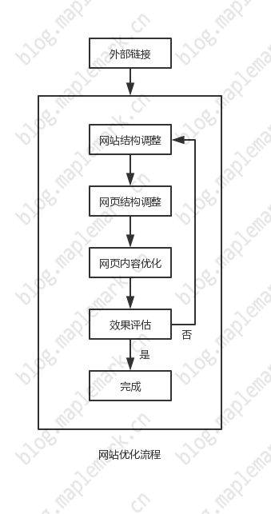
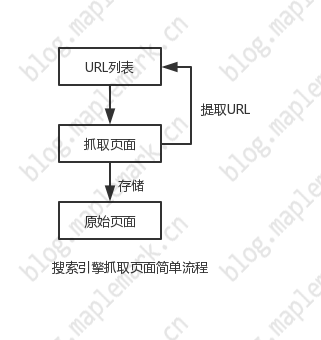
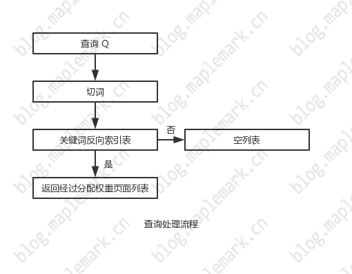

# 初探 SEO

## 初探 SEO

### SEO 的基本概念

> 搜索引擎优化（英语：search engine optimization，缩写为 SEO），是一种透过了解搜索引擎的运作规则来调整网站，以及提高目的网站在有关搜索引擎内排名的方式

> 一般的可以理解为，通过了解谷歌/百度搜索引擎规则，从而提高网站在某些关键字下的排名，提高网站访问量

### SEO 优缺点

> 成本较低。从某个角度上看，SEO 是一种"免费"的搜索引擎营销方式。对个人网站来说，只要站长掌握一定的搜索引擎优化技术即可。而对于企业来说，成本主要来自于从引擎优化员工的薪酬或雇用专业搜索引擎优化公司所花的费用

> 持久性。一般情况下，采用正规方法优化的网站，排名效果会比较稳定。除非搜索算法发生重大的改变或强大的竞争对手后来居上，否则不会有太大的变化

### SEO 应用领域

- 企业网站

> 企业网站通过优化后，大大增加了向目标客户展示产品或者服务的机会，从而增强企业的影响力，提升品牌知名度

- 电子商务型网站

> 电子商务类网站经过优化后可以通过搜索引擎向更多的潜在消费者推销自身的产品，从而节省巨额的广告费用，提高产品销量

- 内容型网站

> 资讯内容类网站经过优化后，可以大大提高网站的流量，从而进一步蚕食强大的竞争对手的市场，最终后来居上，成为行业领先者

### SEO 主要工作

- SEO 的主要工作可以分为内部优化与外部优化

> 内部优化：从网站内部出发，对网站的基本要素（如网站结构、页面结构、关键字分布等）进行适当的调整，如果经过调整后，网站在搜索引擎中的表现达到了我们预期的效果，则内部优化工作就基本完成；否则，需要反复地对网站进行调整，直至达到预期效果为止

> 外部优化：主要围绕增强外部链接关系而展开的，此项工作必须贯彻优化的全过程。常用于增加外部链接的方法包括交换友情链接、登录分类目录、发布链接诱饵等

### SEO 宗旨

> SEO 工作应该以用户为中心，围绕提高用户体验、完善网站功能而进行，不能为了优化而优化

## 搜索引擎工作原理

> 搜索引擎优化的主要任务之一就是提高网站的搜索引擎友好性，因此，搜索引擎优化的每个环节都与搜索引擎存在必然的联系，研究搜索引擎优化实际上是对搜索引擎工作过程的逆向推理。因此，学习搜索引擎优化应该从了解搜索引擎的工作原理开始

> 搜索引擎的主要工作包括：页面收录、页面分析、页面排序及关键字查询

### 页面收录

> 页面收录指搜索引擎通过蜘蛛程序在互联网上抓取页面并进行存储的过程，它为搜索引擎开展各项工作提供了数据支持

- 页面收录流程

> 在互联网中，URL 是每个页面的入口地址，搜索引擎蜘蛛程序就是通过 URL 抓取到页面的。搜索引擎蜘蛛程序从 URL 列表出发，通过 URL 抓取并存储原始页面；同时，提取原始页面中的 URL 资源并加入到 URL 列表中。如此不断地循环，就可以从互联网获取足够多的页面

> 利用搜索引擎提供的网站登录入口，想搜索引擎提交网站域名

> 通过与外部网站建立链接关系，使搜索引擎可以通过外部网站发现我们的网站，从而实现对网站的收录

- 页面收录原理

> 如果把网站页面组成的集合看作是一个有向图，从指定的页面出发，沿着页面中的链接，按照某种特定的策略对网站中的页面进行遍历。不停地从 URL 列表中移出已经访问过的 URL，并存储原始页面，同时提取原始页面中的 URL 信息；再将 URL 分为域名及内部 URL 两大类，同时判断 URL 是否被访问过，将未访问的 URL 加入 URL 列表中。递归地扫描 URL 列表，直至耗尽所有 URL 资源为止。经过这些工作，搜索引擎就可以建立庞大的域名列表、页面 URL 列表并存储足够多的原始页面

- 页面收录方式

> 在互联网数以亿计的页面中，搜索引擎怎样才能从中抓取到相对重要的页面呢？这就涉及搜索引擎的页面收录方式

> 页面收录方式是指搜索引擎抓取页面时所使用的策略，目的是为了能在互联网中筛选出相对重要的信息

> 搜索引擎收录页面的方式主要有广度优先、深度优先及用户提交三种

> 广度优先：如果把整个网站看作是一棵树，首页就是根，每个页面就是叶子。广度优先是一种横向的页面抓取方式，先从树的较浅层开始抓取页面，直至抓取完同层次的所有页面后才进入下一层

> 深度优先：与广度优先抓取方式相反，深度优先首先跟踪浅层页面中的某一链接逐步抓取深层页面，直至抓取完最深的页面后才返回浅层页面再跟踪其另一链接，继续向深层页面抓取，这是一种纵向的页面抓取方式

> 用户提交：为了抓取更多的网页，搜索引擎还允许网站管理员主动提交页面。网站管理员只需要把网站中页面 URL 按照指定的格式制作成文件，提交给搜索引擎，搜索引擎即可通过该文件对网站中的页面进行抓取及更新

- 如何避免重复性收录

> 在互联网中，信息的重复是在所难免的。搜索引擎怎样识别重复信息呢？怎样判断哪些网页的信息是原创的，哪些是“复制”的？又会认为哪些重复的信息是有价值的，哪些又是可以舍弃的？

> 在网站中，重复信息主要包括转载内容及镜像内容两大类

> 转载页面：通过将网页正文内容划分，进行比对，判断相识度，确定互为转载关系后，再结合搜索引擎的抓取存储时间、页面权重等因素判断页面是否是原创页面还是转载页面

> 镜像页面：与转载页面判别类似

> 镜像网站：指两个内容完全相同的网站，形成镜像网站主要有两种情况，第一种是多个域名或 IP 指向同一服务器的同一个物理目录；另一个整个网站内容被复制到使用不同域名或者IP服务器上

> 转载页面、镜像页面、镜像网站，综合多项因素（网站权重值、建立时间）等因素，可能只收录极少页面，甚至不收录页面

### 页面分析

> 页面分析首先是对原始页面建立索引，实现对页面的快速定位；然后，提取页面的正文信息，并对正文信息进行切词以及为这些词（即关键字）建立索引，从而得到页面与关键字的对应关系；最后，对关键字进行重组，并建立关键字与网页相对于的反向索引列表，从而能够根据关键字快速定位至相应网页

- 页面索引

> 为了提高页面检索的效率，搜索引擎需要对抓取回来的原始页面建立索引，由于 URL 就是页面的入口地址，为了原始页面建立索引实际上就是为页面的 URL 建立索引，这样就可以实现根据 URL 快速定位到对应页面

- 网页分析

> 页面分析是整个网页处理中最重要的环节，包括了网页正文信息的提取、切词、建立关键字索引列表及关键字重组几个重要的步骤。结果形成了一个关键字对应多个原始页面的关系，即形成了与用户习惯相符合的信息雏形

### 页面排序

> 搜索引擎结合页面的内外部因素计算出页面与某个关键字的相关程度，从而得到与该关键字相关的页面排序列表

- 页面相关性

> 页面相关性是指页面内容与用户所查询的关键字的接近程度，主要由关键字匹配度、关键字密度、关键字分布及关键字的权重标签决定

- 链接权重

> 链接主要分内部链接及外部链接，是网页制作或者编辑者在对页面内容进行规划或者编辑时加入到页面中的，加入的理由可能是该链接所指向的页面非常重要，或者它是大部分用户所需要的。因此，某一页面得到的链接越多，从一定程度上反映了该页面越重要，链接权重值就越高

- 用户行为

> 搜索引擎在完成页面基本权重计算后，就可以向用户展示初步的排序结果。但这个排序结果不一定能让大部分用户满意，因此还要结合其他因素对该排序结果进行改进。列如，统计每条搜索结果的点击次数来推测用户对搜索结果的偏好

### 关键字查询

> 搜索引擎接收来自用户的查询请求，并对查询信息进行切词及匹配后，再向用户返回相应的页面排序列表

- 查询流程

> 先对用户提供的查询条件进行切词，并删除查询条件中没有的字或词，例如的、得等停用词

> 再以切词结果作为条件在关键字反向索引列表中进行匹配

> 如果存在匹配结果，则把所有与关键字相匹配的页面组成一个列表

> 最后，把匹配的页面按照权重值从高到低进行排序，并返回给用户

- 用户行为

> 用户在搜索中的行为主要包括搜索及点击。搜索是用户获取信息的过程，点击是用户得到需要信息后的表现

> 用户的搜索及点击行为中蕴含着非常丰富和重要的信息。例如，在用户搜索行为中包含了“提交的关键字”、“提交时间”、“用户IP地址”等信息，而在点击行为中则包含了“每个结果的点击次数”等信息

> 搜索引擎通过对用户行为的分析可以进一步发掘用户的需求，提高搜索结果的精准度。例如，从用户的搜索行为中，搜索引擎还可以发现新词汇；而从用户对搜索结果的点击行为中，可以分析出用户对每个搜索结果的偏好等

- 缓存机制

> 为了能在极短的时间内响应用户的查询请求，搜索引擎除了在用户提交查询信息前就生成关键字的页面排序列表外，还需要为那些查询最频繁的关键字对应的页面排序列表建立缓存机制

### 搜索引擎介绍

- Google

> Google 十分重视链接关系，对于链接的质量、数量及相关性方面的分析技术在业界更是遥遥领先。尽管百度、雅虎也非常重视链接关系，但对链接的质量及相关性方面的分析则远不如 Google

> 在切词算法上，Google 与其他中文搜索引擎也存在一定的区别

> 在对待新网站方面，Google 非常严格，新网站只有同时满足多个条件时，才能正常参与排名竞争，这就是所谓的“沙盒效应”现象。这样做可以有效避免垃圾网站，但同时也给了一些新的优秀网站诸多制肘，很难通过 Google 向用户展示其极具价值的信息

> 在对垃圾信息处理方面，尽管 Google 目前还是以人工为主，但与其他搜索引擎相比，Google Spam 检测算法已经比较成熟。对于一些常见的作弊手段，例如伪装（cloaking）、门页（doorway page）、堆砌关键字、隐藏文字、垃圾链接等，Google 可以轻易识别

- 百度

> 如果把决定页面权重的因素分内部因素与外部因素两大类。在百度中，内部因素与外部因素在影响页面权重方面的差距比较小

> 百度对新网站比较宽松，这就造成了搜索结果中充斥着大量的垃圾信息，严重影响了用户体验

> 百度也非常重视链接关系，对于被高质量页面链接的页面会赋予极高的权重，但却忽悠了链接关系中网站间的主题相关性

> 百度对搜索结果的人工干预非常强

## 关键字

> 要对网站进行优化，首先需要为网站中的页面选择合适的关键词；然后，围绕突出关键字、提高页面相关性开展一系列的工作，以提高页面在相关关键字搜索结果中的排名

### 关键字介绍

> 关键字（keyword）在不同的领域有不同的含义。在搜索引擎中，关键字是指用户在寻找相关信息时所使用的内容，是搜索应用的基础，也是搜索引擎优化的基础。搜索引擎优化的目的之一就是提高页面与某个关键字间的相关性，要了解关键字与页面相关性的关系，我们要从认识关键字词频及关键字密度开始

### 关键字词频

> 关键字词频是指某个关键字的页面中出现的概率，也即关键字在页面中出现的次数，从一定程度上反映了页面与该关键字的相关性

> 在搜索引擎发展初期，搜索结果中页面的排序基本是由关键字词频决定的。也就是说，页面中某个关键字出现的次数越多，说明该页面与此关键字间的相关性就越高，在此关键字的搜索结果中排名就越靠前。这种单纯以词频决定排序的方式，极容易被恶意操纵，从而影响搜索引擎的用户体验。因此，搜索引擎逐渐引进了诸如“关键字密度”、“关键字分布”及“外部链接”等因素进行制约

### 关键字密度

> 在实际中，常用关键字密度来衡量页面中关键字的词频是否合理。关键字密度主要是由“关键字词频”及“网页总词汇量”两个因素决定，这三者关系如下：

> 关键字密度=关键字词频/网页总词汇量

> 式中，总词汇量是指页面程序标签（如 HTML 标签及 ASP、JSP、PHP 等）以外的所有词汇的数量

### 关键字分布及表现形式

> 搜索引擎分析网页时，在 HTML 源代码中是自上而下地进行的；而从页面布局的角度上看，则是自上而下、自左而右地进行（这也符合用户浏览网页的习惯）。因此，搜索引擎会更加重视网页中首先出现的内容，故我们在规划页面时也应该把相对重要的内容安排在页面的顶部，搜索引擎对页面的重视程度沿箭头方向逐渐减低

> 关键字表现形式是指关键字在页面中的显示样式，常见的关键字表现形式包括字体的字号、颜色、样式等；而字体样式又包括加粗、下划线、斜体、段落标题等

> 关键字描述指在页面中通过多种方式表达主辅关键字，以达到合理增加主辅关键字的词频及控制主关键字密度的目的

### 关键字策略

> 制定符合自己网站特点的科学的关键字策略，可以避免与强大的竞争对手直接硬碰硬的竞争，从而占据属于自己的一席之地，为以后的生存打下坚实的基础。制定关键字策略，首先要寻找与页面主题相关的关键字，然后再根据实际情况从中筛选出一部分合适的关键字

> 利用搜索引擎的搜索功能，我们可轻松地找到与页面主题相关的关键字

> 用户搜索习惯是指用户在搜索引擎中寻找相关内容时所使用的关键字形式。对于不同类别的产品，用户的搜索习惯会存在一定的差别，而我们应该优先选择那些符合大部分用户搜索习惯的关键字形式

> 一个关键字是否具有优化可行性，需要首先对该关键字进行综合的评估，包括关键字的“搜索量”、“商业价值”及“竞争程度”；再从中筛选出高搜索量、高相关性、低竞争的关键字

> 关键字选择技巧：次关键字法、长尾理论法

## URL 优化

### URL 优化简介

> URL 优化就是指通过对 URL 各组成部分进行适当的调整，以提高 URL 的搜索引擎友好性。它包括三大部分：第一，对域名、目录、文件的命名；第二，分隔符的使用；第三，URL 长度及关键字词频的控制。这三部分之间相互制约、相互影响。在优化的过程中，我们必须掌握着三部分的内在联系，对各部分进行充分的协调，才能达到最佳的优化效果，否则就功败垂成

### URL 命名技巧

> URL 命名是针对 URL 各组成部分而进行的，是 URL 优化最重要的环节。URL 命名的关键在于使用合适的关键字为 URL 各组成部分进行命名，即该关键字所表达的意义必须与 URL 所指向的页面的主题是相关的，这样有利于提高页面的相关性，突出页面的主题

### 分隔符的使用

> 为了让搜索引擎能够正确识别以英文形式命名的 URL 中的关键字，我们需要使用相应的符号对单词进行分隔，常见的分隔符包括：空格“ ”、横杠“-”、下划线“\_”、逗号“，”及加号“+”等

### URL 长度

> 搜索引擎在抓取页面时，对页面的 URL 长度存在一定的限制。对于超过限定长度的 URL 所指向的页面，搜索引擎就有可能放弃收录。决定 URL 长度的主要因素包括域名长度、路径长度及文件名长度

### 关键字词频

> 在一定完整的 URL 中，主关键字只出现一次，不管对于普通用户还是搜索引擎都是较为友好的。一方面涉及 URL 长度的问题；另一方面，如果同一关键字在 URL 中多次重复出现，还会涉嫌关键字堆砌，严重者可能遭到搜索引擎的惩罚

### 关键字结合

> 在 URL 中，还可以利用分隔符对 URL 各组成的名称进行组合，从而产生新的词组（或短语）来扩展 URL 的意义

### URL 重定向

> 重定向是指把对一个域名、目录或者文件的访问请求转发至另一个域名、目录或其他服务器空间上，当用户发出相应的访问请求时将自动跳转到指定的位置

> 常见的重定向欧301（永久重定向）及302（暂时重定向）两种

### URL 静态化

> 不管是普通用户还是搜索引擎，都更钟情于静态页面

## 代码优化

### 代码优化简介

> 代码优化就是对网页中的 HTML 源代码进行必要的调整，以提高页面的友好性。页面经过代码优化后，一方面可以有效精简页面中的冗余代码，加快页面的显示速度，同时也降低页面占用搜索引擎服务器的存储空间，从而提高页面的用户体验及搜索引擎友好性；另一方面，还可以有效地突出页面的主题，提高页面的相关性。代码优化的主要工作包括精简代码、头部优化、权重标签使用及图片优化。在这四个环节中，精简代码是最基础、最根本的

### 精简代码

> 精简代码是指清除或者简化页面中的代码，从而达到降低页面体积、提高页面的用户体验及搜索引擎友好性的目的。页面代码的精简包括五大环节，它们是清理垃圾代码、 HTML 标签转换、 CSS 优化、 Js 优化及表格优化。其中，清理垃圾代码又是精简代码中最重要、最基础的

### 页面头部优化

> 摘要信息的生成在不同的搜索引擎中会存在比较大的差别，即使是同一个搜索引擎也会由于页面的实际情况而有所不同。一般情况下，搜索引擎会提取页面标题标签中的内容作为摘要信息的标题，而描述则常来自页面描述标签的内容或直接从页面正文中截取

> <title\>标签也称为标题标签，标题标签内容是对网页主题的概括，相当于一篇文章的题目。标题标签的优化是网站优化中最重要的内容之一，对页面相关性产生决定性的影响。大多数搜索引擎都是提取网页标题中的全部或部分内容作为搜索结果中摘要信息的标题向用户展示。因此，在拟写标题内容时，要做到主题突出、内容简洁

> 描述标签，即<description\>标签，其内容是对页面内容的概括，相当于页面的简介。由于描述标签常被一些不法分子用于堆砌关键字，导致其对页面相关性的影响力日渐下降。但是，Google 仍然相当重视描述标签的内容。在 Google 的搜索结果中，大部分页面的描述都是来自页面描述标签里的内容

> 关键字标签即<keywords\>标签，是头部三大标签之一。相对于标题标签及描述标签，关键字标签所起的作用微乎其微，甚至己经被忽略。但无论如何，为了能在残酷的竞争中脱颖而出，我们还是要把握好每一个可能会影响页面相关性的细节。

### 权重标签使用

> <h\>标签又称为标题标签，是所有权重标签中最重要的。它一共有六种样式，从<h1\>至<h6\>

> 字体标签（<font\>）包括字体颜色、字号大小等属性，其中最重要的就是字号及颜色属性

### 图片优化

> 在制作网页的时候，为了增强网页的视觉效果，在网页中或多或少会使用图片或者多媒体元素。然而，相对于文本来说，图片的体积庞大（少则二三十千字节，多则上百千字节），这就造成页面显示缓慢等现象。此外，搜索引擎也不能识别图片叭的文本内容。所以，对于页面中的重要内容，例如主关键字、辅关键字、频道名称、栏目名称等，我们不能以图片形式进行展示

> 为了减轻图片带来的负面影响，我们需要对图片进行相应的处理（即图片优化），以满足搜索引擎索引信息的要求。图片优化主要包括“图片描述”及“图片压缩”两大块，前者主要是为了向搜索引擎表达图片蕴含的信息，而后者主要是为了降低图片体积，加快页面显示速度

## 网页结构

### 网页结构简介

> 网页结构即网页内容的布局，创建网页结构，实际上就是对网页内容的布局进行规划。网页结构的创建是页面优化的重要环节之一，直接影响页面的用户体验及相关性。而且，还在一定程度上影响网站的整体结构及页面被收录的数量

### 网页组成元素

> 从页面结构的角度上看，网页主要由"导航栏"、"栏目"及"正文内容"这三大元素组成。网页结构的创建，网页内容的规划实际也是围绕这三大组成元素展开的

> 导航栏是构成网页的重要元素之一，是网站频道入口的集合区域，相当于网站的菜单

> 栏目是指页面中存放相同性质（或特征）内容的区域。在对页面内容进行内容布局时，把性质（或特征）相同的内容安排在页面上的同一区域，可以帮助用户快速获取所需的信息，对网站内容起到非常好的导航作用

> 正文内容是指页面中的主体内容。例如一个文章类页面，正文内容就是文章本身；而对于展示产品的网站，正文内容就是产品信息

### 页面重要区域分布规律

> 左上 > 右上 > 左 > 右 > 左下 > 右下

> 搜索引擎分析网页时，在 HTML 源代码中是自上而下地进行的。因此，搜索引擎更加重视接近页面顶部的代码

### 网页结构类型

> 创建网页结构实际就是对导航栏、栏目及正文内容这三大页面基本组成元素进行组织布局。

## 搜索引擎优化工具

### 关键字查询工具

> 关键字查询工具是指可以提供指定关键字的搜索量及相关信息的工具。这些工具可以帮助我们寻找与网站相关的关键字，常见的关键字查询工具包括 overtrue 关键字选择器、百度火爆地带、百度指数、 Google 趋势及 Google Adwords 关键字选择工具

### Google 管理员工具

> Google 管理员工具是 Google 为了加强网站管理员间的互动及提高搜索质量而退出的一款网站管理员工具。通过 Google 管理员工具，网站管理员可以了解 Google 查看网站的方式，并与 Google 协调工作，进一步提高网站的友好性

### Sitemap 生成器

> 可以利用相关工具生成 Sitemap，并将入口置于站点首页底部，便于爬虫快速爬取整站

**《初探SEO》原文链接：[https://blog.maplemark.cn/2019/03/初探-seo.html](https://blog.maplemark.cn/2019/03/初探-seo.html)**