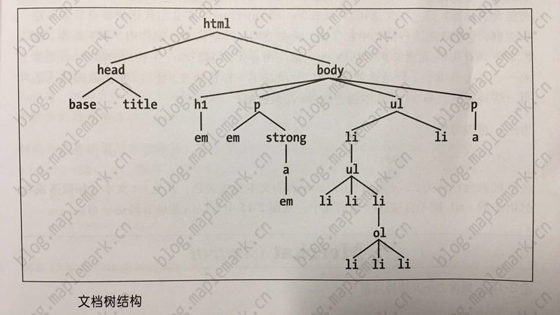

# CSS 选择器的分类

## 基本规则

> 通过 CSS 可以向文档中的一组元素类型应用某些规则

> 利用 CSS，可以创建易于修改和编辑的规则，且能很容易地将其应用到定义的所有文本元素

### 规则结构

> 每个规则都有两个基本部分：选择器和声明块；声明块由一个或多个声明组成；每个声明则是一个属性-值对

> 每个样式表由一系列规则组成


> 如规则左边所示，选择器定义了将影响文档中的哪些部分

> 规则右边包含声明块，它由一个或多个声明组成。每个声明是一个 CSS 属性和该属性的值的组合

### 元素选择器

> 最常见的选择器往往是 HTML 元素。文档的元素就是最基本的选择器

### 声明和关键字

> 声明块包含一个或多个声明。声明总有如下格式：一个属性后面跟一个冒号，再后面是一个值，然后是一个分号。冒号和分号后面可以有0个或多个空格

> 如果一个属性的值可以取多个关键字，在这种情况下，关键字通常由空格分隔。并不是所偶属性都能接受多个关键字，不过确实有许多属性是这样

```css
p {font: medium Helvetica;}
```

## 选择器

### 通配选择器

> CSS2引入了一种新的简单选择器，称为通配选择器（universal selector），显示为一个星号（\*）。这个选择器可以与任何元素匹配，就像是一个通配符

```css
* {color: red;}
```

### 类选择器

> 要应用样式而不考虑具体涉及的元素，最常用的方法就是使用类选择器。在使用类选择器之前，需要修改具体的文档标记，以便选择器正常工作

> 为了将一个类选择器的样式与元素关联，必须将 class 属性指定为一个适当的值

```css
*.warning {font-weight: bold;}
p.warning {font-weight: bold;}
.warning {font-weight: bold;}
```

#### 多类选择器

```css
.warning {font-weight: bold;}
.urgent {font-style: italic;}
.warning.urgent {background: silver;}
```

### ID 选择器

> ID 选择器前面有一个 # 号

> ID 选择器不引用 class 属性的值

> 在一个 HTML 文档中，ID 选择器会使用一次，且仅一次

```css
*#first-para {font-weight: bold;}
#first-para {font-weight: bold;}
```

### 属性选择器

> 在某些标记语言中，不能使用类和 ID 选择器。为了解决这个问题，CSS2引入了属性选择器（attribute selector），它可以根据元素的属性及属性值来选择元素

#### 简单属性选择

> 如果希望选择某个属性的元素，而不讨论该属性的值是什么，可以使用一个简单属性选择器

```html
<h1 class="hoopla">Hello</h1>
<h1 class="severe">Serenity</h1>
<h1 class="fancy">Fooling</h1>
```

```css
h1[class] {color: silver;}
```

```css
img[alt] {border: 3px solid red;} /*对所有带有 alt 属性的图像应用样式*/
*[title] {font-weight: bold;} /*包含标题(title)信息的所有元素变为粗体显示*/
```

#### 根据具体属性值选择

> 除了选择有某些属性的元素，还可以进一步缩小选择范围，只选择有特定属性值的元素

```css
/*将指向 Web 服务器上某个特定超链接变成粗体*/
a[href="https://blog.maplemark.cn"] {font-weight: bold;}
```

```html
<planet>Venus</planet>
<planet moons="1">Earth</planet>
<planet moons="2">Mars</planet>
```
```css
/*将第二个元素文本变成粗体*/
planet[moons="1"] {
    font-weight: bold;
}
```

#### 根据部分属性值选择

> 如果属性能接受词列表（词之间用空格分隔），可以根据其中的任意一个词进行选择

```css
img[title~="Figure"] {border: 1px solid gray;}
```

- 子串匹配属性选择器

|类型|描述|
|-|-|
|[foo^="bar"]|选择 foo 属性值以"bar"开头的所有元素|
|[foo$="bar"]|选择 foo 属性值以"bar"结尾的所有元素|
|[foo*="bar"]|选择 foo 属性值中包含子串"bar"的所有元素|

#### 特定属性选择类型

```html
<h1 lang="en">Hello!</h1>
<p lang="en-us">Greetings!</p>
<div lang="en-au">G'day!</div>
<p lang="fr">Bonjour!</p>
<h4 lang="cy-en">Jrooana!</h4>
```

```css
*[lang|="en"] {color: white;}
```

> 这种属性选择器最常见的用途是匹配语言值

### 后代选择器



> 通过文档树结构，可以很形象的理解什么是后代选择器（descendant selector），也称为包含选择器/上下文选择器。定义后代选择器就是来创建一些规则，它们仅在某些结构中起作用，而在另外一些结构中不起作用

```html
<div class="row"><p>文字一</p></div>
<div class="row"><div><p>文字一后代</p></div></div>
<div class="row">文字二</div>
<p>文字三</p>
```

```css
.row p{color: red;}
```

#### 选择子元素

> 在某些情况下，可能并不想选择一个任意的后代元素；而是希望缩小范围，只选择另一个元素的子元素

```css
.row > p{color: red;}
```

#### 选择相邻兄弟元素

```html
<ol>
	<li>List item 1</li>
	<li>List item 1</li>
	<li>List item 1</li>
	<li>List item 1</li>
</ol>
<ul>
	<li>A list item</li>
	<li>Another list item</li>
	<li>Yet Another list item</li>
	<li>Lat list item</li>
</ul>
```

```css
ol + ul {font-weight: bold;} /*将命中 ul*/
```

> ul 必须紧跟在 ol 后面

### 伪类选择器

> 锚类型称为伪类

#### 链接伪类

CSS2.1定义了两个只应用于超链接的伪类

|伪类名|描述|
|-|-|
|:link|指示作为超链接并指向一个未访问地址的所有锚|
|:visited|指示作为已访问超链接的所有锚|

```css
a {color: black;}
a:link {color: bule;}
a:visited {color: red;}
```

#### 动态伪类

> CSS2.1定义了3个动态伪类，它们可以根据用户行为改变文档的外观

|伪类名|描述|
|-|-|
|:focus|指示当前拥有输入焦点的元素|
|:hover|指示鼠标指针停留在哪个元素上|
|:active|指示被用户输入激活的元素|

> 伪类顺序：link-visited-focus-hover-active

#### 选择第一个子元素

> 可以使用静态伪类:first-child 来选择元素的第一个子元素

```css
p:first-child {font-weight: bold;}
```

### 伪元素选择器

> 就像伪类为锚指定幻像类一样，伪元素能够在文档中插入假象的元素，从而得到某种效果。CSS2.1中定义了4个伪元素：设置首字母样式、设置第一行样式、设置之前和之后元素的样式

#### 设置首字母样式

```css
p:first-letter {color: red;}
```

#### 设置第一行样式

```css
p:first-line {color: purple;}
```

#### :first-letter 和 :first-line 的限制

> 在 CSS2 中，:first-letter 和:first-line 伪元素只能应用于标记或段落之类的块级元素，而不能应用于超链接等的行内元素

#### 设置之前和之后元素的样式

```css
p:before {color: black;}
p:after {color: red;}
```

**《CSS选择器的分类》原文链接：[https://blog.maplemark.cn/2019/04/css选择器的分类.html](https://blog.maplemark.cn/2019/04/css选择器的分类.html)**