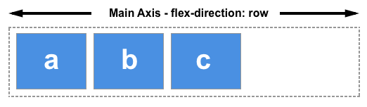
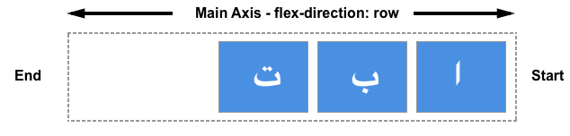

# flex 布局的基本概念

> Flexible Box 模型，通常被称为 flexbox，是一种一维的布局模型。它给 flexbox 的子元素之间提供了强大的空间分布和对齐能力。本文给出了 flexbox 的主要特性，更多的细节将在别的文档中探索。

> 我们说 flexbox 是一种一维的布局，是因为一个 flexbox 一次只能处理一个维度上的元素布局，一行或者一列。作为对比的是另外一个二维布局 CSS Grid Layout，可以同时处理行和列上的布局。

## flexbox 的两根轴线

> 当使用 flex 布局时，首先想到的是两根轴线 — 主轴和交叉轴。主轴由 flex-direction 定义，另一根轴垂直于它。我们使用 flexbox 的所有属性都跟这两根轴线有关, 所以有必要在一开始首先理解它。

### 主轴

> 主轴由 flex-direction 定义，可以取4个值：

- row
- row-reverse
- column
- column-reverse

> 如果你选择了 row 或者 row-reverse，你的主轴将沿着 inline 方向延伸。



> 选择 column 或者 column-reverse 时，你的主轴会沿着上下方向延伸 — 也就是 block 排列的方向。


### 交叉轴

> 交叉轴垂直于主轴，所以如果你的flex-direction (主轴) 设成了 row 或者 row-reverse 的话，交叉轴的方向就是沿着列向下的。


> 如果主轴方向设成了 column 或者 column-reverse，交叉轴就是水平方向。


> 理解主轴和交叉轴的概念对于对齐 flexbox 里面的元素是很重要的；flexbox 的特性是沿着主轴或者交叉轴对齐之中的元素。

## 起始线和终止线

> 另外一个需要理解的重点是 flexbox 不会对文档的书写模式提供假设。过去，CSS的书写模式主要被认为是水平的，从左到右的。现代的布局方式涵盖了书写模式的范围，所以我们不再假设一行文字是从文档的左上角开始向右书写, 新的行也不是必须出现在另一行的下面。

> 你可以在接下来的文章中学到更多 flexbox 和书写模式关系的详细说明。下面的描述是来帮助我们理解为什么不用上下左右来描述 flexbox 元素的方向。

> 如果 flex-direction 是 row ，并且我是在书写英文，那么主轴的起始线是左边，终止线是右边。


> 如果我在书写阿拉伯文，那么主轴的起始线是右边，终止线是左边。



> 在这两种情况下，交叉轴的起始线是flex容器的顶部，终止线是底部，因为两种语言都是水平书写模式。

> 之后，你会觉得用起始和终止来描述比左右更合适，这会对你理解其他相同模式的布局方法（例如：CSS Grid Layout）起到帮助的作用。

## Flex 容器

> 文档中采用了 flexbox 的区域就叫做 flex 容器。为了创建 flex 容器， 我们把一个容器的 display 属性值改为 flex 或者 inline-flex。 完成这一步之后，容器中的直系子元素就会变为 flex 元素。所有CSS属性都会有一个初始值，所以 flex 容器中的所有 flex 元素都会有下列行为：

- 元素排列为一行 (flex-direction 属性的初始值是 row)。
- 元素从主轴的起始线开始。
- 元素不会在主维度方向拉伸，但是可以缩小。
- 元素被拉伸来填充交叉轴大小。
- flex-basis 属性为 auto。
- flex-wrap 属性为 nowrap。

> 这会让你的元素呈线形排列，并且把自己的大小作为主轴上的大小。如果有太多元素超出容器，它们会溢出而不会换行。如果一些元素比其他元素高，那么元素会沿交叉轴被拉伸来填满它的大小。

```html
<div class="box">
	<div>One</div>
	<div>Two</div>
	<div>Three
		<br>has
		<br>extra
		<br>text
	</div>
</div>
```

```css
.box {
	display: flex;
}
```

### 更改flex方向 flex-direction

> 在 flex 容器中添加 flex-direction 属性可以让我们更改 flex 元素的排列方向。设置 flex-direction: row-reverse 可以让元素沿着行的方向显示，但是起始线和终止线位置会交换。

> 把 flex 容器的属性 flex-direction 改为 column ，主轴和交叉轴交换，元素沿着列的方向排列显示。改为 column-reverse ，起始线和终止线交换。

> 下面的例子中，flex-direction 值为 row-reverse。尝试使用其他的值 row ，column，column-reverse，看看内容会发生什么改变。

```html
<div class="box">
	<div>One</div>
	<div>Two</div>
	<div>Three</div>
</div>
```

```css
.box {
	display: flex;
	flex-direction: row-reverse;
}
```

## 用flex-wrap实现多行Flex容器

> 虽然flexbox是一维模型，但可以使我们的flex项目应用到多行中。 在这样做的时候，您应该把每一行看作一个新的flex容器。 任何空间分布都将在该行上发生，而不影响该空间分布的其他行。

> 为了实现多行效果，请为属性flex-wrap添加一个属性值wrap。 现在，如果您的项目太大而无法全部显示在一行中，则会换行显示。 下面的实时例子包含已给出宽度的项目，对于flex容器，项目的子元素总宽度大于容器最大宽度。 由于flex-wrap的值设置为wrap，所以项目的子元素换行显示。若将其设置为nowrap，这也是初始值，它们将会缩小以适应容器，因为它们使用的是允许缩小的初始Flexbox值。 如果项目的子元素无法缩小，使用nowrap会导致溢出，或者缩小程度还不够小。

```html
<div class="box">
	<div>One</div>
	<div>Two</div>
	<div>Three</div>
</div>
```

```css
.box {
	display: flex;
	flex-wrap: wrap;
}
```

## 简写属性 flex-flow

> 你可以将两个属性 flex-direction 和 flex-wrap 组合为简写属性 flex-flow。第一个指定的值为 flex-direction ，第二个指定的值为 flex-wrap.

> 在下面的例子中，尝试将第一个值修改为 flex-direction 的允许取值之一，即 row, row-reverse, column 或 column-reverse, 并尝试将第二个指定值修改为 wrap 或 nowrap。


```html
<div class="box">
	<div>One</div>
	<div>Two</div>
	<div>Three</div>
</div>
```

```css
.box {
	display: flex;
	flex-flow: row wrap;
}
```

## flex 元素上的属性

> 为了更好地控制 flex 元素，有三个属性可以作用于它们：

- flex-grow
- flex-shrink
- flex-basis

> 在这里，我们只会大概介绍一下它们的用法，更详细的细节请参阅其它的文章。

> 在考虑这几个属性的作用之前，需要先了解一下 布局空白 available space 这个概念。这几个 flex 属性的作用其实就是改变了 flex 容器中的布局空白的行为。同时，布局空白对于 flex 元素的对齐行为也是很重要的。

> 假设在 1 个 500px 的容器中，我们有 3 个 100px 宽的元素，那么这 3 个元素需要占 300px 的宽，剩下 200px 的布局空白。在默认情况下， flexbox 的行为会把这 200px 的空白留在最后一个元素的后面。


> 如果期望这些元素能自动地扩展去填充满剩下的空白，那么我们需要去控制布局空白在这几个元素间如何分配，这就是元素上的那些 flex 属性要做的事。

### Flex 元素属性：flex-basis

> flex-basis 定义了该元素的布局空白（available space）的基准值。 该属性的默认值是 auto 。此时，浏览器会检测这个元素是否具有确定的尺寸。 在上面的例子中, 所有元素都设定了宽度（width）为100px，所以 flex-basis 的值为100px。

> 如果没有给元素设定尺寸，flex-basis 的值采用元素内容的尺寸。这就解释了：我们给只要给Flex元素的父元素声明 display: flex ，所有子元素就会排成一行，且自动分配小大以充分展示元素的内容。

### Flex 元素属性：flex-grow

> flex-grow 若被赋值为一个正整数， flex 元素会以 flex-basis 为基础，沿主轴方向增长尺寸。这会使该元素延展，并占据此方向轴上的布局空白（available space）。如果有其他元素也被允许延展，那么他们会各自占据布局空白的一部分。

> 如果我们给上例中的所有元素设定 flex-grow 值为1， 容器中的布局空白会被这些元素平分。它们会延展以填满容器主轴方向上的空间。

> flex-grow 属性可以按比例分配空间。如果第一个元素 flex-grow 值为2， 其他元素值为1，则第一个元素将占有2/4（上例中，即为 200px 中的 100px）, 另外两个元素各占有1/4（各50px）。

### Flex 元素属性： flex-shrink

> flex-grow属性是处理flex元素在主轴上增加空间的问题，相反flex-shrink属性是处理flex元素收缩的问题。如果我们的容器中没有足够排列flex元素的空间，那么可以把flex元素flex-shrink属性设置为正整数来缩小它所占空间到flex-basis以下。与flex-grow属性一样，可以赋予不同的值来控制flex元素收缩的程度 —— 给flex-shrink属性赋予更大的数值可以比赋予小数值的同级元素收缩程度更大。

### Flex属性的简写

> 你可能很少看到 flex-grow，flex-shrink，和 flex-basis 属性单独使用，而是混合着写在 flex 简写形式中。 Flex 简写形式允许你把三个数值按这个顺序书写 — flex-grow，flex-shrink，flex-basis。

> 你可以在下面的实例中尝试把flex简写形式中的数值更改为不同数值，但要记得第一个数值是 flex-grow。赋值为正数的话是让元素增加所占空间。第二个数值是flex-shrink — 正数可以让它缩小所占空间，但是只有在flex元素总和超出主轴才会生效。最后一个数值是 flex-basis；flex元素是在这个基准值的基础上缩放的。

```html
<div class="box">
	<div class="one">One</div>
	<div class="two">Two</div>
	<div class="three">Three</div>
</div>
```

```css
.box {
	display: flex;
}
.one {
	flex: 1 1 auto;
}
.two {
	flex: 1 1 auto;
}
.three {
	flex: 1 1 auto;
}
```

> 大多数情况下可以用预定义的简写形式。 在这个教程中你可能经常会看到这种写法，许多情况下你都可以这么使用。下面是几种预定义的值：

- flex: initial
- flex: auto
- flex: none
- flex: <positive-number>

> flex: initial 是把flex元素重置为Flexbox的初始值，它相当于 flex: 0 1 auto。在这里 flex-grow 的值为0，所以flex元素不会超过它们 flex-basis 的尺寸。flex-shrink 的值为1, 所以可以缩小flex元素来防止它们溢出。flex-basis 的值为 auto. Flex元素尺寸可以是在主维度上设置的，也可以是根据内容自动得到的。

> flex: auto 等同于 flex: 1 1 auto；和上面的 flex:initial 基本相同，但是这种情况下，flex元素在需要的时候既可以拉伸也可以收缩。

> flex: none 可以把flex元素设置为不可伸缩。它和设置为 flex: 0 0 auto 是一样的。元素既不能拉伸或者收缩，但是元素会按具有 flex-basis: auto 属性的flexbox进行布局。

> 你在教程中常看到的 flex: 1 或者 flex: 2 等等。它相当于flex: 1 1 0。元素可以在flex-basis为0的基础上伸缩。

> 尝试在下面的实例中应用这些简写值。

```html
<div class="box">
	<div class="one">One</div>
	<div class="two">Two</div>
	<div class="three">Three</div>
</div>
```

```css
.box {
	display: flex;
}
.one {
	flex: 1;
}
.two {
	flex: 1;
}
.three {
	flex: 1;
}
```

## 元素间的对齐和空间分配

> Flexbox的一个关键特性是能够设置flex元素沿主轴方向和交叉轴方向的对齐方式，以及它们之间的空间分配。

### align-items

> align-items 属性可以使元素在交叉轴方向对齐。

> 这个属性的初始值为stretch，这就是为什么flex元素会默认被拉伸到最高元素的高度。实际上，它们被拉伸来填满flex容器 —— 最高的元素定义了容器的高度。

> 你也可以设置align-items的值为flex-start，使flex元素按flex容器的顶部对齐, flex-end 使它们按flex容器的下部对齐, 或者center使它们居中对齐. 在实例中尝试——我给出了flex容器的高度，以便你可以看到元素在容器中移动。看看如果更改 align-items的值为下列值会发生什么：

- stretch
- flex-start
- flex-end
- center

```html
<div class="box">
	<div>One</div>
	<div>Two</div>
	<div>Three
		<br>has
		<br>extra
		<br>text
	</div>
</div>
```

```css
.box {
	display: flex;
	align-items: flex-start;
}
```

### justify-content

> justify-content属性用来使元素在主轴方向上对齐，主轴方向是通过 flex-direction 设置的方向。初始值是flex-start，元素从容器的起始线排列。但是你也可以把值设置为flex-end，从终止线开始排列，或者center，在中间排列.

> 你也可以把值设置为space-between，把元素排列好之后的剩余空间拿出来，平均分配到元素之间，所以元素之间间隔相等。或者使用space-around，使每个元素的左右空间相等。

> 在实例中尝试下列justify-content属性的值：

- stretch
- flex-start
- flex-end
- center
- space-around
- space-between

```html
<div class="box">
	<div>One</div>
	<div>Two</div>
	<div>Three</div>
</div>
```

```css
.box {
	display: flex;
	justify-content: flex-start;
}
```

**本文转载自 MDN web docs，<a href="https://developer.mozilla.org/zh-CN/docs/Web/CSS/CSS_Flexible_Box_Layout/Basic_Concepts_of_Flexbox" rel="nofollow">《flex 布局的基本概念》</a>**