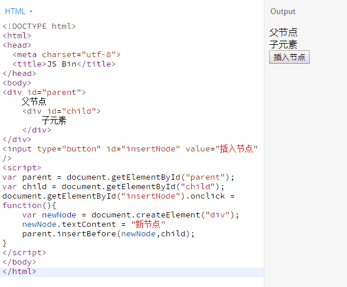
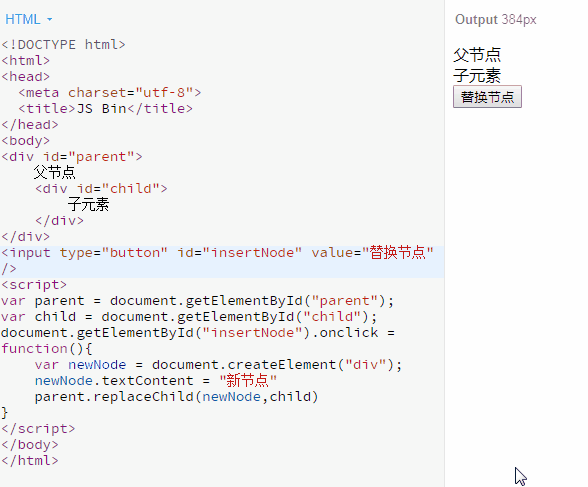
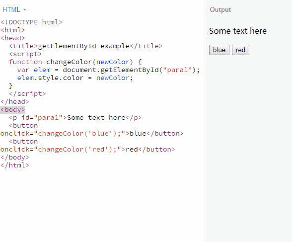
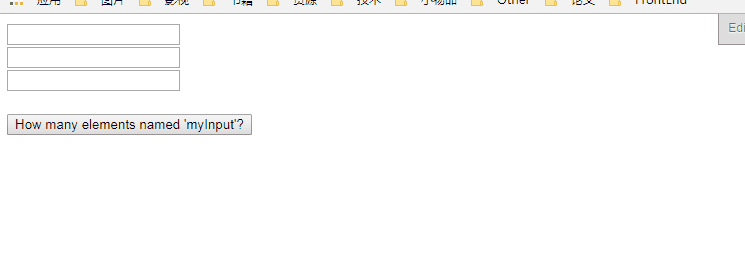
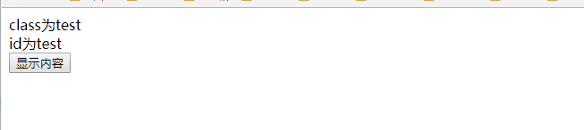
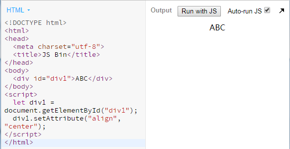
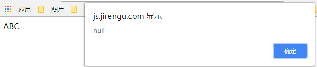
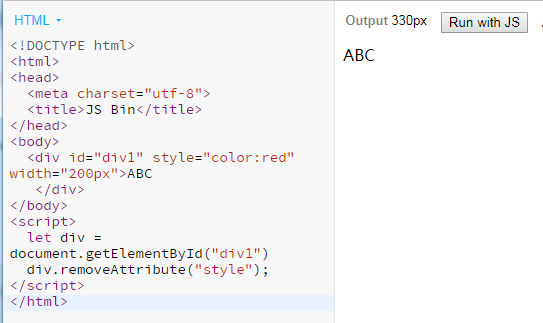

# JavaScript操作DOM常用的API

## 1 什么是DOM

文档对象模型 (DOM) 是HTML和XML文档的编程接口。它提供了对文档的结构化的表述，并定义了一种方式可以使从程序中对该结构进行访问，从而改变文档的结构，样式和内容。
文档对象模型 (DOM) 是对HTML文件的另一种展示，通俗地说，一个HTML 文件，我们可以用编辑器以代码的形式展示它，也可以用浏览器以页面的形式展示它，同一份文件通过不同的展示方式，就有了不一样的表现形式。而DOM 将文档解析为一个由节点和对象（包含属性和方法的对象）组成的结构集合。简言之，它会将web页面和脚本或程序语言连接起来，我们可以使用脚本或者程序语言通过DOM 来改变或者控制web页面。

## 2 如何访问DOM

我们可以通过JavaScript 来调用document和window元素的API来操作文档或者获取文档的信息。

## 3 Node

Node 是一个接口，有许多接口都从Node 继承方法和属性：
Document, Element, CharacterData (which Text, Comment, and CDATASection inherit), ProcessingInstruction, DocumentFragment, DocumentType, Notation, Entity, EntityReference。
Node 有一个nodeType的属性表示Node 的类型，是一个整数，不同的值代表不同的节点类型。具体如下表所示：

- 节点类型常量

|常量|值|描述|
|-|-|-|
|Node.ELEMENT_NODE|	1|	一个元素节点，例如 `<p>` 和 `<div>`|
|Node.TEXT_NODE|	3|	Element 或者 Attr 中实际的文字|
|Node.PROCESSING_INSTRUCTION_NODE|	7|	一个用于XML文档的 ProcessingInstruction ，例如 `<?xml-stylesheet ... ?>` 声明|
|Node.COMMENT_NODE|	8|	一个 Comment 节点|
|Node.DOCUMENT_NODE|	9|	一个 Document 节点|
|Node.DOCUMENT_TYPE_NODE|	10|	描述文档类型的 DocumentType 节点。例如 `<!DOCTYPE html> `就是用于 HTML5 的|
|Node.DOCUMENT_FRAGMENT_NODE|	11|	一个 DocumentFragment 节点|

- 已弃用的节点类型常量

|常量|值|描述|
|-|-|-|
|Node.ATTRIBUTE_NODE|	2|	元素的耦合属性。在DOM4 规范里Node 接口将不再实现这个元素属性|
|Node.CDATA_SECTION_NODE|	4|	一个CDATASection。在DOM4 规范里被移除|
|Node.ENTITY_REFERENCE_NODE|	5|	一个XML 实体引用节点。在DOM4 规范里被移除|
|Node.ENTITY_NODE|	6|	一个XML `<!ENTITY ...>`节点。在DOM4 规范中被移除|
|Node.NOTATION_NODE|	12|	一个XML `<!NOTATION ...>`节点。在DOM4 规范里被移除|

假设我们要判断一个Node 是不是一个元素，通过查表可知元素的nodeType属性值为1，代码可以这么写：

```javascript
if(X.nodeType === 1){
  console.log('X 是一个元素');
}
```

在Node 类型中，比较常用的就是element，text，comment，document，document_fragment这几种类型。

### 3.1 Element

Element提供了对元素标签名，子节点和特性的访问，我们常用HTML元素比如div，span，a等标签就是element中的一种。Element有下面几条特性：
（1）nodeType为1
（2）nodeName为元素标签名，tagName也是返回标签名
（3）nodeValue为null
（4）parentNode可能是Document或Element
（5）子节点可能是Element，Text，Comment，Processing_Instruction，CDATASection或EntityReference

### 3.2 Text

Text表示文本节点，它包含的是纯文本内容，不能包含html代码，但可以包含转义后的html代码。Text有下面的特性：
（1）nodeType为3
（2）nodeName为#text
（3）nodeValue为文本内容
（4）parentNode是一个Element
（5）没有子节点

### 3.3 Comment

Comment表示HTML文档中的注释，它有下面的几种特征：
（1）nodeType为8
（2）nodeName为#comment
（3）nodeValue为注释的内容
（4）parentNode可能是Document或Element
（5）没有子节点

### 3.4 Document

Document表示文档，在浏览器中，document对象是HTMLDocument的一个实例，表示整个页面，它同时也是window对象的一个属性。Document有下面的特性：
（1）nodeType为9
（2）nodeName为#document
（3）nodeValue为null
（4）parentNode为null
（5）子节点可能是一个DocumentType或Element

### 3.5 DocumentFragment

DocumentFragment是所有节点中唯一一个没有对应标记的类型，它表示一种轻量级的文档，可能当作一个临时的仓库用来保存可能会添加到文档中的节点。DocumentFragment有下面的特性：
（1）nodeType为11
（2）nodeName为#document-fragment
（3）nodeValue为null
（4）parentNode为null

## 4 节点创建型API

用如其名，这类API是用来创建节点的

### 4.1 createElement

createElement通过传入指定的一个标签名来创建一个元素，如果传入的标签名是一个未知的，则会创建一个自定义的标签，注意：IE8以下浏览器不支持自定义标签。

语法

```javascript
let element = document.createElement(tagName);
```

使用createElement要注意：通过createElement创建的元素并不属于HTML文档，它只是创建出来，并未添加到HTML文档中，要调用appendChild或insertBefore等方法将其添加到HTML文档树中。

例子：

```javascript
let elem = document.createElement("div");
elem.id = 'test';
elem.style = 'color: red';
elem.innerHTML = '我是新创建的节点';
document.body.appendChild(elem);
```

运行结果为：


### 4.2 createTextNode

createTextNode用来创建一个文本节点

语法

```javascript
var text = document.createTextNode(data);
```

createTextNode接收一个参数，这个参数就是文本节点中的文本，和createElement一样，创建后的文本节点也只是独立的一个节点，同样需要appendChild将其添加到HTML文档树中

例子：

```javascript
var node = document.createTextNode("我是文本节点");
document.body.appendChild(node);
```

运行结果为：


### 4.3 cloneNode

cloneNode返回调用该方法的节点的一个副本

- 语法

```javascript
var dupNode = node.cloneNode(deep);
```

node 将要被克隆的节点
dupNode 克隆生成的副本节点
deep（可选）是否采用深度克隆,如果为true,则该节点的所有后代节点也都会被克隆,如果为false,则只克隆该节点本身.

这里有几点要注意：
（1）和createElement一样，cloneNode创建的节点只是游离有HTML文档外的节点，要调用appendChild方法才能添加到文档树中
（2）如果复制的元素有id，则其副本同样会包含该id，由于id具有唯一性，所以在复制节点后必须要修改其id
（3）调用接收的deep参数最好传入，如果不传入该参数，不同浏览器对其默认值的处理可能不同

- 注意

如果被复制的节点绑定了事件，则副本也会跟着绑定该事件吗？这里要分情况讨论：
（1）如果是通过addEventListener或者比如onclick进行绑定事件，则副本节点不会绑定该事件
（2）如果是内联方式绑定比如：`<div onclick="showParent()"></div>`，这样的话，副本节点同样会触发事件。

例子：

```html
<body>
  <div id="parent">
    我是父元素的文本
    <br/>
    <span>
        我是子元素
    </span>
  </div>
  <button id="btnCopy">复制</button>
</body>
<script>
  var parent = document.getElementById("parent");
  document.getElementById("btnCopy").onclick = function(){
  	var parent2 = parent.cloneNode(true);
  	parent2.id = "parent2";
  	document.body.appendChild(parent2);
  }
</script>
```

运行结果为：


### 4.4 createDocumentFragment

DocumentFragments 是DOM节点。它们不是主DOM树的一部分。通常的用例是创建文档片段，将元素附加到文档片段，然后将文档片段附加到DOM树。在DOM树中，文档片段被其所有的子元素所代替。
因为文档片段存在于内存中，并不在DOM树中，所以将子元素插入到文档片段时不会引起页面回流(reflow)(对元素位置和几何上的计算)。因此，使用文档片段document fragments 通常会起到优化性能的作用。

语法

```javascript
let fragment = document.createDocumentFragment();
```

例子：
```html
<body>
  <ul id="ul"></ul>
</body>
<script>
  (function()
  {
    var start = Date.now();
    var str = '', li;
    var ul = document.getElementById('ul');
    var fragment = document.createDocumentFragment();
    for(var i=0; i<1000; i++)
    {
        li = document.createElement('li');
        li.textContent = '第'+(i+1)+'个子节点';
        fragment.appendChild(li);
    }
    ul.appendChild(fragment);
  })();
</script>
```
运行结果为：


### 4.5 节点创建型API总结

节点创建型API主要包括createElement，createTextNode，cloneNode和createDocumentFragment四个方法，需要注意下面几点：
（1）它们创建的节点只是一个孤立的节点，要通过appendChild添加到文档中
（2）cloneNode要注意如果被复制的节点是否包含子节点以及事件绑定等问题
（3）使用createDocumentFragment来解决添加大量节点时的性能问题

## 5 页面修改型API

前面我们提到节点创建型API，它们只是创建节点，并没有真正修改到页面内容，而是要调用·appendChild·来将其添加到文档树中。我在这里将这类会修改到页面内容归为一类。
修改页面内容的api主要包括：appendChild，insertBefore，removeChild，replaceChild。

### 5.1 appendChild

appendChild我们在前面已经用到多次，就是将指定的节点添加到调用该方法的节点的子元素的末尾。

语法

```javascript
parent.appendChild(child);
```

child节点将会作为parent节点的最后一个子节点。
appendChild这个方法很简单，但是还有有一点需要注意：如果被添加的节点是一个页面中存在的节点，则执行后这个节点将会添加到指定位置，其原本所在的位置将移除该节点，也就是说不会同时存在两个该节点在页面上，相当于把这个节点移动到另一个地方。
如果child绑定了事件，被移动时，它依然绑定着该事件。

例子：
```html
<body>
  <div id="child">
    要被添加的节点
  </div>
  <br/>
  <br/>
  <br/>
  <div id="parent">
    要移动的位置
  </div>		
  <input id="btnMove" type="button" value="移动节点" />
</body>
<script>
  document.getElementById("btnMove").onclick = function(){
	  var child = document.getElementById("child");
 	  document.getElementById("parent").appendChild(child);
  } 
</script>
```
运行结果：


### 5.2 insertBefore

insertBefore用来添加一个节点到一个参照节点之前

语法

```javascript
parentNode.insertBefore(newNode,refNode);
```

parentNode表示新节点被添加后的父节点
newNode表示要添加的节点
refNode表示参照节点，新节点会添加到这个节点之前

例子：
```html
<body>
  <div id="parent">
    父节点
    <div id="child">				
        子元素
    </div>
  </div>
  <input type="button" id="insertNode" value="插入节点" />
</body>
<script>
  var parent = document.getElementById("parent");
  var child = document.getElementById("child");
  document.getElementById("insertNode").onclick = function(){
  	var newNode = document.createElement("div");
  	newNode.textContent = "新节点"
  	parent.insertBefore(newNode,child);
  }
</script>
```
运行结果：



关于第二个参数参照节点还有几个注意的地方：
（1）refNode是必传的，如果不传该参数会报错
（2）如果refNode是undefined或null，则insertBefore会将节点添加到子元素的末尾

### 5.3 removeChild

删除指定的子节点并返回

语法

```javascript
var deletedChild = parent.removeChild(node);
```

deletedChild指向被删除节点的引用，它等于node，被删除的节点仍然存在于内存中，可以对其进行下一步操作。
注意：如果被删除的节点不是其子节点，则程序将会报错。我们可以通过下面的方式来确保可以删除：

```javascript
if(node.parentNode){
​    node.parentNode.removeChild(node);
}
```

运行结果：


通过节点自己获取节点的父节点，然后将自身删除

### 5.4 replaceChild

replaceChild用于使用一个节点替换另一个节点

语法

```
parent.replaceChild(newChild,oldChild);
```

newChild是替换的节点，可以是新的节点，也可以是页面上的节点，如果是页面上的节点，则其将被转移到新的位置
oldChild是被替换的节点

例子：
```html
<body>
  <div id="parent">
    父节点
    <div id="child">				
        子元素
    </div>
  </div>
  <input type="button" id="insertNode" value="替换节点" />
</body>
<script>
  var parent = document.getElementById("parent");
  var child = document.getElementById("child");
  document.getElementById("insertNode").onclick = function(){
  	var newNode = document.createElement("div");
  	newNode.textContent = "新节点"
  	parent.replaceChild(newNode,child)
  }
</script>
  ```
运行结果：


### 5.5 页面修改型API总结

页面修改型API主要是这四个接口，要注意几个特点：
（1）不管是新增还是替换节点，如果新增或替换的节点是原本存在页面上的，则其原来位置的节点将被移除，也就是说同一个节点不能存在于页面的多个位置
（2）节点本身绑定的事件会不会消失，会一直保留着。

## 6 节点查询型API

### 6.1 document.getElementById

这个接口很简单，根据元素id返回元素，返回值是Element类型，如果不存在该元素，则返回null

语法

```javascript
  var element = document.getElementById(id);
```

使用这个接口有几点要注意：
（1）元素的Id是大小写敏感的，一定要写对元素的id
（2）HTML文档中可能存在多个id相同的元素，则返回第一个元素
（3）只从文档中进行搜索元素，如果创建了一个元素并指定id，但并没有添加到文档中，则这个元素是不会被查找到的

例子：
```html
<body>
  <p id="para1">Some text here</p>
  <button onclick="changeColor('blue');">blue</button>
  <button onclick="changeColor('red');">red</button>
</body>
<script>
  function changeColor(newColor) {
    var elem = document.getElementById("para1");
    elem.style.color = newColor;
  }
</script>
```
运行结果：


### 6.2 document.getElementsByTagName

返回一个包括所有给定标签名称的元素的HTML集合HTMLCollection。 整个文件结构都会被搜索，包括根节点。返回的 HTML集合是动态的, 意味着它可以自动更新自己来保持和 DOM 树的同步而不用再次调用document.getElementsByTagName()

语法

```javascript
  var elements = document.getElementsByTagName(name);
```

（1）如果要对HTMLCollection集合进行循环操作，最好将其长度缓存起来，因为每次循环都会去计算长度，暂时缓存起来可以提高效率
（2）如果没有存在指定的标签，该接口返回的不是null，而是一个空的HTMLCollection
（3）name是一个代表元素的名称的字符串。特殊字符 `"*"` 代表了所有元素。

例子：
```html
<body>
  <div>div1</div>
  <div>div2</div>	
  <input type="button" value="显示数量" id="btnShowCount"/>
  <input type="button" value="新增div" id="btnAddDiv"/>	
</body>
<script>
  var divList = document.getElementsByTagName("div");
  document.getElementById("btnAddDiv").onclick = function(){
  	var div = document.createElement("div");
  	div.textContent ="div" + (divList.length+1);
  	document.body.appendChild(div);
  }
  document.getElementById("btnShowCount").onclick = function(){
    alert(divList.length);
  }
</script>
```
这段代码中有两个按钮，一个按钮是显示HTMLCollection元素的个数，另一个按钮可以新增一个div标签到文档中。前面提到HTMLCollcetion元素是即时的表示该集合是随时变化的，也就是是文档中有几个div，它会随时进行变化，当我们新增一个div后，再访问HTMLCollection时，就会包含这个新增的div。
运行结果：


### 6.3 document.getElementsByName
getElementsByName主要是通过指定的name属性来获取元素，它返回一个即时的NodeList对象

语法

```javascript
var elements = document.getElementsByName(name) 
```

使用这个接口主要要注意几点：
（1）返回对象是一个即时的NodeList，它是随时变化的
（2）在HTML元素中，并不是所有元素都有name属性，比如div是没有name属性的，但是如果强制设置div的name属性，它也是可以被查找到的
（3）在IE中，如果id设置成某个值，然后传入getElementsByName的参数值和id值一样，则这个元素是会被找到的，所以最好不好设置同样的值给id和name

例子：

```html
<script type="text/javascript">
  function getElements()
   {
   var x=document.getElementsByName("myInput");
   alert(x.length);
   }
</script>
<body>
  <input name="myInput" type="text" size="20" /><br />
  <input name="myInput" type="text" size="20" /><br />
  <input name="myInput" type="text" size="20" /><br />
  <br />
  <input type="button" onclick="getElements()" value="How many elements named 'myInput'?" />
</body>
```
运行结果：


### 6.4 document.getElementsByClassName
这个API是根据元素的class返回一个即时的HTMLCollection

语法
```javascript
var elements = document.getElementsByClassName(names); // or:
var elements = rootElement.getElementsByClassName(names);
```

elements是一个实时集合，包含了找到的所有元素
names是一个字符串，表示要匹配的类名列表；类名通过空格分隔
getElementsByClassName可以在任何元素上调用，不仅仅是document。调用这个方法的元素将作为本次查找的根元素
这个接口有下面几点要注意：
（1）返回结果是一个即时的HTMLCollection，会随时根据文档结构变化
（2）IE9以下浏览器不支持
（3）如果要获取2个以上classname，可传入多个classname，每个用空格相隔，例如

```javascript
var elements = document.getElementsByClassName("test1 test2");
```

例子：

获取所有class为 'test' 的元素

```javascript
var elements = document.getElementsByClassName('test');
```

获取所有class同时包括 'red' 和 'test' 的元素

```javascript
var elements = document.getElementsByClassName('red test');
```

在id为'main'的元素的子节点中，获取所有class为'test'的元素

```javascript
var elements = document.getElementById('main').getElementsByClassName('test');
```

我们还可以对任意的HTMLCollection 使用Array.prototype的方法，调用时传递HTMLCollection 作为方法的参数。这里我们将查找到所有class为'test'的div元素:

```javascript
var testElements = document.getElementsByClassName('test');
var testDivs = Array.prototype.filter.call(testElements, function(testElement){
​ return testElement.nodeName === 'DIV';;
});
```

### 6.5 document.querySelector和document.querySelectorAll

这两个API很相似，通过css选择器来查找元素，注意选择器要符合CSS选择器的规则

#### 6.5.1 document.querySelector

document.querySelector返回第一个匹配的元素，如果没有匹配的元素，则返回null

语法

```javascript
var element = document.querySelector(selectors);
```

注意，由于返回的是第一个匹配的元素，这个api使用的深度优先搜索来获取元素。

例子：
```html
<body>
  <div>
    <div>
      <span class="test">第三级的span</span>	
    </div>
  </div>
  <div class="test">			
    同级的第二个div
  </div>
  <input type="button" id="btnGet" value="获取test元素" />
</body>
<script>
  document.getElementById("btnGet").addEventListener("click",function(){
    var element = document.querySelector(".test");
    alert(element.textContent);
  })
</script>
```
两个class都包含“test”的元素，一个在文档树的前面，但是它在第三级，另一个在文档树的后面，但它在第一级，通过querySelector获取元素时，它通过深度优先搜索，拿到文档树前面的第三级的元素。
运行结果：


#### 6.5.2 document.querySelectorAll

返回的是所有匹配的元素，而且可以匹配多个选择符
语法

```javascript
var elementList = document.querySelectorAll(selectors);
```

elementList是一个静态的NodeList类型的对象
selectors是一个由逗号连接的包含一个或多个CSS选择器的字符串
如果selectors参数中包含CSS伪元素,则返回一个空的elementList
例子：

```javascript
var matches = document.querySelectorAll("div.note, div.alert");
```

返回一个文档中所有的class为"note"或者"alert"的div元素
```html
<body>
  <div class="test">
    class为test
  </div>
  <div id="test">
    id为test
  </div>
  <input id="btnShow" type="button" value="显示内容" />
</body>
<script>
  document.getElementById("btnShow").addEventListener("click",function(){
	var elements = document.querySelectorAll("#test,.test");	
	for(var i = 0,length = elements.length;i<length;i++){
		alert(elements[i].textContent);
	}	
  })
</script>
```

这段代码通过querySelectorAll，使用id选择器和class选择器选择了两个元素，并依次输出其内容。要注意两点：
（1）querySelectorAll也是通过深度优先搜索，搜索的元素顺序和选择器的顺序无关
（2）返回的是一个非即时的NodeList，也就是说结果不会随着文档树的变化而变化
兼容性问题：querySelector和querySelectorAll在ie8以下的浏览器不支持。

运行结果：



## 7 节点关系型API

在html文档中的每个节点之间的关系都可以看成是家谱关系，包含父子关系，兄弟关系等等

### 7.1 父关系型API

#### 7.1.1 parentNode

每个节点都有一个parentNode属性，它表示元素的父节点。Element的父节点可能是Element，Document或DocumentFragment

#### 7.1.2 parentElement

返回元素的父元素节点，与parentNode的区别在于，其父节点必须是一个Element，如果不是，则返回null

### 7.2 子关系型APPI

#### 7.2.1 childNodes

返回一个即时的NodeList，表示元素的子节点列表，子节点可能会包含文本节点，注释节点等

#### 7.2.2 children：

一个即时的HTMLCollection，子节点都是Element，IE9以下浏览器不支持
children属性为只读属性，对象类型为HTMLCollection，你可以使用elementNodeReference.children[1].nodeName来获取某个子元素的标签名称

#### 7.2.3 firstChild

只读属性返回树中节点的第一个子节点，如果节点是无子节点，则返回 null

#### 7.2.4 lastChild

返回当前节点的最后一个子节点。如果父节点为一个元素节点，则子节点通常为一个元素节点，或一个文本节点，或一个注释节点。如果没有子节点，则返回null

#### 7.2.5 hasChildNodes

返回一个布尔值,表明当前节点是否包含有子节点.

### 7.3 兄弟关系型API

#### 7.3.1 previousSibling

返回当前节点的前一个兄弟节点,没有则返回null
Gecko内核的浏览器会在源代码中标签内部有空白符的地方插入一个文本结点到文档中.因此,使用诸如Node.firstChild和Node.previousSibling之类的方法可能会引用到一个空白符文本节点, 而不是使用者所预期得到的节点

#### 7.3.2 previousElementSibling

previousElementSibling返回当前元素在其父元素的子元素节点中的前一个元素节点,如果该元素已经是第一个元素节点,则返回null,该属性是只读的。注意IE9以下浏览器不支持

#### 7.3.3 nextSibling

Node.nextSibling是一个只读属性，返回其父节点的childNodes列表中紧跟在其后面的节点，如果指定的节点为最后一个节点，则返回null
Gecko内核的浏览器会在源代码中标签内部有空白符的地方插入一个文本结点到文档中.因此,使用诸如Node.firstChild和Node.previousSibling之类的方法可能会引用到一个空白符文本节点, 而不是使用者所预期得到的节点

#### 7.3.4 nextElementSibling

nextElementSibling返回当前元素在其父元素的子元素节点中的后一个元素节点,如果该元素已经是最后一个元素节点,则返回null,该属性是只读的。注意IE9以下浏览器不支持

## 8 元素属性型API

### 8.1 setAttribute

设置指定元素上的一个属性值。如果属性已经存在，则更新该值; 否则将添加一个新的属性用指定的名称和值

语法

```javascript
element.setAttribute(name, value);
```

其中name是特性名，value是特性值。如果元素不包含该特性，则会创建该特性并赋值。

例子：
```html
<body>
  <div id="div1">ABC</div>
</body>
<script>  
  let div1 = document.getElementById("div1"); 
  div1.setAttribute("align", "center");
</script>
```
运行结果：



如果元素本身包含指定的特性名为属性，则可以世界访问属性进行赋值，比如下面两条代码是等价的：

```javascript
element.setAttribute("id","test");
element.id = "test";
```

### 8.2 getAttribute

getAttribute()返回元素上一个指定的属性值。如果指定的属性不存在，则返回null或""（空字符串）

语法

```javascript
let attribute = element.getAttribute(attributeName);
```

attribute是一个包含attributeName属性值的字符串。attributeName是你想要获取的属性值的属性名称

例子：
```html
<body>
  <div id="div1">ABC</div>
</body>
<script>  
  let div1 = document.getElementById("div1");
  let align = div1.getAttribute("align");
  alert(align);
</script>
```
运行结果：


### 8.3 removeAttribute

removeAttribute()从指定的元素中删除一个属性

语法

```javascript
element.removeAttribute(attrName)
```

attrName是一个字符串，将要从元素中删除的属性名

例子：
```html
<body>
  <div id="div1" style="color:red" width="200px">ABC
   </div>
</body>
<script>  
  let div = document.getElementById("div1")
  div.removeAttribute("style");
</script>
```
在运行之前div有个style="color:red"的属性，在运行之后这个属性就被删除了

运行结果：



## 9 元素样式型API

### 9.1 window.getComputedStyle

Window.getComputedStyle()方法给出应用活动样式表后的元素的所有CSS属性的值，并解析这些值可能包含的任何基本计算
假设某个元素并未设置高度而是通过其内容将其高度撑开，这时候要获取它的高度就要用到getComputedStyle

语法

```javascript
var style = window.getComputedStyle(element[, pseudoElt]);
```

element是要获取的元素，pseudoElt指定一个伪元素进行匹配。
返回的style是一个CSSStyleDeclaration对象。
通过style可以访问到元素计算后的样式

### 9.2 getBoundingClientRect

getBoundingClientRect用来返回元素的大小以及相对于浏览器可视窗口的位置

语法

```javascript
var clientRect = element.getBoundingClientRect();
```

clientRect是一个DOMRect对象，包含left，top，right，bottom，它是相对于可视窗口的距离，滚动位置发生改变时，它们的值是会发生变化的。除了IE9以下浏览器，还包含元素的height和width等数据

### 9.3 直接修改元素的样式

例子：

```javascript
elem.style.color = 'red';
elem.style.setProperty('font-size', '16px');
elem.style.removeProperty('color');
```

### 9.4 动态添加样式规则

例子：

```javascript
var style = document.createElement('style');
style.innerHTML = 'body{color:red} #top:hover{background-color: red;color: white;}';
document.head.appendChild(style););
```

## 10 总结

JavaScript中的API太多了，将这些API记住并熟练使用对JavaScript的学习是有很大的提高

**本文转载自 YyzclYang/notes，<a href="https://github.com/YyzclYang/notes/issues/1" rel="nofollow">《JavaScript操作DOM常用的API》</a>**