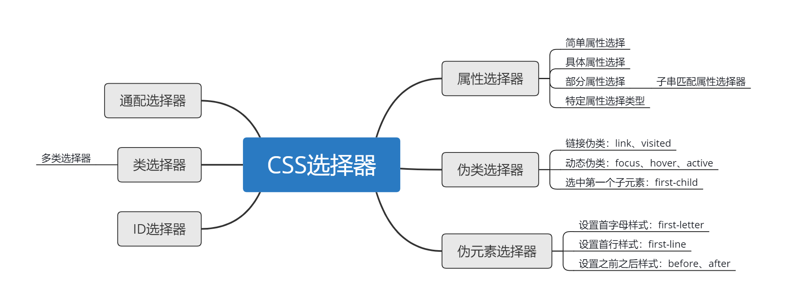

# 问题与简答

## Web 篇

### SEO 有哪些需要注意的

合理的 title、description、keywords

语义化的 HTML 代码，符合 W3C 规范：语义化代码让搜索引擎容易理解网页

重要内容 HTML 代码放在最前：搜索引擎抓取 HTML 顺序是从上到下，有的搜索引擎对抓取长度有限制，保证重要内容一定会被抓取

重要内容不要用 js 输出：爬虫不会执行 js 获取内容

少用 iframe：搜索引擎不会抓取 iframe 中的内容

非装饰性图片必须加 alt

提高网站速度：网站速度是搜索引擎排序的一个重要指标

拓展阅读[《初探 SEO》](./04.Web/01.初探SEO.md)

### img 标签的 title 和 alt 有什么区别

title 属性规定关于元素的额外信息，这些信息通常会在鼠标移到元素上时显示一段提示文本

alt 是标签的特有属性，是图片内容的等价描述。图片无法加载时显示。搜索引擎会重点分析

### CSS 选择器的分类



拓展阅读[《CSS选择器的分类》](./04.Web/02.CSS选择器的分类.md)

### CSS sprite 是什么，有什么优缺点

概念：将多个小图片拼接到一个图片中。通过 background-position 和元素尺寸调节需要显示的背景图案。

- 优点

减少 HTTP 请求数，极大地提高页面加载速度

增加图片信息重复度，提高压缩比，减少图片大小

更换风格方便，只需在一张或几张图片上修改颜色或样式即可实现

- 缺点

图片合并麻烦

维护麻烦，修改一个图片可能需要从新布局整个图片，样式

拓展阅读[《雪碧图CSS Sprite的应用》](./04.Web/03.CSS-Sprite的应用.md)

### display: none 与 visibility: hidden 的区别

- 用途

通过为属性设置一个值来影响用户代理显示的方式

- 区别

display:none 会让元素完全从渲染树中消失，渲染的时候不占据任何空间；visibility: hidden 不会让元素从渲染树消失，渲染师元素继续占据空间，只是内容不可见

display: none 是非继承属性，子孙节点消失由于元素从渲染树消失造成，通过修改子孙节点属性无法显示；visibility: hidden 是继承属性，子孙节点消失由于继承了hidden，通过设置visibility: visible 可以让子孙节点显式

修改常规流中元素的 display 通常会造成文档重排。修改 visibility 属性只会造成本元素的重绘

读屏器不会读取 display: none 元素内容；会读取 visibility: hidden 元素内容

### display: block 和 display: inline 的区别

- block 元素特点

处于常规流中时，如果 width 没有设置，会自动填充满父容器

可以应用 margin/padding

在没有设置高度的情况下会扩展高度以包含常规流中的子元素 

处于常规流中时布局时在前后元素位置之间（独占一个水平空间）

忽略 vertical-align

- inline 元素特点

水平方向上根据 direction 依次布局

不会在元素前后进行换行

受 white-space 控制

margin/padding 在竖直方向上无效，水平方向上有效

width/height 属性对非替换行内元素无效，宽度由元素内容决定

非替换行内元素的行框高由 line-height 确定，替换行内元素的行框高由 height,margin,padding,border 决定

浮动或绝对定位时会转换为 block

vertical-align 属性生效

### CSS 文件、style 标签、行内 style 属性优先级

最近的祖先样式比其他祖先样式优先级高

"直接样式"比"祖先样式"优先级高

### link 与 @import 的区别

link 是 HTML 方式， @import 是 CSS 方式

link 最大限度支持并行下载，@import 过多嵌套导致串行下载，出现FOUC

link 可以通过 rel="alternate stylesheet"指定候选样式

浏览器对 link 支持早于 @import，可以使用 @import 对老浏览器隐藏样式

@import 必须在样式规则之前，可以在 css 文件中引用其他文件

总体来说：link 优于 @import

### 盒子模型


具备属性：内容(content)、填充(padding)、边框(border)、边界(margin)

拓展阅读[《CSS盒模型》](./04.Web/04.CSS盒模型.md)

### 容器包含若干浮动元素时如何清理(包含)浮动

容器元素闭合标签前添加额外元素并设置clear: both

父元素触发块级格式化上下文(见块级可视化上下文部分)

设置容器元素伪元素进行清理推荐的清理浮动方法

```html
/**
* 在标准浏览器下使用
* 1 content内容为空格用于修复opera下文档中出现
*   contenteditable属性时在清理浮动元素上下的空白
* 2 使用display使用table而不是block：可以防止容器和
*   子元素top-margin折叠,这样能使清理效果与BFC，IE6/7
*   zoom: 1;一致
**/
.clearfix:before,
.clearfix:after {
    content: " "; /* 1 */
    display: table; /* 2 */
}
.clearfix:after {
    clear: both;
}
```

### 如何水平居中一个元素

被设置元素为文本、图片等行内元素时，水平居中是通过给父元素设置 text-align:center 来实现的

定宽和块状可以通过设置 “左右margin” 值为 “auto” 实现居中

不定宽块状使用 float:left 实现居中

拓展阅读[《CSS 水平居中设置》](./04.Web/05.CSS水平居中设置.md)

### 如何竖直居中一个元素

父元素高度确定的单行文本

父元素高度确定的多行文本

拓展阅读[《CSS 垂直居中设置》](./04.Web/06.CSS垂直居中设置.md)

### flex 与 CSS 盒子模型有什么区别

布局的传统解决方案，基于盒状模型，依赖 display 属性 + position属性 + float属性。它对于那些特殊布局非常不方便，比如，垂直居中就不容易实现

Flex 布局，可以简便、完整、响应式地实现各种页面布局。目前，它已经得到了所有浏览器的支持，这意味着，现在就能很安全地使用这项功能

拓展阅读 [《flex 布局的基本概念》](./04.Web/07.flex布局的基本概念.md)

### Position 属性

|值|描述|
|-|-|
|absolute|生成绝对定位的元素，相对于 static 定位以外的第一个父元素进行定位。元素的位置通过 "left", "top", "right" 以及 "bottom" 属性进行规定|
|fixed|生成绝对定位的元素，相对于浏览器窗口进行定位。元素的位置通过 "left", "top", "right" 以及 "bottom" 属性进行规定|
|relative|生成相对定位的元素，相对于其正常位置进行定位。因此，"left:20" 会向元素的 LEFT 位置添加 20 像素|
|static|默认值。没有定位，元素出现在正常的流中（忽略 top, bottom, left, right 或者 z-index 声明）|
|inherit|规定应该从父元素继承 position 属性的值|

拓展阅读 [《CSS Position学习》](./04.Web/08.CSS-Position学习.md)

### PNG,GIF,JPG 的区别及如何选

- GIF

8位像素，256色；无损压缩；支持简单动画；支持boolean透明；适合简单动画

- JPEG

颜色限于256；有损压缩；可控制压缩质量；不支持透明；适合照片

- PNG

有PNG8和truecolor PNG；PNG8类似GIF颜色上限为256，文件小，支持alpha透明度，无动画；适合图标、背景、按钮

### 为什么把 JavaScript 文件放在 Html 底部

脚本会阻塞页面其他资源的下载，因此推荐将所有`<script>`标签尽可能放到`<body>`标签的底部，以尽量减少对整个页面下载的影响

拓展阅读 [《JavaScript 的性能优化：加载和执行》](./04.Web/09.JavaScript的性能优化-加载和执行.md)

### JavaScript 数据类型


拓展阅读 [《JavaScript 数据类型和数据结构》](./04.Web/10.JavaScript数据类型和数据结构.md)

### JavaScript 操作 DOM 的方法有哪些

获取节点的方法getElementById、getElementsByClassName、getElementsByTagName、 getElementsByName、querySelector、querySelectorAll,对元素属性进行操作的 getAttribute、 setAttribute、removeAttribute方法，对节点进行增删改的appendChild、insertBefore、replaceChild、removeChild、 createElement等

拓展阅读 [《JavaScript操作DOM常用的API》](./04.Web/11.JavaScript操作DOM常用的API.md)

### JavaScript 字符串方法有哪些

简单分为获取类方法，获取类方法有charAt方法用来获取指定位置的字符，获取指定位置字符的unicode编码的charCodeAt方法， 与之相反的fromCharCode方法，通过传入的unicode返回字符串。查找类方法有indexof()、lastIndexOf()、search()、match() 方法。截取类的方法有substring、slice、substr三个方法，其他的还有replace、split、toLowerCase、toUpperCase方法

### JavaScript 字符串截取方法有哪些？有什么区别

js字符串截取方法有substring、slice、substr三个方法，substring和slice都是指定截取的首尾索引值，不同的是传递负值的时候 substring会当做0来处理，而slice传入负值的规则是-1指最后一个字符，substr方法则是第一个参数是开始截取的字符串，第二个是截取的字符数量， 和slice类似，传入负值也是从尾部算起的

### setTimeout 和 setInterval 的区别

setTimeout表示间隔一段时间之后执行一次调用，而setInterval则是每间隔一段时间循环调用，直至clearInterval结束。 内存方面，setTimeout只需要进入一次队列，不会造成内存溢出，setInterval因为不计算代码执行时间，有可能同时执行多次代码， 导致内存溢出

### 使用 new 操作符实例化一个对象的具体步骤

- 构造一个新的对象

- 将构造函数的作用域赋给新对象（也就是说this指向了新的对象）

- 执行构造函数中的代码

- 返回新对象

### 如何实现 ajax 请求

通过实例化一个XMLHttpRequest对象得到一个实例，调用实例的open方法为这次 ajax请求设定相应的http方法、相应的地址和以及是否异步，当然大多数情况下我们都是选异步， 以异步为例，之后调用send方法ajax请求，这个方法可以设定需要发送的报文主体，然后通过 监听readystatechange事件，通过这个实例的readyState属性来判断这个ajax请求的状态，其中分为0,1,2,3,4这四种 状态，当状态为4的时候也就是接收数据完成的时候，这时候可以通过实例的status属性判断这个请求是否成功

```javascript
var xhr = new XMLHttpRequest();
xhr.open('get', 'aabb.php', true);
xhr.send(null);
xhr.onreadystatechange = function() {
  if(xhr.readyState==4) {
    if(xhr.status==200) {
      console.log(xhr.responseText);
    }
  }
}
```

### 同源策略是什么

同源策略是指只有具有相同源的页面才能够共享数据，比如cookie，同源是指页面具有相同的协议、域名、端口号，有一项不同就不是同源。 有同源策略能够保证web网页的安全性

拓展阅读 [《浏览器的同源策略》](./04.Web/12.浏览器的同源策略.md)

### 如何解决跨域问题

- 通过 JSONP 跨域
- document.domain + iframe 跨域
- location.hash + iframe
- window.name + iframe 跨域
- postMessage 跨域
- 跨域资源共享（CORS）
- nginx 代理跨域
- nodejs 中间件代理跨域
- WebSocket 协议跨域

拓展阅读 [《前端常见跨域解决方案》](./04.Web/13.前端常见跨域解决方案.md)

### 引起内存泄漏的操作有哪些

- 全局变量引起

- 闭包引起

- dom清空，事件未清除

- 子元素存在引用

- 被遗忘的计时器

### 闭包理解及应用

闭包是函数和声明该函数的词法环境的组合

应用

- 定义事件行为

- 模拟私有方法，用于定义公共函数

拓展阅读 [《JavaScript闭包》](./04.Web/14.JavaScript闭包.md)

### 对 JavaScript 原型的理解

我们知道在es6之前，js没有类和继承的概念，js是通过原型来实现继承的。在js中一个构造函数默认自带有一个prototype属性， 这个的属性值是一个对象，同时这个prototype对象自带有一个constructor属性，这个属性指向这个构造函数，同时每一个实例 都有一个__proto__属性指向这个prototype对象，我们可以将这个叫做隐式原型，我们在使用一个实例的方法的时候，会先检查 这个实例中是否有这个方法，没有则会继续向上查找这个prototype对象是否有这个方法，刚刚我们说到prototype是一个对象， 那么也即是说这个是一个对象的实例，那么这个对象同样也会有一个__proto__属性指向对象的prototype对象

### 对 JavaScript 模块化的理解

在ES6出现之前，js没有标准的模块化概念，这也就造成了js多人写作开发容易造成全局污染的情况，以前我们可能会采用立即执行 函数、对象等方式来尽量减少变量这种情况，后面社区为了解决这个问题陆续提出了AMD规范和CMD规范，这里不同于Node.js的 CommonJS的原因在于服务端所有的模块都是存在于硬盘中的，加载和读取几乎是不需要时间的，而浏览器端因为加载速度取决于网速， 因此需要采用异步加载，AMD规范中使用define来定义一个模块，使用require方法来加载一个模块，现在ES6也推出了标准的模块 加载方案，通过export和import来导出和导入模块。

### 如何判断网页中图片加载成功或者失败

使用onload事件运行加载成功，使用onerror事件判断失败

### 如何实现懒加载

懒加载就是根据用户的浏览需要记载内容，也就是在用户即将浏览完当前的内容时进行继续加载内容，这种技术常常用来加载图片的时候使用。我们判断用户是否即将浏览到底部之后进行在家内容 这时候可能会需要加载大量的内容，可以使用fragment来优化一下，因为大部分是使用滑动和滚轮来触发的，因此很有可能会不断触发，可以使用函数节流做一个优化，防止用户不断触发

### JSONP 原理

创建一个回调函数，然后在远程服务上调用这个函数并且将 JSON 数据形式作为参数传递，完成回调

拓展阅读 [《jsonp的原理与简单实现》](./04.Web/15.jsonp的原理与简单实现.md)

### Cookie 读写

```javascript
document.cookie = "name=oeschger";
document.cookie = "favorite_food=tripe";
alert(document.cookie);
// 显示: name=oeschger;favorite_food=tripe
```

```javascript
document.cookie = "test1=Hello";
document.cookie = "test2=World";
var myCookie = document.cookie.replace(/(?:(?:^|.*;\s*)test2\s*\=\s*([^;]*).*$)|^.*$/, "$1");
alert(myCookie);
// 显示: World
```

### 渐进增强

渐进增强(英语：Progressive enhancement)是网页设计的一种策略，强调可访问性，语义 HTML 标记，外部样式表和脚本技术。渐进增强使用 Web 技术以分层的方式，允许所有人访问网页的基本内容和功能，使用任何浏览器或互联网连接，同时还给更先进的浏览器软件或更大的带宽提供了这些页面的一个增强版本

核心原则

- 基本内容应该是被所有网络浏览器访问

- 基本功能应该是被所有网络浏览器访问

- 稀疏的，语义化的标记包含的所有内容

- 增强的布局是由外部链接的 CSS 提供

- 增强的行为是由外部链接的非侵入式 JavaScript 提供

- 最终用户的网络浏览器偏好被受到尊重

### 从浏览器地址栏输入 URL 到显示页面的步骤

### Vue.js 双向绑定原理

拓展阅读 [《vue的双向绑定原理及实现》](./04.Web/16.vue的双向绑定原理及实现.md)

### 如何进行网站性能优化

### 优化
浏览器单域名并发数限制、静态资源缓存 304 （If-Modified-Since 以及 Etag 原理）、多个小图标合并使用 position 定位技术 减少请求、静态资源合为单次请求 并压缩、CDN、静态资源延迟加载技术、预加载技术、keep-alive、CSS 在头部，JS 在尾部的优化（原理）

### 新技术（了解）
ES6、模块化、打包、构建工具、vue、react、webpack、前端 MVVM

### 简要介绍 ES6