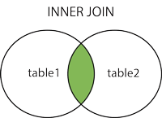

# MySQL 连接的使用

在前几章节中，我们已经学会了如何在一张表中读取数据，这是相对简单的，但是在真正的应用中经常需要从多个数据表中读取数据。

本章节我们将向大家介绍如何使用 MySQL 的 JOIN 在两个或多个表中查询数据。

你可以在 SELECT, UPDATE 和 DELETE 语句中使用 Mysql 的 JOIN 来联合多表查询。

JOIN 按照功能大致分为如下三类：

- INNER JOIN（内连接,或等值连接）：获取两个表中字段匹配关系的记录。
- LEFT JOIN（左连接）：获取左表所有记录，即使右表没有对应匹配的记录。
- RIGHT JOIN（右连接）： 与 LEFT JOIN 相反，用于获取右表所有记录，即使左表没有对应匹配的记录。
本章节使用的数据库结构及数据下载：[runoob-mysql-join-test.sql](http://static.runoob.com/download/runoob-mysql-join-test.sql)。

## 在命令提示符中使用 INNER JOIN

我们在RUNOOB数据库中有两张表 tcount_tbl 和 runoob_tbl。两张数据表数据如下：

### 实例

尝试以下实例：

- 测试实例数据

```text
mysql> use RUNOOB;
Database changed
mysql> SELECT * FROM tcount_tbl;
+---------------+--------------+
| runoob_author | runoob_count |
+---------------+--------------+
| 菜鸟教程  | 10           |
| RUNOOB.COM    | 20           |
| Google        | 22           |
+---------------+--------------+
3 rows in set (0.01 sec)
 
mysql> SELECT * from runoob_tbl;
+-----------+---------------+---------------+-----------------+
| runoob_id | runoob_title  | runoob_author | submission_date |
+-----------+---------------+---------------+-----------------+
| 1         | 学习 PHP    | 菜鸟教程  | 2017-04-12      |
| 2         | 学习 MySQL  | 菜鸟教程  | 2017-04-12      |
| 3         | 学习 Java   | RUNOOB.COM    | 2015-05-01      |
| 4         | 学习 Python | RUNOOB.COM    | 2016-03-06      |
| 5         | 学习 C      | FK            | 2017-04-05      |
+-----------+---------------+---------------+-----------------+
5 rows in set (0.01 sec)
```

接下来我们就使用MySQL的INNER JOIN(也可以省略 INNER 使用 JOIN，效果一样)来连接以上两张表来读取runoob_tbl表中所有runoob_author字段在tcount_tbl表对应的runoob_count字段值：

- INNER JOIN

```text
mysql> SELECT a.runoob_id, a.runoob_author, b.runoob_count FROM runoob_tbl a INNER JOIN tcount_tbl b ON a.runoob_author = b.runoob_author;
+-------------+-----------------+----------------+
| a.runoob_id | a.runoob_author | b.runoob_count |
+-------------+-----------------+----------------+
| 1           | 菜鸟教程    | 10             |
| 2           | 菜鸟教程    | 10             |
| 3           | RUNOOB.COM      | 20             |
| 4           | RUNOOB.COM      | 20             |
+-------------+-----------------+----------------+
4 rows in set (0.00 sec)
```

以上 SQL 语句等价于：

- WHERE 子句

```text
mysql> SELECT a.runoob_id, a.runoob_author, b.runoob_count FROM runoob_tbl a, tcount_tbl b WHERE a.runoob_author = b.runoob_author;
+-------------+-----------------+----------------+
| a.runoob_id | a.runoob_author | b.runoob_count |
+-------------+-----------------+----------------+
| 1           | 菜鸟教程    | 10             |
| 2           | 菜鸟教程    | 10             |
| 3           | RUNOOB.COM      | 20             |
| 4           | RUNOOB.COM      | 20             |
+-------------+-----------------+----------------+
4 rows in set (0.01 sec)
```



## MySQL LEFT JOIN

MySQL left join 与 join 有所不同。 MySQL LEFT JOIN 会读取左边数据表的全部数据，即便右边表无对应数据。

### 实例

尝试以下实例，以 runoob_tbl 为左表，tcount_tbl 为右表，理解 MySQL LEFT JOIN 的应用：

- LEFT JOIN

```text
mysql> SELECT a.runoob_id, a.runoob_author, b.runoob_count FROM runoob_tbl a LEFT JOIN tcount_tbl b ON a.runoob_author = b.runoob_author;
+-------------+-----------------+----------------+
| a.runoob_id | a.runoob_author | b.runoob_count |
+-------------+-----------------+----------------+
| 1           | 菜鸟教程    | 10             |
| 2           | 菜鸟教程    | 10             |
| 3           | RUNOOB.COM      | 20             |
| 4           | RUNOOB.COM      | 20             |
| 5           | FK              | NULL           |
+-------------+-----------------+----------------+
5 rows in set (0.01 sec)
```

以上实例中使用了 LEFT JOIN，该语句会读取左边的数据表 runoob_tbl 的所有选取的字段数据，即便在右侧表 tcount_tbl中 没有对应的 runoob_author 字段值。


## MySQL RIGHT JOIN

MySQL RIGHT JOIN 会读取右边数据表的全部数据，即便左边边表无对应数据。

### 实例

尝试以下实例，以 runoob_tbl 为左表，tcount_tbl 为右表，理解MySQL RIGHT JOIN的应用：

- RIGHT JOIN

```text
mysql> SELECT a.runoob_id, a.runoob_author, b.runoob_count FROM runoob_tbl a RIGHT JOIN tcount_tbl b ON a.runoob_author = b.runoob_author;
+-------------+-----------------+----------------+
| a.runoob_id | a.runoob_author | b.runoob_count |
+-------------+-----------------+----------------+
| 1           | 菜鸟教程    | 10             |
| 2           | 菜鸟教程    | 10             |
| 3           | RUNOOB.COM      | 20             |
| 4           | RUNOOB.COM      | 20             |
| NULL        | NULL            | 22             |
+-------------+-----------------+----------------+
5 rows in set (0.01 sec)
以上实例中使用了 RIGHT JOIN，该语句会读取右边的数据表 tcount_tbl 的所有选取的字段数据，即便在左侧表 runoob_tbl 中没有对应的runoob_author 字段值。
```


**本文转载自 菜鸟教程，<a href="http://www.runoob.com/mysql/mysql-join.html" rel="nofollow">《MySQL 连接的使用》</a>**