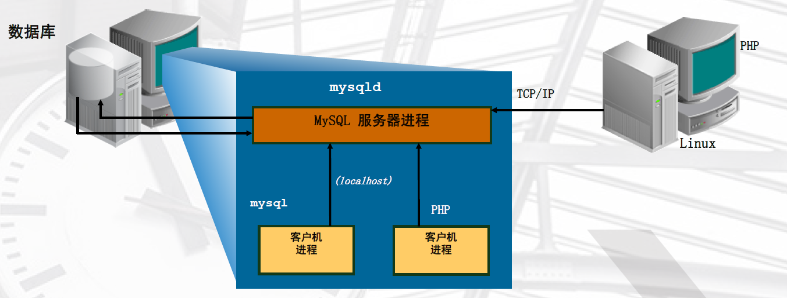
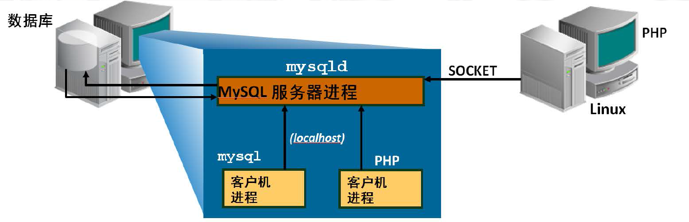
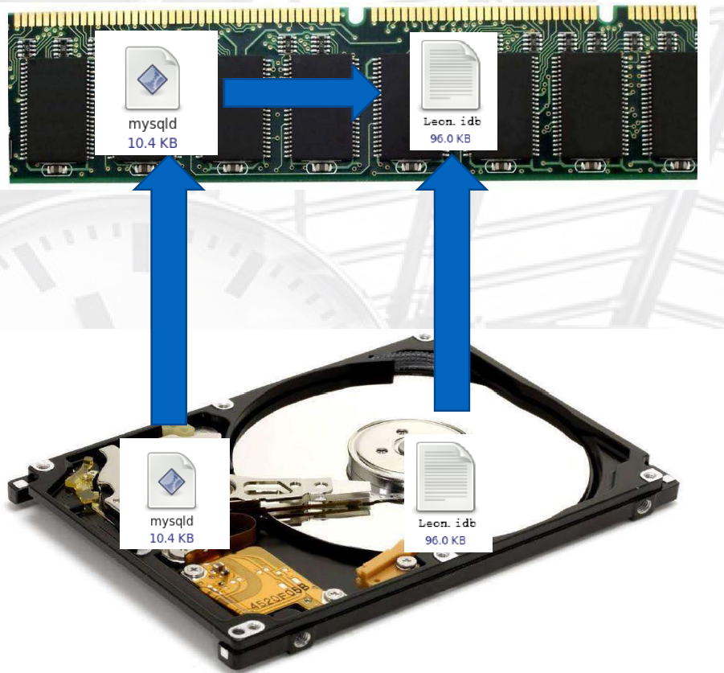
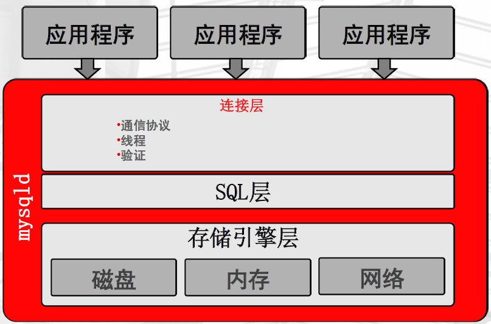

# MySQL体系结构

## 第1章 MySQL服务器构成

### 1.1 客户端与服务器端模型

MySQL是一个典型的C/S模式，单进程多线程的服务结构。MySQL自带的客户端程序在/usr/local/mysql/bin下，如：mysql、 mysqladmin、mysqldump等；服务端程序是mysqld（即守护进程，二进制的程序）


### 1.2 应用程序连接MySQL的方式

#### 1.2.1 TCP/IP方式

- 通过网络连接串：

```text
[root@db02 ~]# mysql -uroot -p12345678 -h 127.0.0.1
```



#### 1.2.2 Socket方式

- 通过套接字文件：

```text
[root@db02 ~]# mysql -uroot -p12345678 -S /usr/local/mysql/tmp/mysql.sock
```



> 提示：服务器默认使用Socket方式连接数据库。

### 1.3 实例介绍

#### 1.3.1 什么是实例

MySQL在启动过程中会启动后台守护进程，并生成工作线程，预分配内存结构供MySQL处理数据使用，这些MySQL的后台进程+线程+预分配的内存结构就是实例。



## 第2章 MySQL的逻辑结构

### 2.1 mysqld服务器程序构成

msyqld服务程序分为三层，分别为连接层、SQL层、存储引擎层：


#### 2.1.1 连接层

所包含的服务并不是MySQL所独有的技术。它们都是服务于C/S程序或者是这些程序所需要的 ：连接处理，身份验证，安全性等等：



#### 2.1.2 SQL层

这是MySQL的核心部分，通常叫做 SQL Layer。在 MySQL据库系统处理底层数据之前的所有工作都是在这一层完成的，包括权限判断，sql解析，行计划优化，query cache的处理以及所有内置的函数(如日期、时间、数学运算、加密)等等。各个存储引擎提供的功能都集中在这一层，如存储过程，触发器，视图等：


- SQL处理流程图：


#### 2.1.3 存储引擎层

通常叫做StorEngine Layer，也就是底层数据存取操作实现部分，由多种存储引擎共同组成。它们负责存储和获取所有存储在MySQL中的数据。就像Linux众多的文件系统一样。每个存储引擎都有自己的优点和缺陷。服务器是通过存储引擎API来与它们交互的。这个接口隐藏了各个存储引擎不同的地方，对于查询层尽可能的透明。这个API包含了很多底层的操作，如开始一个事务，或者取出有特定主键的行。存储引擎不能解析SQL，互相之间也不能通信，仅仅是简单的响应服务器 的请求：


### 2.2 SQL的整个处理过程


#### 2.2.1 Connectors

指的是不同语言中与SQL的交互。

#### 2.2.2 Management Serveices & Utilities：

系统管理和控制工具。

#### 2.2.3 Connection Pool: 连接池

管理缓冲用户连接，线程处理等需要缓存的需求。负责监听对 MySQL Server 的各种请求，接收连接请求，转发所有连接请求到线程管理模块。每一个连接上 MySQL Server 的客户端请求都会被分配（或创建）一个连接线程为其单独服务。而连接线程的主要工作就是负责 MySQL Server 与客户端的通信，接受客户端的命令请求，传递 Server 端的结果信息等。线程管理模块则负责管理维护这些连接线程。包括线程的创建，线程的 cache 等。

#### 2.2.4 SQL Interface: SQL接口

接受用户的SQL命令，并且返回用户需要查询的结果。比如select from就是调用SQL Interface。

#### 2.2.5 Parser: 解析器

SQL命令传递到解析器的时候会被解析器验证和解析。解析器是由Lex和YACC实现的，是一个很长的脚本。

在 MySQL中我们习惯将所有 Client 端发送给 Server 端的命令都称为 query ，在 MySQL Server 里面，连接线程接收到客户端的一个 Query 后，会直接将该 query 传递给专门负责将各种 Query 进行分类然后转发给各个对应的处理模块。

- 主要功能：

将SQL语句进行语义和语法的分析，分解成数据结构，然后按照不同的操作类型进行分类，然后做出针对性的转发到后续步骤，以后SQL语句的传递和处理就是基于这个结构的。
如果在分解构成中遇到错误，那么就说明这个sql语句是不合理的

#### 2.2.6 Optimizer: 查询优化器

SQL语句在查询之前会使用查询优化器对查询进行优化。就是优化客户端请求的 query（sql语句） ，根据客户端请求的 query 语句，和数据库中的一些统计信息，在一系列算法的基础上进行分析，得出一个最优的策略，告诉后面的程序如何取得这个 query 语句的结果，他使用的是“选取-投影-联接”策略进行查询，用一个例子就可以理解：

```sql
select uid,name from user where gender = 1;
```

- 解析方式：

这个select 查询先根据where 语句进行选取，而不是先将表全部查询出来以后再进行gender过滤
这个select查询先根据uid和name进行属性投影，而不是将属性全部取出以后再进行过滤
将这两个查询条件联接起来生成最终查询结果

#### 2.2.7 Cache和Buffer：查询缓存

他的主要功能是将客户端提交 给MySQL 的Select类query请求的返回结果集cache到内存中，与该query的一个hash值做一个对应。该Query所取数据的基表发生任何数据的变化之后，MySQL会自动使该query的Cache失效。在读写比例非常高的应用系统中，Query Cache对性能的提高是非常显著的。当然它对内存的消耗也是非常大的。

如果查询缓存有命中的查询结果，查询语句就可以直接去查询缓存中取数据。这个缓存机制是由一系列小缓存组成的：比如表缓存、记录缓存、key缓存、权限缓存等

#### 2.2.8 存储引擎接口

存储引擎接口模块可以说是MySQL数据库中最有特色的一点了。目前各种数据库产品中，基本上只有MySQL可以实现其底层数据存储引擎的插件式管理。这个模块实际上只是一个抽象类，但正是因为它成功地将各种数据处理高度抽象化，才成就了今天MySQL可插拔存储引擎的特色。

从图上还可以看出，MySQL区别于其他数据库的最重要的特点就是其插件式的表存储引擎。MySQL插件式的存储引擎架构提供了一系列标准的管理和服务支持，这些标准与存储引擎本身无关，可能是每个数据库系统本身都必需的，如SQL分析器和优化器等，而存储引擎是底层物理结构的实现，每个存储引擎开发者都可以按照自己的意愿来进行开发。

注意：存储引擎是基于表的，而不是数据库。

### 2.3 存储引擎概览

存储引擎是充当不同表类型的处理程序的服务器组件。依赖于存储引擎的功能

#### 2.3.1 存储引擎用于

- 存储数据
- 检索数据
- 通过索引查找数据

#### 2.3.2 双层处理

- 上层包括SQL解析器和优化器
- 下层包含一组存储引擎

#### 2.3.3 SQL层不依赖于存储引擎

- 引擎不影响SQL处理
- 有一些例外

#### 2.3.4 依赖于存储引擎的功能

- 存储介质
- 事务功能
- 锁定
- 备份和恢复
- 优化
- 特殊功能：如全文搜索、引用完整性、空间数据处理等

## 第3章 MySQL“库”的构成


### 3.1 数据库的逻辑结构

#### 3.1.1 库

```sql
show databases
use mysql
```

#### 3.1.2 表

```sql
show tables;
```

#### 3.1.3 记录（行、列）

```sql
select user,host,password from user;
desc user
```

### 3.2 数据库的物理结构

对象存储中的库相当于目录。表分为MyIASM和InnoDB方式：

- MyIASM方式：

```text
[root@db02 ~]# ll -h /usr/local/mysql/data/mysql/user*
-rw-rw---- 1 mysql mysql  11K Nov 13 11:54 /usr/local/mysql/data/mysql/user.frm     # 存放索引
-rw-rw---- 1 mysql mysql  488 Nov 13 12:33 /usr/local/mysql/data/mysql/user.MYD     # 存放列结构
-rw-rw---- 1 mysql mysql 2.0K Nov 13 12:33 /usr/local/mysql/data/mysql/user.MYI     # 存放行结构
```

InnoDB方式：

共享表空间：ibdata1:ibdata2

独立表空间：t1.frm t1.ibd

- 创建一个数据库和表，查看一下独立表空间存储的不同

```text
mysql> create database leon;
Query OK, 1 row affected (0.00 sec)

mysql> use leon;
Database changed
mysql> create table t1 (id int);
Query OK, 0 rows affected (0.63 sec)

mysql> insert into t1 values(1);
Query OK, 1 row affected (0.01 sec)

mysql> select id from t1;
+------+
| id   |
+------+
|    1 |
+------+

1 row in set (0.00 sec)

mysql> desc t1;
+-------+---------+------+-----+---------+-------+
| Field | Type    | Null | Key | Default | Extra |
+-------+---------+------+-----+---------+-------+
| id    | int(11) | YES  |     | NULL    |       |
+-------+---------+------+-----+---------+-------+

1 row in set (0.00 sec)

[root@db02 leon]# ll -h t1*
-rw-rw---- 1 mysql mysql 8.4K Nov 14 10:21 t1.frm       # 存储表结构定义
-rw-rw---- 1 mysql mysql  96K Nov 14 10:21 t1.ibd       # 存储行、列结构
```

### 3.3 MySQL使用磁盘方式


程序文件随数据目录一起存储在服务器安装目录下。执行各种客户机程序、管理程序和实用程序时将创建程序可执行文件和日志文件。首要使用磁盘空间的是数据目录。

- 服务器日志文件和状态文件：包含有关服务器处理的语句的信息。日志可用于进行故障排除、监视、复制和恢复。
- InnoDB 日志文件：（适用于所有数据库）驻留在数据目录级别。
- nnoDB 系统表空间：包含数据字典、撤消日志和缓冲区。
每个数据库在数据目录下均具有单一目录（无论在数据库中创建何种类型的表）。数据库目录存储以下内容：

- 数据文件：特定于存储引擎的数据文件。这些文件也可能包含元数据或索引信息，具体取决于所使用的存储引擎。
- 格式文件 (.frm)：包含每个表和/或视图结构的说明，位于相应的数据库目录中。
- 触发器：某个表关联并在该表发生特定事件时激活的命名数据库对象。
数据目录的位置取决于配置、操作系统、安装包和分发。典型位置是 /var/lib/mysql。MySQL在磁盘上存储系统数据库 (mysql)。mysql 包含诸如用户、特权、插件、帮助列表、事件、时区实现和存储例程之类的信息。

**本文转载自 leon 的博客，<a href="https://blog.leonshadow.com/763482/527.html" rel="nofollow">《MySQL体系结构》</a>**