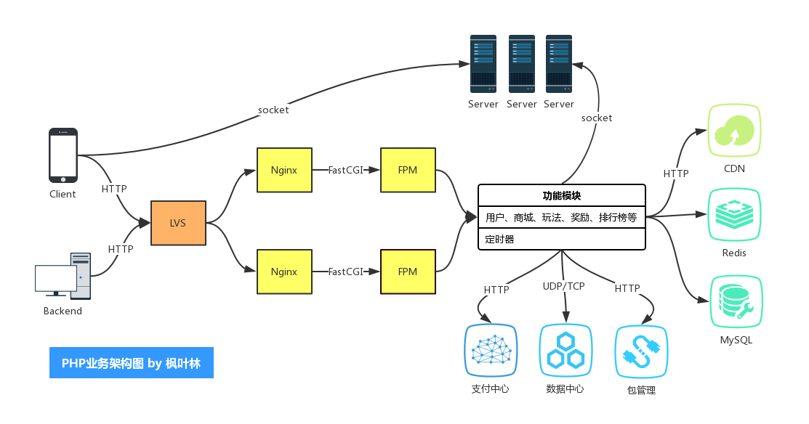
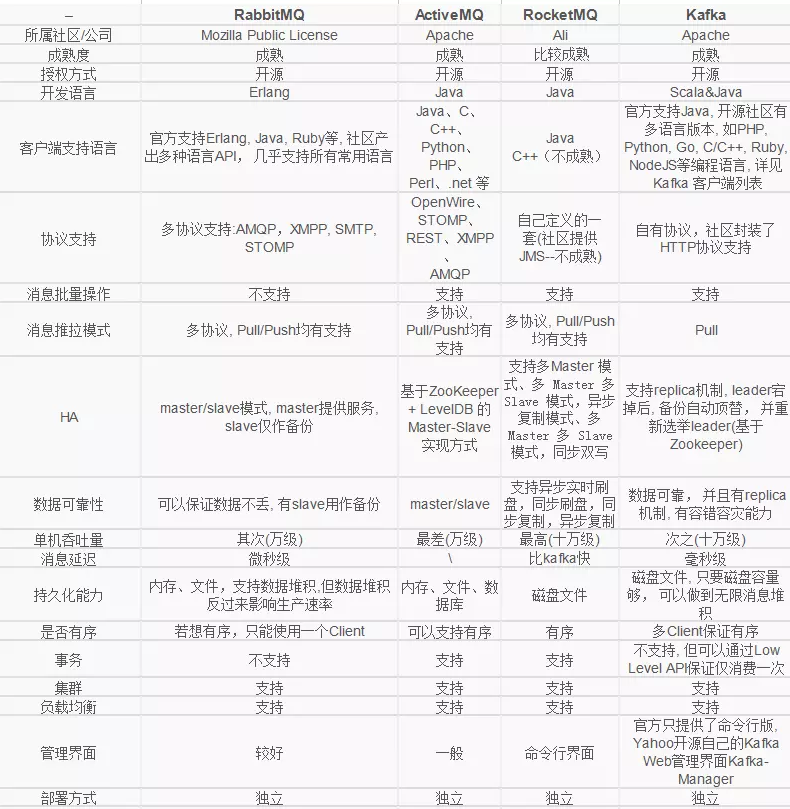

# 问题与简答

## 架构篇

### OAuth 2.0

#### 开放授权

开放授权(OAuth)是一个开放标准，允许用户让第三方应用访问该用户在某一网站上存储的私密的资源(如照片，视频，联系人列表)，而无需将用户名和密码提供给第三方应用

#### OAuth 2.0

OAuth 2.0 是 OAuth 协议的下一版本，但不向下兼容 OAuth 1.0。OAuth 2.0 关注客户端开发者的简易性，同时为 Web 应用、桌面应用、手机和智能设备提供专门的认证流程

### 单点登录

单点登录(Single sign-on，SSO)，一种对于许多相互关连，但是又是各自独立的软件系统，提供访问控制的属性。当拥有这项属性时，当用户登录时，就可以获取所有系统的访问权限，不用对每个单一系统都逐一登录。这项功能通常是以轻型目录访问协议(LDAP)来实现，在服务器上会将用户信息存储到 LDAP 数据库中。相同的，单一退出(single sign-off)就是指，只需要单一的退出动作，就可以结束对于多个系统的访问权限

#### 优点

- 降低访问第三方网站的风险(不存储用户密码，或在外部管理)
- 减少因不同的用户名和密码组合而带来的密码疲劳
- 减少为相同的身份重新输入密码所花费的时间
- 因减少与密码相关的调用IT服务台的次数而降低IT成本

### REST

一种软件架构风格、设计风格，而不是标准，只是提供了一组设计原则和约束条件。它主要用于客户端和服务器交互类的软件。基于这个风格设计的软件可以更简洁，更有层次，更易于实现缓存等机制

#### REST 优点

- 可更高效利用缓存来提高响应速度
- 通讯本身的无状态性可以让不同的服务器的处理一系列请求中的不同请求，提高服务器的扩展性
- 浏览器即可作为客户端，简化软件需求
- 相对于其他叠加在 HTTP 协议之上的机制，REST 的软件依赖性更小
- 不需要额外的资源发现机制
- 在软件技术演进中的长期的兼容性更好

### API 版本兼容

#### 版本控制

API 服务可以提供多个 API 接口，可以在 API 接口级层增加版本控制策略

#### 兼容性

将服务更新到新的版本时客户端不受影响

- 向 API 服务定义添加 API 接口
- 向 API 接口添加方法
- 向请求消息添加字段
- 向响应消息添加字段
- 向枚举添加值

- 移除或重命名服务、字段、方法或枚举值
- 更改字段的类型

### JWT

JSON Web Token 是一种跨域认证解决方案

### 画出 PHP 业务架构图



### LVS

#### LVS 介绍

Linux 虚拟服务器(Linux Virtual Server，LVS)是一个虚拟的服务器集群系统，用于实现负载均衡

LVS集群采用 IP 负载均衡技术和基于内容请求分发技术。调度器具有很好的吞吐率，将请求均衡地转移到不同的服务器上执行，且调度器自动屏蔽掉服 务器的故障，从而将一组服务器构成一个高性能的、高可用的虚拟服务器。整个服务器集群的结构对客户是透明的，而且无需修改客户端和服务器端的程序

#### LVS 体系结构


- 负载调度器（load balancer），它是整个集群对外面的前端机，负责将客户的请求发送到一组服务器上执行，而客户认为服务是来自一个IP地址（我们可称之为虚拟IP地址）上的
- 服务器池（server pool），是一组真正执行客户请求的服务器，执行的服务有WEB、MAIL、FTP和DNS等
- 共享存储（shared storage），它为服务器池提供一个共享的存储区，这样很容易使得服务器池拥有相同的内容，提供相同的服务


### Ngnix

Nginx 是异步架构的 Web 服务器，也可以用作反向代理、负载均衡器和 HTTP 缓存

#### Nginx 特点

- 更快：单次请求响应更快，高并发可以更快的处理响应
- 高拓展性：设计极具扩展性，由多个不同功能、不同层次、不同类型且耦合度极低的模块组成
- 高可靠性：很多高流量网站都在核心服务器上大规模使用 Nginx
- 低内存消耗：一般1万个非活跃的 HTTP Keep-Alive 连接在 Nginx 中仅消耗2.5MB内存
- 高并发：单机支持10万以上的并发连接
- 热部署：master 管理进程与 worker工作进程的分离设计，使得 Nginx 能够支持热部署
- 开源协议：使用 BSD 许可协议，免费使用，且可修改源码

#### 对比 Apache

Apache 有许多优点，如稳定、开源、跨平台，但它出现的时间太长了，在它兴起的年代，互联网的产业规模远远比不上现在，所以它被设计成了一个重量级、不支持高并发的 Web 服务器。在 Apache 服务器上，如果有数以万计的并发 HTTP 请求同时访问，就会导致服务器上消耗大量内存，操作系统内核对成百上千的 Apache 进程做进程间切换也会消耗大量 CPU 资源，并导致 HTTP 请求的平均响应速度降低，这些都决定了 Apache 进程不可能成为高性能 Web 服务器，这也促使了 Lighttpd 和 Nginx 的出现

#### Nginx 配置

- 基本配置

|配置项|默认|用途|
|-|-|-|
|daemon on\|off;|on|是否以守护进程方式运行 Nginx|
|master_process on\|off;|on|是否以 master/worker 方式工作|
|error_log /path/file level;|logs/error.log error;|error 日志的设置|
|include /path/file;||嵌入其他配置文件|
|pid path/file|logs/nginx.pid|pid 文件的路径|
|user username [groupname];|nobody nobody|Nginx worker 进程运行的用户及用户组|
|worker_processes number;|4|Nginx worker 进程个数|
|worker_connections number;||每个 worker 的最大连接数|
|worker_cpu_affinity cpumask [cpumask...]|1000 0100 0010 0001;|绑定 Nginx worker 进程到指定的 CPU 内核|
|accept_mutex on\|off;|on|是否打开 accept 锁|
|accept_mutex_delay Nms;|500ms|再次获取锁延迟时间|

- Web 服务器配置

配置块：http 块、server 块、location 块、upstream 块

|配置项|默认|用途|配置块|
|-|-|-|-|
|listen 80;||监听端口|server|
|server_name name;|""|主机名称|server|
|root path;|html|以 root 方式设置资源路径|http、server、location|
|index file ...;|index index.html|访问首页|http、server、location|
|error_page 404 /404.html||根据 HTTP 返回码重定向页面|http、server、location|
|try_files path1 [path2] uri;||try_files|server、location|
|location [=\|~\|~*\|^~\|@]/uri/{...}|location|server|

> location 参数说明：`=`表示完全匹配、`~`表示字母大小写敏感、`~*`表示忽略字母大小写、`^~`表示只需匹配前半部分、`@`表示 Nginx 服务内部之间重定向；参数支持正则表达式

```nginx
location ~* \.(gif|jpg|jepg)$ {
    # 匹配以 .gif、.jpg、.jpeg 结尾的请求
}
```

- 网络连接配置

|配置项|默认|用途|配置块|
|-|-|-|-|
|client_header_timeout time;|60|读取 HTTP 头部的超时时间|http、server、location|
|client_body_timeout time;|60|读取 HTTP 包体的超时时间|http、server、location|
|send_timeout time;|60|发送响应的超时时间|http、server、location|
|lingering_close off\|on\|always;|on|该配置控制 Nginx 关闭用户连接的方式|http、server、location|
|lingering_time time;|30s|lingering_time|http、server、location|

- 客户端请求配置

|配置项|默认|用途|配置块|
|-|-|-|-|
|limit_except method ...{...}||按 HTTP 方法名限制用户请求|location|
|client_max_body_size size;|1m|HTTP 请求包体的最大值|http、server、location|
|limit_rate speed;|0|对请求的限速|http、server、location|
|limit_rate_after time;|1m|发送响应长度超过1m后限速|http、server、location|

#### 反向代理

反向代理(reverse proxy)方式是指代理服务器来接受 Internet 上的连接请求，然后将请求转发给内部网络中的上游服务器，并将从上游服务器上得到的结果返回给 Internet 上请求连接的客户端，此时代理服务器对外的表现就是一个 Web 服务器

> 反向代理服务器必须能够处理大量并发请求

- Nginx 反向代理


当客户端发来 HTTP 请求时，Nginx 并不会立即转发到上游服务器，而是先把用户的请求(包括 HTTP 包体)完整地接受到 Nginx 所在服务器的硬盘或者内存中，然后再向上游服务器发起连接，把缓存的客户端请求转发到上游服务器

缺点是延长了请求的处理时间，并增加了用于缓存请求内容的内存和磁盘空间。优点则是降低了上游服务器的负载，尽量把压力放在了 Nginx 服务器上

- 反向代理配置

```nginx
upstream backend {
    ip_hash; #保持相同 IP 用户落点一致
    server backend1.example.com;
    server backend2.example.com;
    server backend3.example.com down; #机器暂时不可用
}
```

```nginx
server {
    location / {
        proxy_pass http://backend;
    }
}
```

### 服务化

### 微服务

### 服务注册发现

### 数据库读写分离

为了确保数据库产品的稳定性，很多数据库拥有双机热备功能。也就是，第一台数据库服务器，是对外提供增删改业务的生产服务器；第二台数据库服务器，主要进行读的操作

主数据库(master)处理事务性增、改、删操作(INSERT、UPDATE、DELETE)，从数据库(slave)处理 SELECT 查询操作

### 数据库拆分

数据库拆分有两种方式，一个是`垂直拆分`，一个是`水平拆分`。垂直拆分就是把一个数据库中不同业务单元的数据分到不同的数据库里面，水平拆分根据一定的规则把同一业务单元的数据拆分到多个数据库中

#### 垂直拆分影响

- 单机的 ACID 保证被打破了
- 一些 Join 操作会变得比较困难
- 靠外键去进行约束的场景会受影响

#### 水平拆分影响

- 单机的 ACID 保证被打破了
- 一些 Join 操作会变得比较困难
- 靠外键去进行约束的场景会受影响
- 依赖单库的自增序列生成唯一 ID 受影响
- 针对单个逻辑意义上的表的查询要跨库了

### 分布式事务

分布式事务是指事务的参与者、支持事务的服务器、资源服务器以及事务管理器分别位于分布式的不同节点上

### ID 生成器

### 一致性哈希

一致性哈希把节点对应的哈希值变成了一个范围，而不再是离散的。在一致性哈希中，把整个哈希值的范围定义得非常大，然后把这个范围分配给现有的节点

#### 示例

假设哈希值范围是从0到100，四个节点为：[0,25)、[25,50)、[50,75)、[75,100]

> 第二个节点退出，节点变为：[0,25)、[25,75)、[75,100]，只需要把第二节点接管过来即可，其他节点数据未受影响

> 在第二和第三节点之间增加节点，节点变为：[0,25)、[25,50)、[50,63)、[63,75)、[75,100]，第三节点部分数据未收影响，另一部分数据给新增节点管理，其他节点数据未受影响


### Redis 集群

Redis 集群是 Redis 提供的分布式数据库方案，集群通过分片(sharding)来进行数据库共享，并提供复制和故障转移功能

Redis 集群中的节点分为主节点(master)和从节点(slave)，其中主节点用于处理槽，而从节点则用于复制某个主节点，并在被复制的主节点下线时，代替下线主节点继续处理命令请求

Redis 集群为了保证一致性而牺牲了一部分容错性。系统在保证对网络短线和节点失效具有有限抵抗力的前提下，尽可能地保持数据的一致性

#### 故障检测

集群中的每个节点都会定期地向集群中的其他节点发送 PING 消息，以此来检测对方是否在线，如果接收 PING 消息的节点没有在规定的消息内，向发送 PING 消息的节点返回 PONG 消息，那么发送 PING 消息的节点就会将接收 PING 消息的节点标记为疑似下线(probable fail, PFAIL)

如果一个集群里面，半数以上负责处理槽的主节点将某个主节点 x 报告为疑似下线，那么这个主节点 x 将被标记为已下线(FAIL)，将主节点 x 标记为已下线的节点会向集群广播一条关于主节点 x 的 FAIL 消息，所有收到这条 FAIL 消息的节点都会立即将主节点 x 标记为已下线

#### 故障转移

- 复制下线主节点的所有从节点里面，会有一个从节点被选中
- 被选中的从节点会执行 SLAVEOF on one 命令，成为新的主节点
- 新的主节点会撤销所有对已下线主节点的槽指派，并将这些槽全部指派给自己
- 新的主节点向集群广播一条 PONG 消息，这条 PONG 消息可以让集群中的其他节点立即知道这个节点已经由从节点变成了主节点
- 新的主节点开始接收和自己负责处理的槽有关的命令请求，故障转移完成

#### 选举新的主节点

新的主节点是通过选举产生的，基于 Raft 算法的领头选举(leader election)方法实现

- 集群里每个负责处理槽的主节点都有一次投票的机会，而第一个向主节点要求投票的从节点将获得主节点的投票
- 当从节点发现自己正在复制的主节点进入已下线状态，从节点会向集群广播一条消息，要求所有收到消息具有投票权的主节点向这个从节点投票
- 具有投票权的主节点尚未投票给其他节点，那么主节点将回应消息，表示主节点支持从节点成为新的主节点
- 每个参与选举的从节点收到消息，统计自己获得多少主节点的支持
- 如果集群有 N 个具有投票权的主节点，那么当一个从节点收集到大于等于`N/2 + 1`张支持票，这个从节点就会选为新的主节点
- 如果从节点没有收集到足够多的支持票，那么集群将再次进行选举，直到选出新的主节点为止

### 消息队列

消息队列(Message queue)是一种进程间通信或同一进程的不同线程间的通信方式。消息的发送者和接受者不需要同时与消息队列交互。消息会保存在队列中，直到接收者取回它

### Kafka

Kafka 是一个开源的流处理平台，目标是为处理实时数据提供一个统一、高吞吐、低延迟的平台

#### Kafka 特点

- 可靠性： Kafka 是分布式的、可分区的、数据可备份的、高度容错的
- 可扩展性： 在无需停机的情况下实现轻松扩展
- 消息持久性： Kafka 支持将消息持久化到本地磁盘
- 性能：Kafka 的消息发布订阅具有很高的吞吐量，即便存储了 TB 级的消息，它依然能保持稳定的性能

### 消息中间件对比



### ZooKeeper

Zookeeper 是一个为分布式应用提供一致性服务的开源软件，提供功能包括：分布式配置服务、同步服务和命令注册

### 穿透、雪崩

### 限流(木桶、令牌桶)

### 服务降级

### 语言对比

PHP VS Java
PHP VS Python
PHP VS Golang