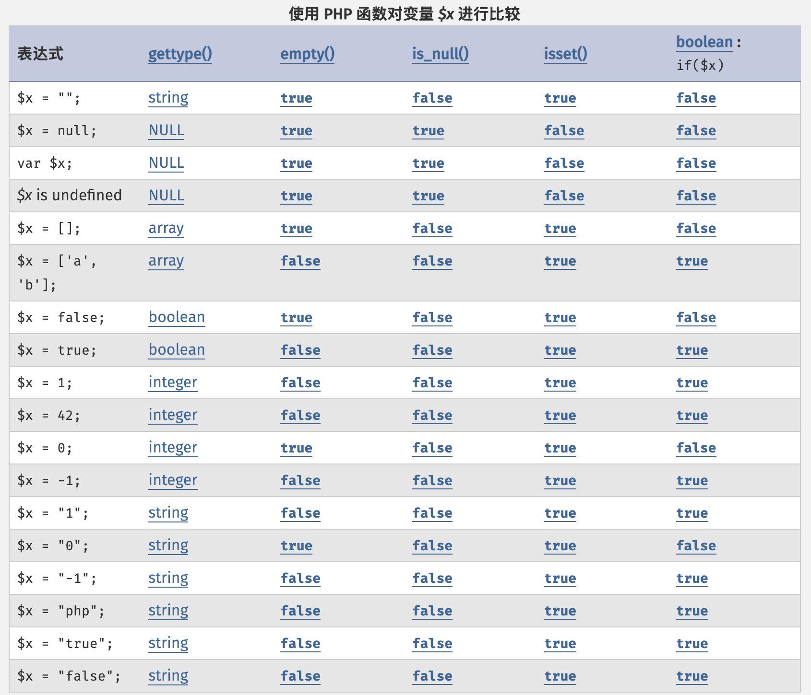
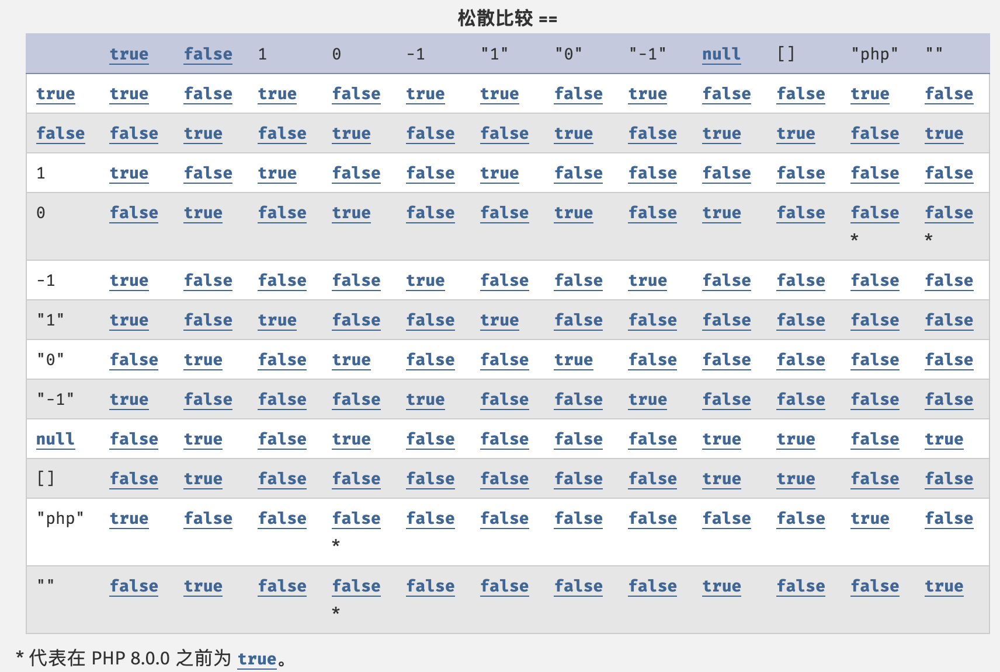
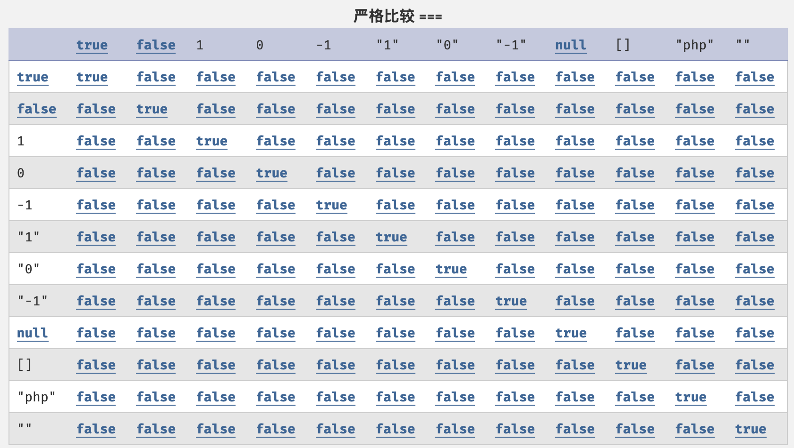

# isset和empty的区别之如何判空

本文从 isset 和 empty 的区别，引出常见的类型如何判空方式，帮你梳理清楚开发中常见的判空误区。全文共计 1724 字，阅读时间约 8 分钟，作者：凌枫。如果文章对你有帮助，请关注和转发，谢谢！

## 一、isset 和 empty 的区别

### 1、是否声明 vs 是否设置

我们先来看一下在 PHP 语境下，变量的是否声明与是否设置的区别。变量是声明在指的是变量是否创建，是否在当前作用域内诞生，当你尝试使用一个未被声明的变量时，PHP 会抛出一个 E\_NOTICE 级别的错误（如：undefined variable）。变量是否设置指的是变量已经声明好了并且值不为 null，首先满足变量已创建，而且在当前作用域诞生，值有两种情况，非 null 和 null。

```php
// 是否存在：key1 存在
// 是否存在：key3 不存在
// 是否设置：key1 已设置
// 是否设置：key2 未设置
$arr = ['key1' => '凌枫', 'key2' => null];
```

### 2、isset 与 empty 的区别

isset 是用于检测变量是否已声明php并且其值不为 null。isset 可以一次传入多个参数，只有在全部参数都已被设置时返回 true，计算过程为从左往右，中途遇到未设置的变量就会即可停止。

empty 是用于检查变量是否为空，如果变量不存在或者其值等于 false ，则认为变量为空。empty 不会在变量不存在时产生告警。

```php
$a; // isset($a)返回false empty($a)返回true
$b = ''; // true true
$b1 = '凌枫'; // true false
$c = null; // false true
$d = 0; // true true
$d1 = 1; // true false
$e = new stdClass(); // true true
$f = []; // true true
$f1 = ['凌枫']; // true false
```

## 二、PHP 的判空机制

### 1、松散的类型系统

造成编程中判空操作异常复杂都源于 PHP 的松散类型系统。这里我们暂不讨论松散的类型系统的优缺点。PHP 是一种弱类型编程语言，这意味着变量在声明时不需要预定义数据类型，并且可以在运行中根据上下文自动转换类型。我们可以看到这样的写法，前一刻变量还是整型类型，后一刻还是这个变量就变成字符类型。在某些情况下空数组、空字符串和 null 值似乎可以互通。而这些看似奇怪的特性，都源自 PHP 自身的松散的类型系统，进而导致增加了判空操作的复杂性。

### 2、动态变量解析机制

在判空操作中清楚的知道要检查的变量。动态变量解析机制是另一个体现 PHP 灵活的动态特性，同样也增加了代码的复杂性。在判空操作中，必须清楚的知道要检查的是哪个变量，以及变量名如何动态确定。当 PHP 解析器遇到 \$$name 时，执行操作顺序：首先获取 $name 的值，再将该值视为变量名去查找对应变量 $username，最终返回这个变量的值。

```php
$name = 'username';
$username = '凌枫';
echo $$name; // 输出: 凌枫
echo $username; // 二者等价
$nums = [1, 2, 3];
echo "$number[1]"; // 输出：2
echo "{$number[1]}"; // 输出：2
```

### 3、类型转换规则

理解 PHP 的类型转换规则是掌握判空的基础。在 PHP 中，主要有两种类型转换方式：自动类型转换和强制类型转换。自动类型转换由 PHP 引擎在运行时根据上下文自动完成，即不同类型的值一起运算时，PHP 会自动将它们转换为统一的类型。强制类型转换指允许开发者显式的控制转换过程，包括类型转换语法、类型转换函数、settype 函数三种方式。

```php
// 自动转换
$number = 1 + "0"; // 输出：1，字符串“0”转为整数0
$number1 = 1 + "0abc"; // 输出：1，提取数字部分“0”
$number2 = 1 + "abc0"; // 输出：1，字符串开头无数字转为0
// 强制转换
$str = "0abc";
$number = (int)$str; // 输出：0
$number1 = floatval($str); // 输出：0
$number2 = settype($str, 'int'); // $str 现在是整数0
```

## 三、更多判空方式

### 1、空有哪些形式

这里我们先来看一下空有哪些形式。通过前面介绍，已经知道变量会经历以下过程：变量声明、变量赋值、变量使用；在变量声明时候可以知道变量类型，虽然在后续过程中变量类型并不是固定的；在变量使用中，又会发生变量动态解析和变量类型转换。

所以，空会包括变量未声明和变量已声明；而已变量已声明又包括这些空：null、空字符、整型0、布尔  false、空数组、空对象。

### 2、易错判空

未声明、null、空字符、空白字符、整型0、布尔 false、空数组、空对象都会被认为满足 empty 条件。

使用松散比较（==）替代严格比较（===），导致 0==null 返回 true 误判类型。

混淆 empty($arr\['key']) 和 isset($arr\['key']) 语义。

### 3、类型比较表

以下表格清晰的显示在 PHP 中不同方式的比较差异，包括函数方式、松散比较、严格比较。







## 四、总结概要

通过本文的探讨，我们可以清晰地看到 PHP 判空操作背后的复杂性和重要性。常见的 isset()和 empty() 判空函数，看似相同实际上却又本质区别，但它们有着本质的区别。PHP 的松散类型系统和动态变量解析机制使得判空操作需要格外谨慎。类型自动转换规则虽然提供了便利，但也带来了潜在的风险。判空的最终目的是为业务逻辑服务，而非机械地套用函数。理解 PHP 的类型系统和转换规则，结合实际需求做出明智的判空决策，将帮助你编写出更加健壮、可靠的 PHP 代码。

如果文章对你有帮助，请关注和转发，谢谢！

