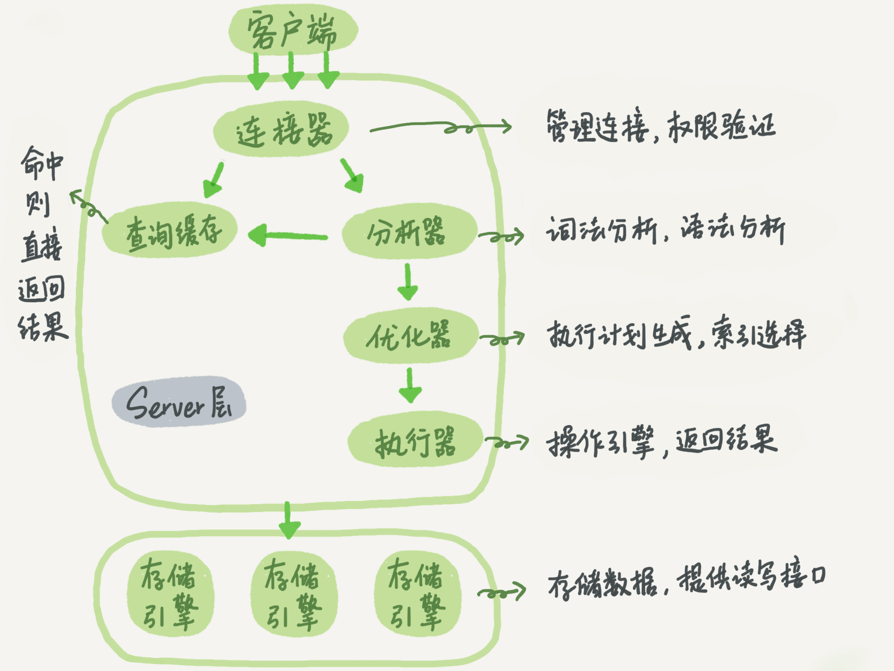

# 一条SQL查询语句是如何执行的

## SQL内部执行过程

假如你有一张表T，表里只有一个ID字段，在执行下面这个查询语句，可以简述一下这条语句在MySQL内部的执行过程。

> mysql > SELECT * FROM T WHERE ID=10;

## MySQL架构概览

- MySQL可以分为Server层和存储引擎层。
- Server层包括连接器、查询缓存、分析器、优化器、执行器等核心服务功能，以及所有内置函数和跨存储引擎的功能（如存储过程、触发器、视图等）。
- 存储引擎层负责数据的存储和提取，支持InnoDB、MyISAM、Memory等多个存储引擎，其中InnoDB是最常用的存储引擎。

## 连接器

- 连接器负责与客户端建立连接、获取权限、维持和管理连接。
- 连接命令包括用户名、密码等认证信息。
- 连接成功后，权限判断逻辑依赖于此时读到的权限，即使后续权限被修改，已建立的连接权限不变。

## 查询缓存

- 查询缓存用于存储之前执行过的语句及其结果，以提高查询效率。
- 但由于查询缓存的频繁失效和命中率低，大多数情况下建议不使用查询缓存。
- MySQL 8.0版本中，查询缓存功能被完全移除。

## 分析器

- 分析器对SQL语句进行词法分析和语法分析，识别语句中的字符串和语法规则。
- 如果SQL语句有语法错误，会提示错误信息。

## 优化器

- 优化器决定使用哪个索引或表的连接顺序，以提高执行效率。
- 优化器的选择可能影响查询性能。

## 执行器

- 执行器根据分析器和优化器的结果执行SQL语句。
- 执行过程中，会检查权限，并根据表的存储引擎使用相应的接口。
- 对于没有索引的表，执行器会遍历表中的每一行来查找满足条件的数据。