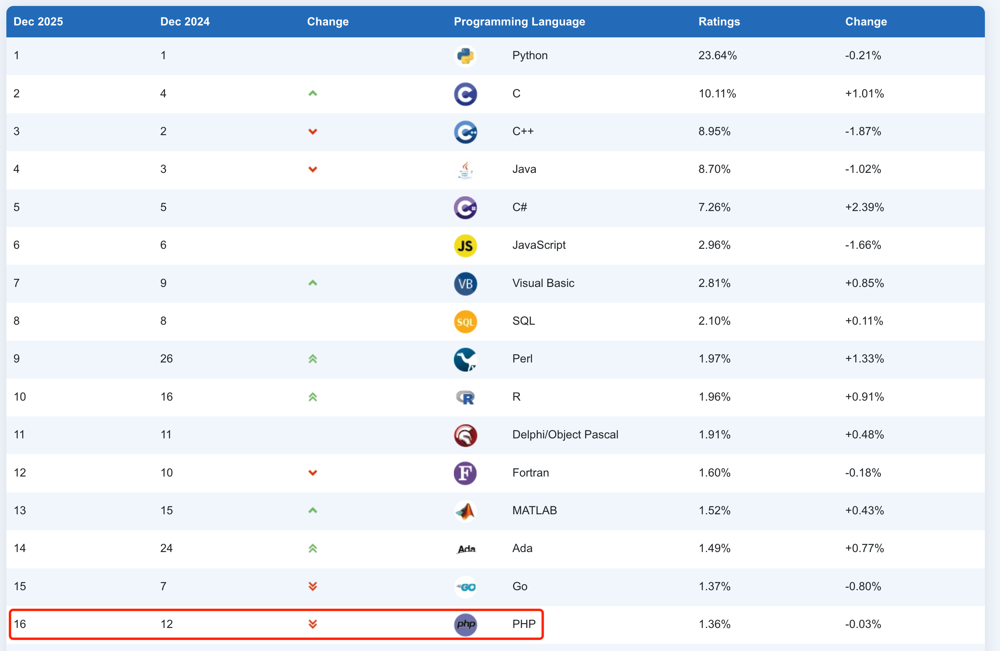
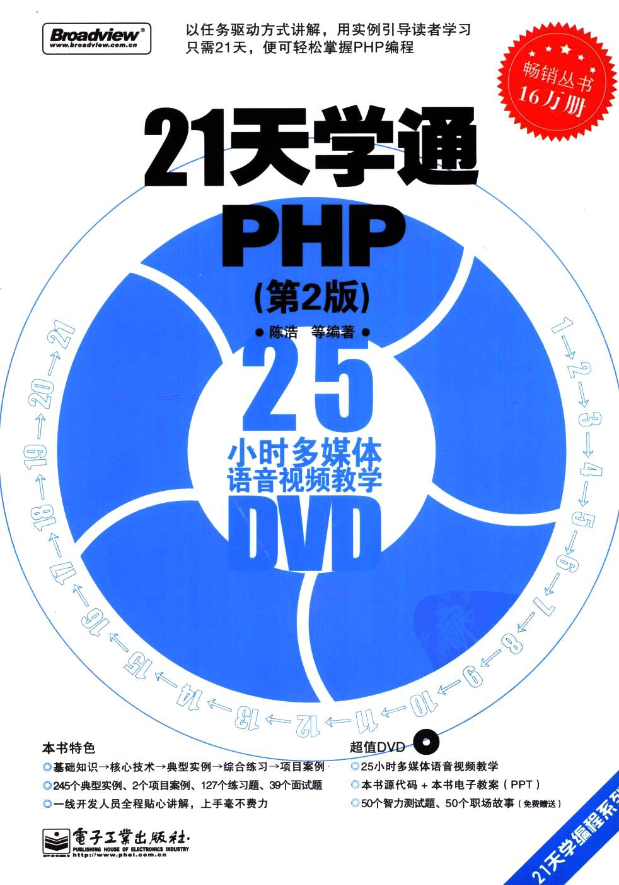
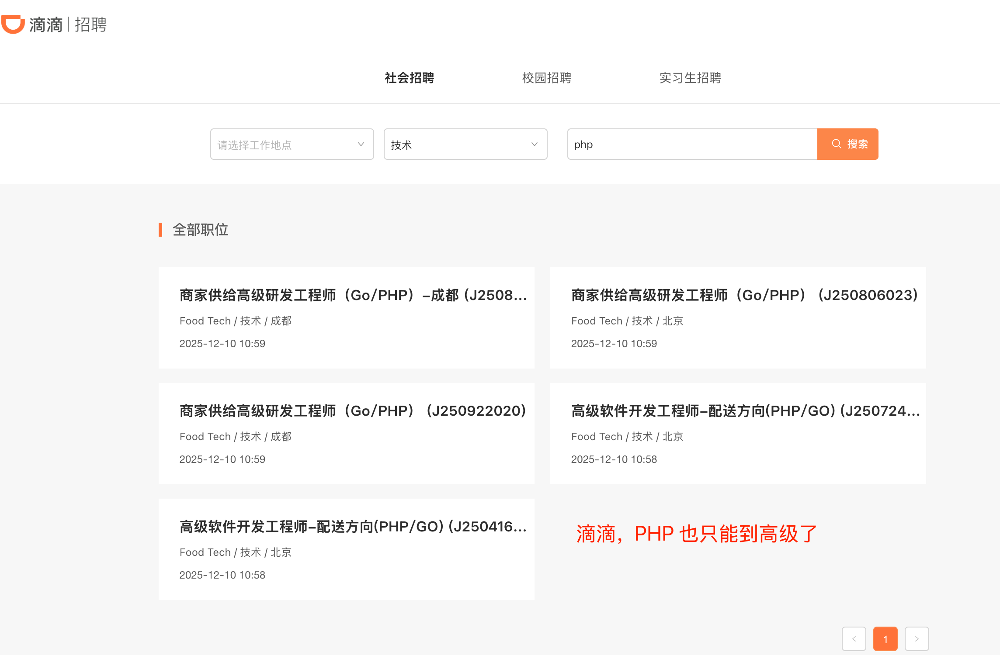
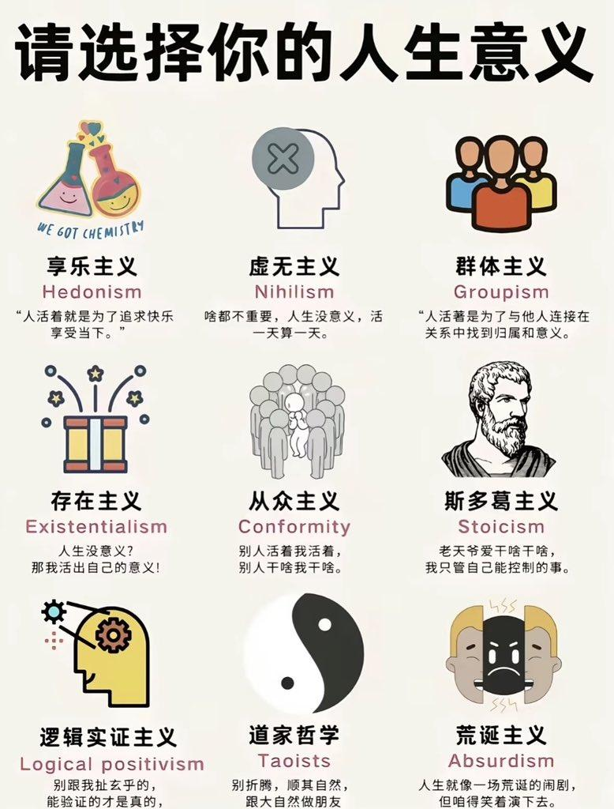
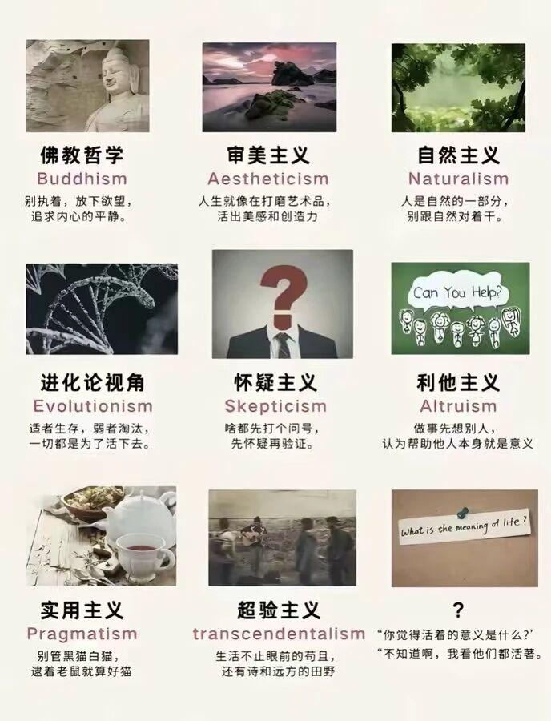

# 你的编码热情是如何消退的？

本文基于 PHP 从业者**编码热情会随时间逐渐消退**这是事实，探讨导致消退的原因，分享自己重拾热情的方式，抛砖引玉，**助你找到自己重拾热情的方式**。全文共计 **3163 字**，阅读时间约 **16 分钟**，作者：凌枫。如果文章对你有帮助，请关注和转发，谢谢！

## 一、热情消退现象

作为一名 PHP 开发者，你是否察觉到曾经那种初学时的热情在逐渐消退？从渴望编写代码，到逐渐将编程视为例行公事，而简单归结为：**提不起劲？**&#x8FD9;种转变在技术领域尤为常见。

**技术学习动力匮乏**是热情消退的首要信号。当发现自己对新框架和语言更新不再感兴趣，宁愿重复使用旧技术而不愿探索新方案时，就需要警惕了。**工作倦怠**则表现为将编程视为重复性劳动，创造力明显下降，只求完成功能而不追求代码优美。**创新意识减弱**则体现在满足于完成需求而非追求技术卓越，对代码质量和架构设计失去往日的热情。

许多 PHP 开发者都经历过这样的阶段：曾经乐在其中的代码实现变成了单调的复制粘贴，问题解决能力退化为机械式的功能堆砌。更令人担忧的是，PHP 在全球编程语言生态中的地位正在经历显著变化，TIOBE 指数显示 PHP 的排名已跌至历史最低点第 16 位（2025 年 12 月），另外 PHP 高端岗位均面临 Java 和 Go 的直接竞争，这些原因无疑加速了 PHP 开发者的热情消退。

## 二、原因剖析

### 1、技术学习热情消退

PHP 开发者技术学习热情的消退，往往始于技术成长的“S型曲线”陷阱。**许多开发者在职业生涯初期经历了急速成长后，会进入一个漫长的平台期。**&#x8FD9;个阶段最显著的特点是：缺乏有挑战性的任务，日常工作中充斥着重复的 CRUD（增删改查）业务逻辑开发，难以接触到高并发、分布式系统等更有深度的技术场景。

随着升职加薪节奏变缓，技术成长的经济回报边际效应递减，进一步削弱了学习动力。当技术能力达到一定水平后，单纯的薪资激励不再像早期那样有效，而 PHP 开发者在中小型企业的薪资上限通常不如中大型企业就职的 Java 或 Go 等语言。此外，家庭琐事的打扰也不容忽视——随着年龄增长，开发者需要投入更多时间在家庭责任上，用于深度学习和思考的完整时间块被碎片化。
更深层次的问题是，部分 PHP 开发者陷入了“工具化”的舒适区，仅将编程视为谋生手段而非创造活动。当编码不再带来成就感，而沦为机械式的任务完成时，热情自然逐渐消退。

### 2、语言局限性与生态劣势

在生态系统方面，PHP 的局限性尤为明显。相比 Java 在桌面软件、Android、大数据、金融系统、电商平台的成熟生态，Python 在 AI 和数据科学领域的主导地位，以及 Go 在云原生和基础服务器端软件方面的优势，PHP 的生态相对单一，主要集中在传统 Web 开发领域。这种生态劣势使得 PHP 开发者难以参与到技术发展的前沿领域中。语言本身的局限性。**相较 Java 语言，大厂成熟工程实践经验可直接复用到中小企业，进一步挤压 PHP 开发者的生存空间。**

### 3、职业发展瓶颈与工作挑战

随着技术发展，PHP 开发者的职业路径面临显著挑战。许多 PHP 开发者长期局限于业务代码的实现，缺乏对系统架构、设计模式等深层技术原理的理解，这限制了职业发展空间。尤其是在小型软件公司或外包公司工作的开发者，很难有机会经历完整的大型项目开发。
复杂项目经验的缺乏使不少 PHP 开发者难以胜任架构师等高级角色。随着移动互联网、云计算等新技术兴起，软件系统变得越来越复杂，大型网站对高并发、可用性的要求越来越高。而 PHP 在这些场景下的表现明显处于劣势。
最终，**PHP 开发者为获得更高端岗位常常面临更换技术栈的艰难抉择。**&#x5927;厂的核心高并发系统很少采用 PHP，而更多使用 Java 或 Go 等语言，这使得有志于进入一线互联网企业的 PHP 开发者不得不考虑转型。这种为职业发展而放弃擅长技术栈的抉择，本身就是热情消退的重要表现。

## 三、重拾方式：从消费者到生产者

面对热情消退的困境，探索出了一条转型之路：**从 PHP 消费者转变为 PHP 生产者。**&#x8FD9;一转变不仅重燃对 PHP 开发的热情，更为职业发展开辟了新天地。

> PHP 消费者：依托现有游戏玩法，解决业务上的问题。PHP 生产者：质疑现有游戏玩法，设计游戏新玩法，解决业务上的问题。

### 1、深耕工程规范与最佳实践

突然意识到，提升工程规范是保持长期开发热情的关键。PHP 社区已形成了许多优秀实践，包括：

* Composer：PHP 的依赖管理工具，可以快速安装、更新和管理项目依赖库。

* PSR 规范：社区制定的一系列 PHP 编码规范，涵盖自动加载、编码风格等方面。

* PHPStan：静态分析检查工具，帮助提前发现代码问题。

采用测试驱动开发（TDD） 模式后，代码质量显著提升，后续维护成本大大降低。同时，重视代码可读性，确保后续维护者都能轻松理解代码逻辑。

### 2、技术深度上的"蜕变"

蜕变是深度优先的成长，是工匠精神的体现。先从简单的脚本开发转向注重软件设计原则，实践领域驱动设计（DDD）和整洁架构。这一转变使代码从"能用"升级到"优美且可维护"。
参与开源项目是转变身份的重要一步。通过阅读高质量源代码并向资深开发者学习，逐渐从被动的代码使用者转变为积极的贡献者。当你的代码被广泛使用时，这种成就感极大地激发了进一步探索的动力。

### 3、技术广度上的"裂变"

**裂变是广度优先的成长**，通过不断打破边界引发知识和影响力的链式反应。可行的裂变路径包括：

* PHP + Vue/React（全栈开发）。

* PHP + Go（微服务架构）。

* DevOps 与容器化技术。

特别是通过 phpy 扩展，可以在 PHP 中直接调用 Python 的 AI 库，运行 AI 大模型推理和训练，这为 PHP 开发者打开了通向人工智能领域的大门。

### 4、打造个人生产链条

建立适合自己的开发环境是提升效率的基础。选择强大的 IDE（如 PhpStorm）可以显著提升编码体验，它们提供代码自动补全、语法检查、调试等功能。以及在工作中体验 VScode 并输出最佳实践；拥抱 cursor 等最新 AI 工具并输出 mdc 规则集。
更重要的是，可以创建了个人工具集，开发专属的代码生成器、自动化测试脚本和部署工具。这些工具不仅解决日常开发中的痛点，还被团队其他成员采用，**真正实现了从代码"消费者"到价值"生产者"的转变**。

## 四、属于你的方式

**转型为生产者不是单一路径**，而是根据个人情况选择合适的成长模式。以下是几种可行的路径：

### 1、"蜕变"优先路径

如果你感到迷茫和瓶颈，请优先选择 **"蜕变"** 。具体方式包括：

* 深入理解 PHP 内核：学习 Zend 引擎、内存管理等底层原理。

* 研究优秀框架源码：阅读 Laravel、Symfony 等框架的源代码，理解设计模式应用。

* 参与开源项目：从解决 issue 开始，逐步参与代码审查和功能开发。

### 2、"裂变"优先路径

如果你感到厌倦和重复，可以尝试 **"裂变"** 。具体方向包括：

* 全栈开发：学习 Vue.js、React 等前端技术，理解前后端协作。

* 微服务架构：探索 Go、Rust 等语言在特定场景下的应用。

* 技术管理：培养项目管理、团队协作能力，扩展职业边界。

### 3、螺旋式成长模型

理想的成长模型是螺旋式上升的，在"深度蜕变"与"广度裂变"之间不断循环。每个循环都让你站在更高维度：

* 阶段一：专注蜕变，夯实 PHP 核心基础。

* 阶段二：触发裂变，拓展技术边界。

* 阶段三：在新领域再次蜕变，深耕新技术点。

* 阶段四：整合升华，形成 T 型或 π 型能力。

> T 型：有一项核心专长（深度），同时具备跨领域知识（广度），如：精通 PHP，又懂 Java / Go，帮助企业转型技术栈。
>
> π 型：有至少两项专长（深度），同时具备跨领域知识（广度），如：精通 PHP，又懂其他语言，也懂业务，帮助企业在细分市场站稳脚跟。

## 五、结束语

PHP 开发者热情消退是一个复杂因素最终导致的现象，但并非不可逆转。**通过重新定义自己的技术定位，从被动的代码实现者转变为主动的价值创造者，我们完全可以重拾对 PHP 开发的热情。**

"生产者"心态的核心在于，不再将 PHP 视为单纯的谋生工具，而是作为创造和表达的平台。当你开始构建自己的工具、参与开源项目、分享知识并探索新应用领域时，你会发现自己与 PHP 的关系发生了根本性变化。

从今天开始，选择一条适合自己的转型路径，迈出从消费者到生产者的第一步。**这不仅是技术层面的提升，更是职业态度和人生观的蜕变。**

如果文章对你有帮助，请关注和转发，谢谢！

