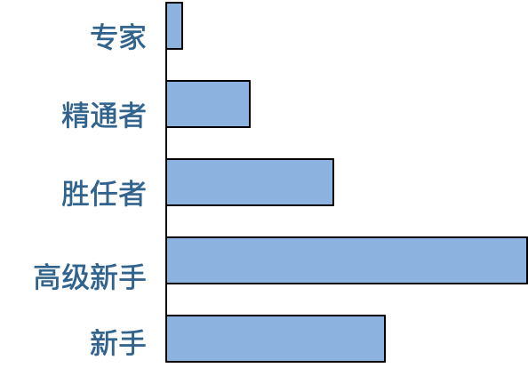

# 如何让工作年限变成优势

在软件开发招聘中，“有多少年工作经验”是一个重要的招聘指标。但实际上，技术能力和工作年限并不是正相关的，特别是工作三五年以后，很多人的技术能力进步就几乎停滞了。但是招聘面试的时候，面试官是期待他有着和工作年限相匹配的技术能力的。

如果一个人空有十几年工作经验，却没有相应的技术能力，那么这十几年的工作经验甚至可能会成为他的劣势，至少反映了他已经没有成长空间了。反而是工作年限不如他，但是技术能力和他相当的其他候选人更有优势，因为这个人可能还有进步的空间。

事实上，就我这些年的面试经验而言，空有十几年工作经验而没有相应技术能力的人大有人在。其实从简历上就能看的出来：最近几年的时间他承担的工作职责几乎没有变化，使用的技术、开发的项目几乎和头几年一样，那么很难相信这些年他的技术会有什么进步。

那么如何保持技术能力持续进步，使工作年限成为自己的优势而不是缺点呢？

## 德雷福斯模型

我们先看一个德雷福斯模型。德雷福斯是一个专业人员能力成长模型，这个模型认为所有专业人员都需要经历5个成长阶段，不管是医生还是律师，或者是软件开发，任何专业技能的从业者都需要经历新手、高级新手、胜任者、精通者、专家5个阶段。

通常一个人进入专业的技能领域，即使在学校已经系统学习过这个专业的相关知识，但依然无法独立完成工作，必须在有经验的同事指导下，学习相关的技能。这里主要学习的是有关工作的规则和套路。比如用什么工具、什么框架，如何开发程序，如何开会、写周报，如何和同事合作，业务领域的名词术语是什么意思等等这些各种各样和工作有关的大小事情。这个阶段叫做新手阶段。

通常说来，一个人大约工作两三年后，就差不多掌握了工作的各种套路，可以摆脱新手阶段，独立完成一些基本的工作了。通过新手阶段的人，少部分会直接进入胜任者阶段，而大多数则进入高级新手阶段。

高级新手其实是新手的自然延续，他不需要别人指导工作，也不需要学习工作的规则和套路，因为高级新手已经在新手阶段掌握了这些套路，他可以熟练应用这些规则套路完成他的工作。但是高级新手的能力也仅限于此，他不明白这些规则是如何制定出来的，为什么使用这个框架开发而不是另一个框架，也不明白这个框架是如何开发出来的。

因此，一旦需要解决的问题和过往的问题有很大不同，以前的规则套路无法解决这些新问题的时候，高级新手就抓瞎了，不知道该怎么办。

一个悲观的事实是，新手会自然进入高级新手阶段，而高级新手却无法自然进入其后的其他等级阶段。实际上，在各个专业领域中，超过半数的人终其一生都停留在高级新手阶段，也就是说，大多数人一生的工作就是基于其专业领域的规则在进行重复性的劳动。他们不了解这些规则背后的原理，也无法在面对新的问题时，开创出新的方法和规则。那些简历上十多年如一日使用相同的技术方案、开发类似软件项目的资深工程师大部分都是高级新手。

导致一个人终身停留在高级新手阶段的原因有很多，其中一个重要的原因是：高级新手不知道自己是高级新手。高级新手觉得自己在这个专业领域混得很不错，做事熟练，经验丰富。

事实上，这种熟练只是对既有规则的熟练，如果岁月静好，一切都循规蹈矩，也没什么问题。而一旦行业出现技术变革或者工作出现新情况，高级新手就会遇到巨大的工作困难。事实上，各行各业都存在大量的高级新手，只是软件开发领域的技术变革更加频繁，问题变化也更加快速，使高级新手问题更加突出。

少部分新手和高级新手会在工作中学习、领悟规则背后的原理，当需要解决的问题变化，或者行业出现技术革新时，能够尝试学习新技术，解决新问题，这样的人就进入胜任者阶段。胜任者工作的一个显著特点是，做事具有主动性。他们在遇到新问题时，会积极寻求新的解决方案去解决问题，而不是像高级新手那样，要么束手无策，要么还是用老办法解决新问题，使问题更加恶化。

胜任者能够解决新问题，但他们通常只会见招拆招，局限于解决问题本身，而缺乏反思精神以及全局思维：为什么会出现这样的问题？如何避免类似问题再发生？这个问题在更宏大的背景下处于什么位置？还有哪些类似的问题？

而拥有反思精神和全局思维，即使没有新问题也能够进行自我突破、寻求新的出路的人，就进入了精通者阶段。精通者需要通过主动学习进行提升，主动进行大量的阅读和培训，而不是仅仅依靠工作中的经验和实践。他们在完成一个工作后会反思：哪些地方可以改进，下次怎么做会更好？

精通者拥有了自我改进的能力。

高级新手会把规则当做普适性的真理而使用，甚至引以为豪；而精通者则会明白所有的规则都只在特定的场景中才会有效，工作中最重要的不是规则，而是对场景的理解。

而最终，各行各业大约只有1%的人会进入专家阶段，专家把过往的经验都融汇贯通，然后形成一种直觉，他们直觉地知道事情应该怎么做，然后用最直接、最简单的方法把问题解决。专家通常也是他所在领域的权威，精通者和胜任者会学习、研究专家是如何解决问题的，然后把这种解决方案形成套路，成为行业做事的规则。

## 如何在工作中成长

德雷福斯模型告诉我们，人的专业能力不会随着工作年限的增加而自然增长，多数人会终身停留在高级新手阶段。那么如何在工作不断成长，提升自我，最终成为专家呢？以下三个建议供你参考。

### 勇于承担责任

好的技术都是经过现实锤炼的，能够真正解决现实问题的，得到大多数人拥护的。所以自己去学习各种各样的新技术固然重要，但是更重要的是要将这些技术应用到实践中，去领悟技术背后的原理和思想。

而所有真正的领悟都是痛的领悟，只有你对自己工作的结果承担责任和后果，在出现问题或者可能出现问题的时候，倒逼自己思考技术的关键点，技术的缺陷与优势，才能真正地理解这项技术。

如果你只是去遵循别人的指令，按别人的规则去做事情，你永远不会知道事物的真相是什么。只有你对结果负责的时候，在压力之下，你才会看透事物的本质，才会抓住技术的核心和关键，才能够让你去学好技术，用好技术，在团队中承担核心的技术职责和产生自己的技术影响，并巩固自己的技术地位。

### 在实践中保持技能

有个说法叫做1万小时定律，是说要想成为某个领域的专家，必须经过1万小时高强度的训练才可以，对软件开发这样更强调技术的领域来说，这一点尤其明显。我们必须要经过长时间的编程实践，从持续的编程实践中提升技术认知，才能够理解技术的精髓，感悟到技术的真谛。

但是1万小时的编程时间并不是说你重复的编程1万小时就能够自动提升成为专家的。真正对你有帮助的是不断超越自我，挑战自我的工作。也就是说，每一次在完成一个工作以后，下一次的工作都要比上一次的工作难度再增加一点点，不断地让自己去挑战更高难度的工作，从而拥有更高的技术能力和技术认知。

通俗说来，就是要摘那些跳起来才能够得着的苹果，不要摘那些伸手就能够得着的苹果。但是如果难度太高，注定要失败的任务，其实对技术提升也没有什么帮助。所以最好是选择那些跳起来能够摘得到的苹果，你要努力再进步一点点，才能够完成。通过这样持续的工作训练和挑战，在实践中持续地获得进步，你就可以不断从新手向专家这个方向前进。

### 关注问题场景

现实中，很多人觉得，学好某一个技术就大功告成了。但事实上是，即使你熟练掌握了强大的技术，但如果对问题不了解，对上下文缺乏感知，也不会真正地用好技术，也就无法去解决真正的问题。试图用自己擅长的技术去解决所有问题，就好像是拿着锤子去找钉子，敲敲打打大半天，才发现打的根本就不是一个钉子。

所谓的专家其实是善于根据问题场景发现解决方法的那个人，如果你关注场景，根据场景去寻找解决办法，也许你会发现解决问题的办法可能会非常简单，也许并不需要多么高深的工具和方法就能够解决，这时候你才能成为真正的专家。也就是在这个时候你会意识到方法、技术、工具这些都不是最复杂的，而真正复杂的是问题的场景，是如何真正地理解问题。

这个世界没有万能的方法，没有一劳永逸的银弹。每一种方法都有适用的场景，每一种技术都有优点和缺点，你必须要理解问题的关键细节、上下文场景，才能够选择出最合适的技术方案，真正地解决问题

## 结束语

如果你是一个新手，刚刚工作不久，那么不要被所谓的工作经验和所谓的资深工程师的说教局限住，你要去思考规则背后的原理，主动发现新问题然后去解决问题，越过高级新手阶段，直接向着胜任者、精通者和专家前进吧。

如果你是一个有多年经验的资深工程师，那么忘了你的工作年限吧，去问自己，我拥有和工作年限相匹配的工作技能吗？我在德雷福斯模型的哪个阶段？我该如何超越当前阶段，成为一个专家？