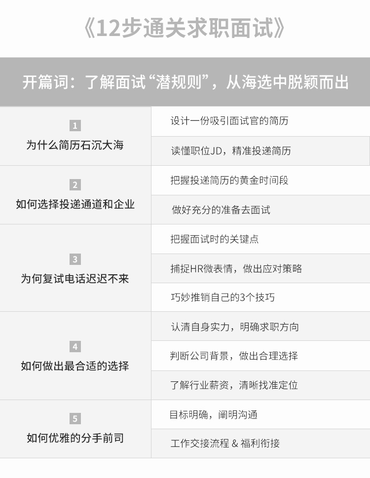

# 面试潜规则

## 551定律

你知道招聘市场的“551 定律”吗？ 551 定律：每一层筛选环节都会有百分之十的折损率。一个岗位从接收简历到发下 Offer 至少要筛选 500 份左右的简历、面试 50 人左右、只有 5 人左右通过面试，最终也只有 1 位候选人可以顺利入职。

对于企业内的招聘人员平均每天至少在一个岗位上要收到几百份简历，至少要面试十几个候选人，每周至少会发出 4~5 个 Offer；一周内至少同时会招聘 5~7 个不同的岗位。因此，可以看出，招聘人员的工作强度是非常巨大的，面试者需要把控好每个环节的节奏并表现优秀，才能得到最好的结果。 所以说你的简历是否对自己的工作内容和项目经历描述清晰，你的面试表达是否可以直击面试官的问题要点，你的Offer沟通是表现的完美无缺，都对你能否赢得心仪的岗位至关重要。

## 面试的那些事

简历已被阅读却迟迟没有回应 相信大部分人都会有这样的疑惑：每个求职的早上都会迫不及待的打开手机查看是否收到昨天投递简历的回复，发现都显示为“您的简历已经被阅读”的状态，带着兴奋的心情等待着心仪企业的面试邀请电话，上午过去了没有接到电话，午饭时间过去了没有接到电话，下班了仍然没有接到电话，第二天、第三天……一直没有收到任何的信息，一度以为自己的手机是否坏掉了或者怀疑招聘人员是不是忘记了拨打电话…

面试很顺利却迟迟没有收到录用通知 相信你也会有这样的困惑：好不容易收到面试电话，兴奋的不能自已，提前和公司请了假，穿上非常体面的衣服，吃一个元气满满的早餐，做好充分的准备去面试。面试时费尽心力地展示自己，把从事过的工作内容和听说过的项目经验全部展示在面试官面前，这时的你侃侃而谈，表现得非常自信且积极正能量。但是，不知是否留意过面试官有时候针会对一个问题进行深入的提问或者偶尔出现锁眉的动作？

面试了很多公司，难道能力已被透支 相信你有过这样的经历：面试了很久，也面试过 N 家公司，最后一份录用通知书也没有收到，此时是否开始对自己的工作能力表示深深的怀疑，真的是自己不够努力吗？之前的工作能力真的那么水吗？有没有想过也许就是与招聘人员沟通时的语气，与部门负责人的一次错误的意见表达等，导致公司对你的看法完全改变了，进而错过了接受心仪公司录用通知的机会。 这时候的你是不是感觉面试的道路上充满了坎坷，对自己的能力也产生了深深的质疑？ 其实求职之路并没有想象的那么复杂，接下来我会从一个面试官的角度来告诉你在简历上需要注意的细节点以及哪些内容是必须要提到的；在面对面试官时如何张弛有度地展示自己，在沟通中如何让面试官感觉到你就是那个公司一直在寻找的人选。

